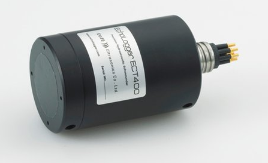
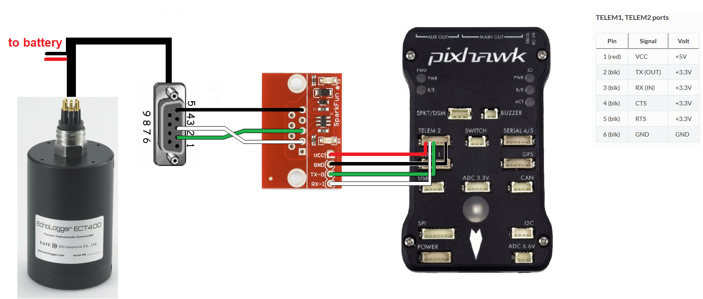

.. _common-echologger-ect400:

=============================
Echologger ECT400 echosounder
=============================

The `EchoLogger ECT400 <http://www.echologger.com/products/9>`__ is an echosounder (aka underwater sonar) with a 100m range, 5 degree beam width and 1hz ~ 10hz update rate.
More details can be found in the `datasheet <http://www.echologger.com/media/main/product/6a5d0079-6a03-469d-b94a-fa0854e4f510.pdf>`__

*image courtesy of echologger.com*

.. note::

   Support for this sensor was added to Rover-3.4.

Recommended Hardware
--------------------

- ECT400 can be purchased after `emailing echologger.com <http://echologger.com/contact>`__
- `Sparkfun RS232 To Serial converter <https://www.sparkfun.com/products/8780>`__
- `USB to RS232 converter <https://www.sparkfun.com/products/11304>`__ to allow testing and configuring the sensor with a PC

Connecting and Configuring
--------------------------

The ECT400 provides distance measurements using the NMEA protocol over serial at 115200 baud.

The sensor can be connected to any available serial/uart port on the fligth controller.  In the diagram below the sensor is connected to SERIAL2.

If the SERIAL2 is used then the following parameters should be set:

-  :ref:`SERIAL2_PROTOCOL <SERIAL2_PROTOCOL>` = 9 (Lidar)
-  :ref:`SERIAL2_BAUD <SERIAL2_BAUD>` = 115 (115200 baud)

Then the following range finder related parameters should be set:

-  :ref:`RNGFND_TYPE <RNGFND_TYPE>` = 17 (NMEA)
-  :ref:`RNGFND_MIN_CM <RNGFND_MIN_CM>` = 13
-  :ref:`RNGFND_MAX_CM <RNGFND_MAX_CM>` = 10000 (i.e. 100m).  *This is the distance in centimeters that the rangefinder can reliably read.*

Testing the sensor
==================

Distances read by the sensor can be seen in the Mission Planner's Flight
Data screen's Status tab. Look closely for "sonarrange".

.. image:: ../../../images/mp_rangefinder_lidarlite_testing.jpg
    :target: ../_images/mp_rangefinder_lidarlite_testing.jpg
