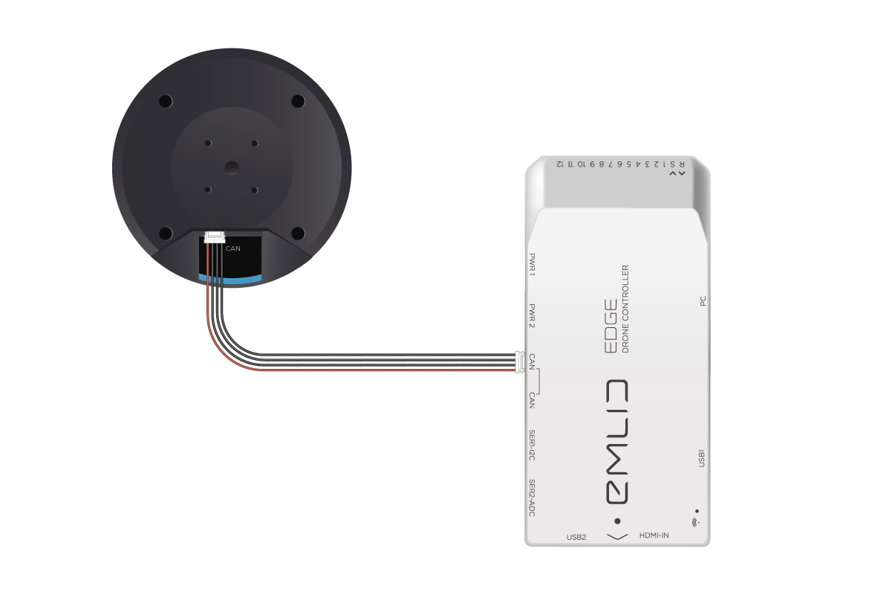
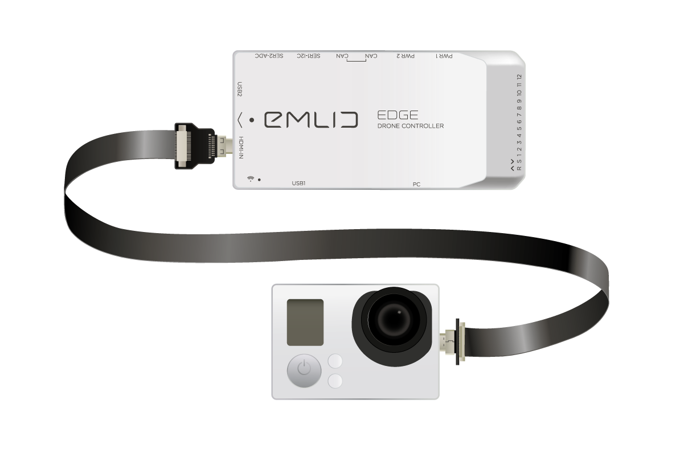
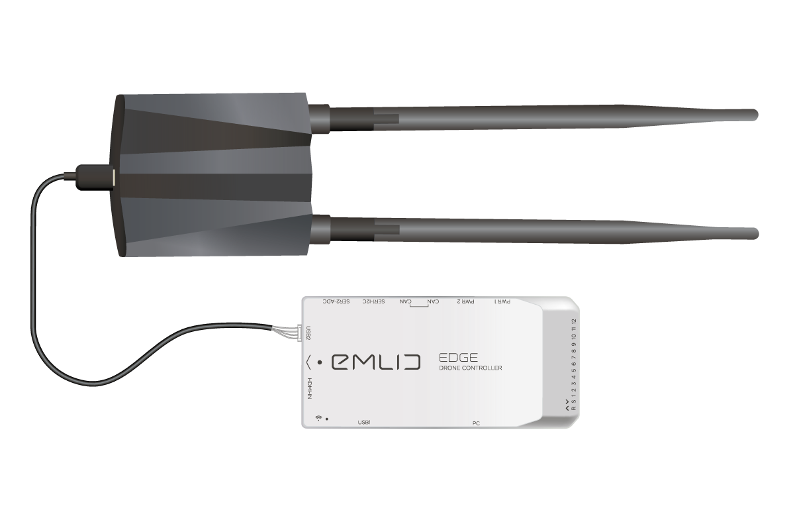
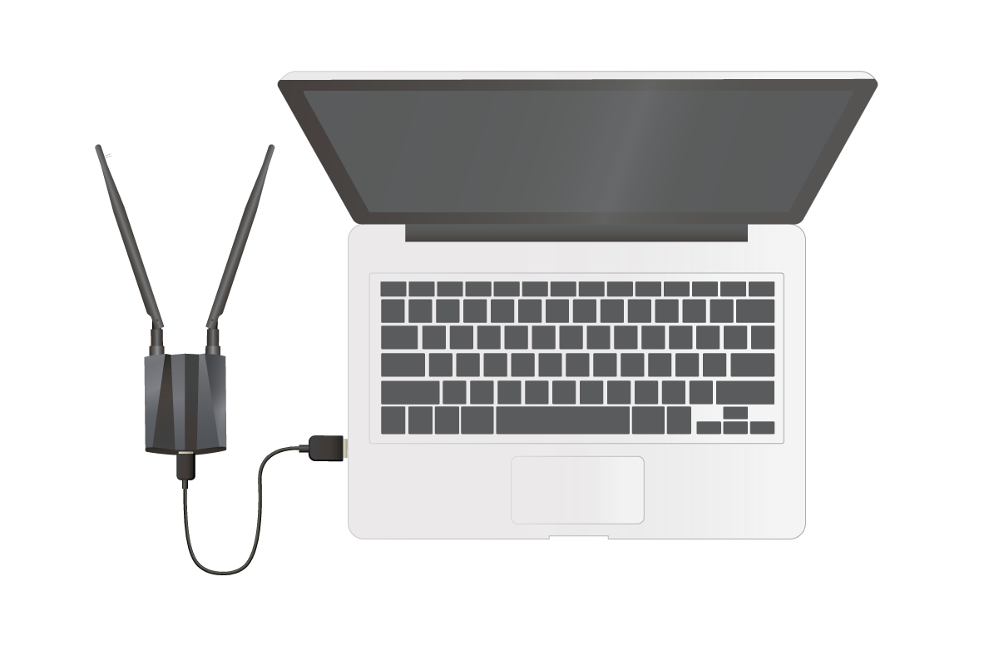
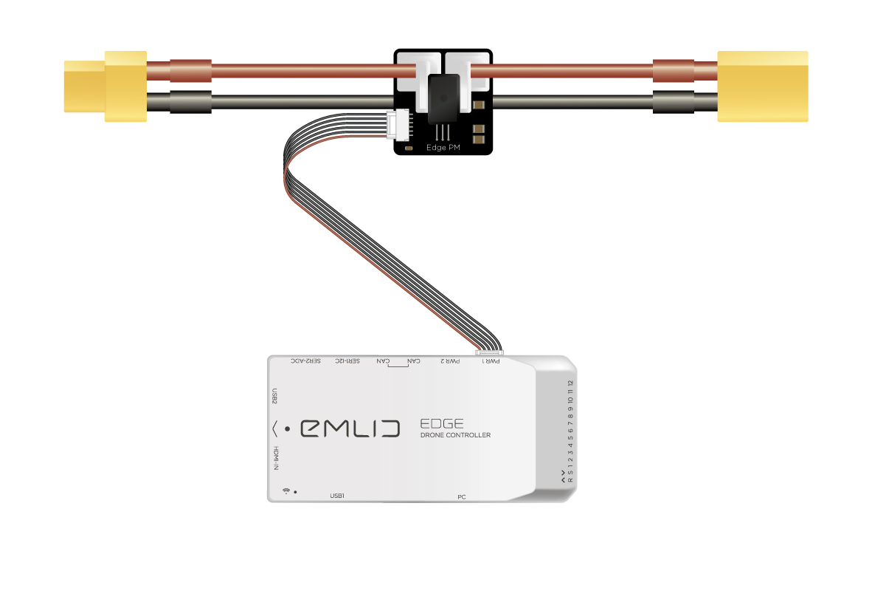
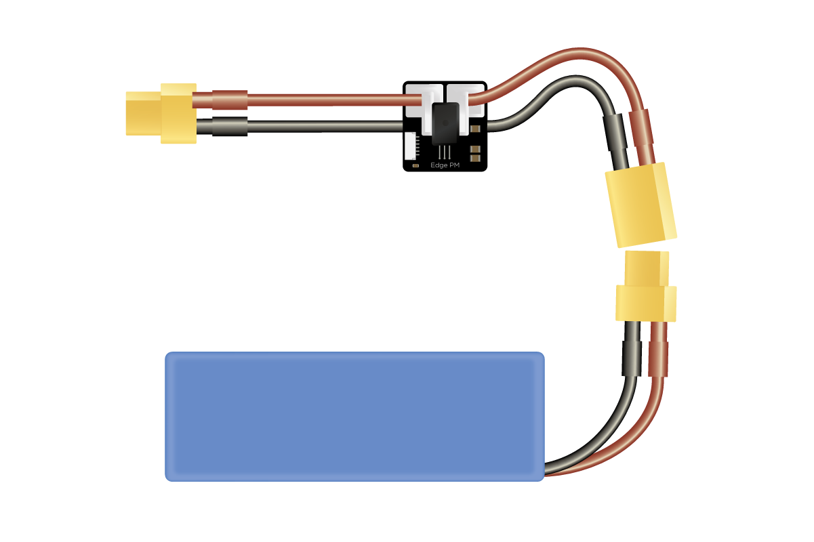
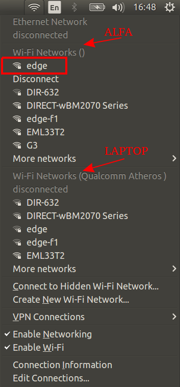

.. _common-edge-qick-start:

=========================
Archived:Edge Quick Start
=========================

This quickstart tutorial will guide you through the initial setup of Edge drone controller and its accessories.
In the end you’ll get a configured Edge drone controller that streams video from a camera to your laptop.
After that you can proceed to the hardware installation guide and install your Edge in a frame.

..  youtube:: K50kYtBbD34
    :width: 100%

|

.. note::
    Please update Edge to the latest `firmware <https://docs.emlid.com/edge/firmware-update/>`__  before continuing.

.. tip::
    If you encounter any issues performing these steps, we are happy to help you out on our `community forum <http://community.emlid.com/>`__ .

------------------------
Connect Edge GNSS module
------------------------

Edge GNSS module is a positioning device that contains a GNSS receiver, a high-precision barometer and two 3-axis compasses.

To connect Edge GNSS module to Edge use a JST-GH-4P to JST-GH-4P cable.
    - Connect one end of the cable to any of the CAN ports on Edge GNSS module
    - Connect another end of the cable to any of the CAN ports of Edge drone controller

--------------------
Connect video camera
--------------------

Camera should be connected to the HDMI-IN port on Edge. In case you are connecting an action camera then most likely it will have Micro-HDMI connector as well.
In that case you would need Micro-HDMI to Micro-HDMI cable to connect the camera to the Edge.

.. warning::
    Turn off the camera’s internal WiFi, otherwise it may interfere with RC equipment or Wi-Fi modules

.. warning::
    Turn the camera on after Edge is `booted <https://docs.emlid.com/edge/led-status/>`__.

.. tip::
    Resolution and frame per second value of the input stream may vary. Maximum supported video format is 1080p 30fps.

---------------------
Connect Wi-Fi modules
---------------------

Edge kit comes with two identical long-range Wi-Fi modules in separate boxes. Use one to connect to the Edge drone controller and another one to connect to a computer (assuming a laptop for rest of the guide).

++++++++++++++++++++++++++++
Connect Wi-Fi module to Edge
++++++++++++++++++++++++++++

To connect Wi-Fi module to the Edge use a Micro-USB to JSH-GH-4P cable from the kit.

    - Plug JST-GH-4P connector into Edge port labeled USB2
    - Plug Micro-USB connector into Micro-USB port of the Wi-Fi module

++++++++++++++++++++++++++++++++++
Connect Wi-Fi module to a computer
++++++++++++++++++++++++++++++++++

We need to connect another Wi-Fi module to the laptop. In order to do that you need to perform two simple steps

Use Alfa’s Micro-USB-3.0 to USB-3.0 cable from the Wi-Fi module box

    - Connect Micro-USB-3.0 one end of the cable to the Wi-Fi module
    - Connect the other end to the USB port of your laptop/desktop computer

+++++++++++++++++++++
Software installation
+++++++++++++++++++++

Now we need to install the driver for the Wi-Fi module. The instructions depend on your OS.
Please, proceed to the `<https://docs.emlid.com/edge/quickstart/#software-installation>`__ for the detailed instructions.

--------------------
Power from a battery
--------------------

Now you can turn on your Edge using the Edge Power Module (PM).

Connect JST-GH-6P connector to any power port on Edge (PWR1 or PWR2).

And after that connect a battery to your PM.

------------------------------
Connect to Edge’s access point
------------------------------

After powering up Edge needs some time to create an access point (AP). Connect to Edge’s AP (edge) with password: EmlidEdge (since 1.2 the password will be emlidedge).

.. note::
    Most laptops have a built-in Wi-Fi module. You need to connect to Edge using specifically the external Wi-Fi module provided with Edge.

.. tip::
    To avoid interference from the internal Wi-Fi we recommend disabling it.

.. warning::
    Be sure you connect to AP using the external Wi-Fi module, not the built-in Wi-Fi module of your laptop
    After the connection succeeded you can run the QGC.

-----------------------------------
Configuring QGroundControl for Edge
-----------------------------------

Detailed instructions are available `here <https://docs.emlid.com/edge/quickstart/#configuring-qgroundcontrol-for-edge>`__.

