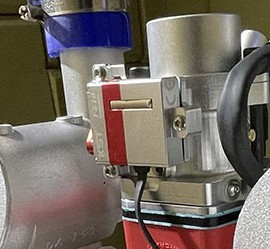
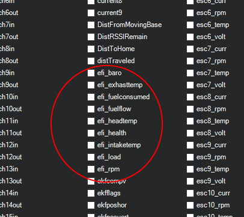

.. _common-efi:
[copywiki destination="plane"]
=========================
Electronic Fuel Injectors
=========================

Photo courtesy of `Lutan Engineering <https://www.lutanefi.com/en/products/uavengine>`__

ArduPilot provides support for several types of electronic fuel injection controllers for :ref:`internal combustion engines<common-ice>`. Both CAN and Serial communication interfaces to the EFI are supported.

Most units provide status information on RPM, Fuel flow, consumption, temperature, etc.

This information is reported in the autopilot logs via the EFI, EFI2, and ECYL log messages. Real time data is sent in the EFI MAVLink messages for monitoring by the GCS.

The following units have been tested and are supported:

- MegaSquirt Serial
- NWPMU CAN bus
- Lutan Serial
- DroneCAN (adapted versions of the above serial units)
- PiccoloCAN (`Currawong's ECU <https://www.currawong.aero/ecu/>`__ and `IntelliJect EFI <https://power4flight.com/uav-engine-products/uav-engine-control-units/intelliject-efi/>`__)

Serial Setup
============

For the example below, the unit will assumed to be attached to SERIAL5 of the autopilot.

- :ref:`EFI_TYPE<EFI_TYPE>`: MegaSquirt = 1, Lutan = 3
- :ref:`SERIAL5_PROTOCOL<SERIAL5_PROTOCOL>` = 24 (Serial EFI))
- :ref:`SERIAL5_BAUD<SERIAL5_BAUD>` = 115 (115.2Kbaud)

NWPMU Setup
===========

For the example below, the unit will be assumed to be attached to the first CAN port.

- :ref:`EFI_TYPE<EFI_TYPE>` = 2 (NWPMU)
- :ref:`CAN_P1_DRIVER<CAN_P1_DRIVER>` = 1 (first driver)
- :ref:`CAN_D1_PROTOCOL<CAN_D1_PROTOCOL>` = 6 (EFI_NWPMU)

DroneCAN Setup
==============

For the example below, the unit will be assumed to be attached to the first CAN port.

- :ref:`EFI_TYPE<EFI_TYPE>` = 5 (DroneCAN)
- :ref:`CAN_P1_DRIVER<CAN_P1_DRIVER>` = 1 (first driver)
- :ref:`CAN_D1_PROTOCOL<CAN_D1_PROTOCOL>` = 1 (DroneCAN)

PiccoloCAN Setup
================

For the example below, the unit will be assumed to be attached to the first CAN port.

- :ref:`EFI_TYPE<EFI_TYPE>` = 6 (Currawong-ECU)
- :ref:`EFI_FUEL_DENS<EFI_FUEL_DENS>`: Fuel density to calculate fuel consumption
- :ref:`CAN_P1_DRIVER<CAN_P1_DRIVER>` = 1 (first driver)
- :ref:`CAN_D1_PROTOCOL<CAN_D1_PROTOCOL>` = 4 (PiccoloCAN)
- :ref:`CAN_D1_PC_ECU_ID<CAN_D1_PC_ECU_ID>`: Node ID to send throttle commands to

Displaying EFI telemetry in Mission Planner
===========================================

The following EFI telemetry is available in the Mission Planner. Just right click in the DATA screens HUD display and select ``User Items``. Then select what data to display.

Using the EFI RPM in ArduPilot
==============================

The EFI's rpm telemetry can be used as the autopilot's RPM sensor, for display in the GCS as above, or for use with the harmonic notch filter.

First, set either RPM1 or RPM2 sensor as being sourced from the EFI (examples will use RPM1):

- set :ref:`RPM1_TYPE<RPM1_TYPE>` = 3 (EFI)
- then setup the :ref:`common-rpm-based-notch`
