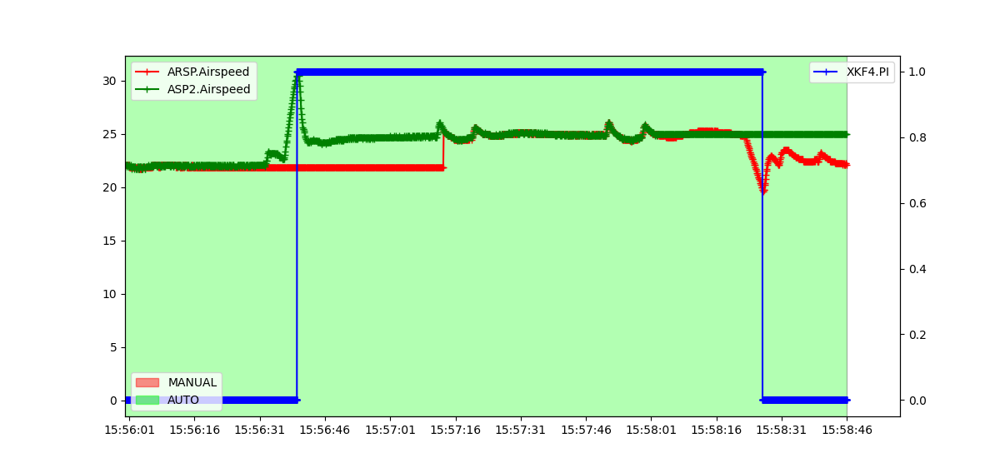
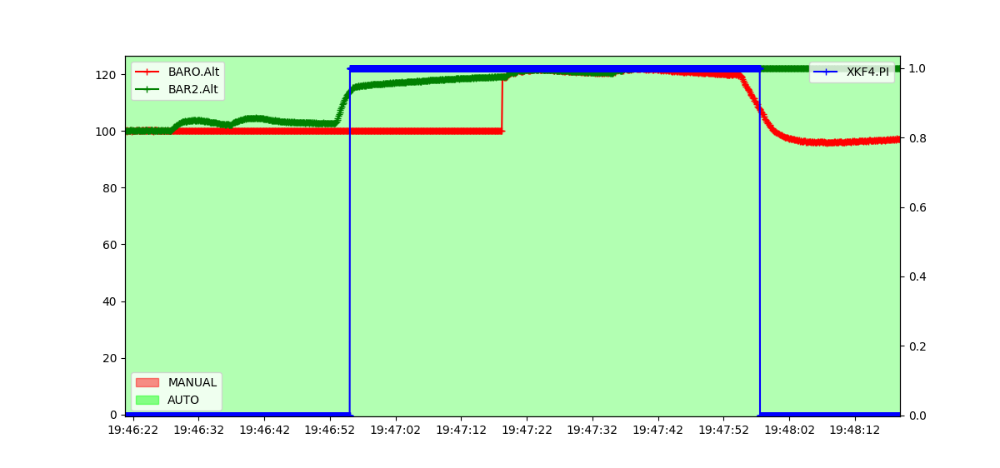
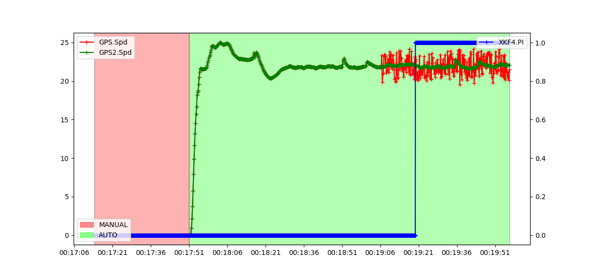
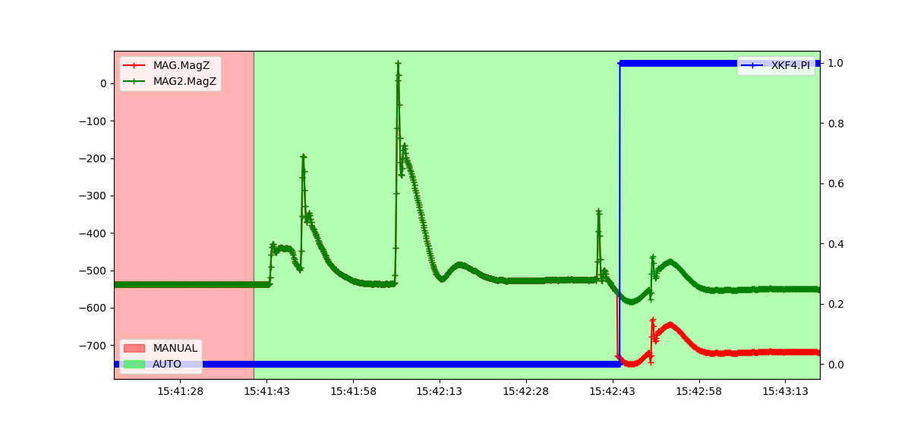

.. _common-ek3-affinity-lane-switching:

[copywiki destination="copter,plane,rover,dev,sub"]
================================
EKF3 Affinity and Lane Switching
================================

The :ref:`EKF <dev:extended-kalman-filter>` instantiates multiple instances of the filter called 'lanes'.
The "primary" lane is the one currently providing state estimates, other lanes are updated in the background and available for switching to.

.. note::

    This page describes an advanced configuration topic. The source code is the truth. This page hopefully provides conceptual clarity, but it *is not perfect* on the details.

The number of possible lanes is the number of IMUs enabled for use (see :ref:`EK3_IMU_MASK <EK3_IMU_MASK>`).
Furthermore, the lanes are 1-1 bound to the (used) IMUs: lane 1 for IMU 1, lane 2 for IMU 2, etc.

For each of the other sensor-types {Airspeed, Barometer, GPS, and Magnetometer (aka Compass)}:
If affinity for that sensor-type is disabled, each lane uses the system's "primary" instance of the sensor.
(Affinity being disabled for every sensor-type is the conventional/default choice.)
The initial primary sensor instance is selected by a user-modifiable parameter.
The system may change which sensor instance is its primary, even in-flight, for example in case of a sensor fault.

Because modern-day vehicles may have redundant good quality sensors installed, "affinity" provides a way to have some EKF lanes prefer sensor instances which are not the system-wide primary.
For sensors with affinity enabled, lane-switching should be thought of as sensor-switching.
The lane error score (used to make a switching decision) takes into account innovations from all sensors used by a lane.
Thus in the case of noisy-but-not-broken non-IMU sensors, affinity might avoid a mishap by simply EKF lane-switching to a less-noisy IMU+sensor combination.

**Example: Vehicle uses 4 IMUs, 2 Airspeeds, 3 Barometers, 2 GPS, and 3 Magnetometers.
Affinity is disabled for airspeed & barometers, enabled for GPS & magnetometers.**

.. raw:: html

   <table border="1" class="docutils">
   <tr><th>LANE</th><th>1</th><th>2</th><th>3</th><th>4</th></tr>
   <tr><td>IMU</td><td>1</td><td>2</td><td>3</td><td>4</td></tr>
   <tr><td>AIRSPEED</td><td>1</td><td>1</td><td>1</td><td>1</td></tr>
   <tr><td>BAROMETER</td><td>1</td><td>1</td><td>1</td><td>1</td></tr>
   <tr><td>GPS</td><td>1</td><td>2</td><td>1</td><td>1</td></tr>
   <tr><td>MAGNETOMETER</td><td>1</td><td>2</td><td>3</td><td>1</td></tr>
   </table>

*Numbers indicate the lane's initial primary sensor instance.*

Configuration Parameters
------------------------

.. note::

    Affinity is only available with EKF3, so make sure you are using it by ensuring :ref:`EK3_ENABLE <EK3_ENABLE>` is set to "1" and :ref:`AHRS_EKF_TYPE <AHRS_EKF_TYPE>` is set to "3"

The :ref:`EK3_AFFINITY <EK3_AFFINITY>` parameter is a bitmask which gives you the option to choose the sensors you want to enable affinity for.
In every EKF lane, sensors for which affinity is not enabled will follow the system's "primary" selection logic.
For a sensor-type with affinity enabled, lane 1's primary sensor is 1, lane 2's primary sensor is 2, etc.

The :ref:`EK3_ERR_THRESH <EK3_ERR_THRESH>` parameter controls the sensitivity of lane switching. Lane errors are accumulated over time relative to the active primary lane. This threshold controls how much of an error difference between a non-primary and primary lane is required to consider the former performing better. Lowering this parameter makes lane switching more responsive to smaller 'relative' errors, and in practical you will see a more aggressive lane switching, and, vice-versa.

.. warning::

    Misconfiguring the :ref:`EK3_ERR_THRESH <EK3_ERR_THRESH>` parameter could adversely affect the lane switching mechanism and have serious consequences which could lead to the loss of your vehicle. Please tune carefully.

Test Results
------------

Following graphs are from SITL testing that show Affinity enabled lane changing when the primary lane's sensor is subjected to noise/malfunctioning.

AIRSPEED
++++++++
An example of lane switching for a plane with 2 airspeed sensors and airspeed affinity enabled. There are 2 IMUs, hence 2 active lanes. The primary lane's airspeed sensor has failed to show changes in pressure, hence reporting a constant value. The speed of the plane is increased and a lane switch occurs. Similarly, the second airspeed sensor of the second lane (now the primary lane) is failed and the plane's speed is decreased which again triggers a lane switch.

BAROMETER
+++++++++
An example of lane switching for a plane with 2 barometers and barometer affinity enabled. There are 2 IMUs, hence 2 active lanes. The primary lane's barometer has failed to show changes in pressure, hence reporting a constant value. The altitude of the plane is increased and a lane switch occurs. Similarly, the second barometer of the second lane (now the primary lane) is failed and the plane's altitude is decreased which again triggers a lane switch.

GPS
+++
An example of lane switching for a plane with 2 GPS and GPS affinity enabled. There are 2 IMUs, hence 2 active lanes. The primary lane's GPS is simulated with a random GPS Velocity Noise of range ±2m in all 3-axis. The actual speed can be tracked with the 2nd GPS. Subsequently, the EKF primary lane starts reporting a consistently high error and a lane switch occurs when the error crosses the set threshold.

MAGNETOMETER
++++++++++++
An example of lane switching for a plane with 2 Magnetometers and magnetometer affinity enabled. There are 2 IMUs, hence 2 active lanes. An error is simulated in the primary lane's magnetometer by changing the offset of the z-axis while flying. The offset change can be tracked with the 2nd magnetometer. Subsequently, the EKF primary lane starts reporting a consistently high error and a lane switch occurs when the error crosses the set threshold.

