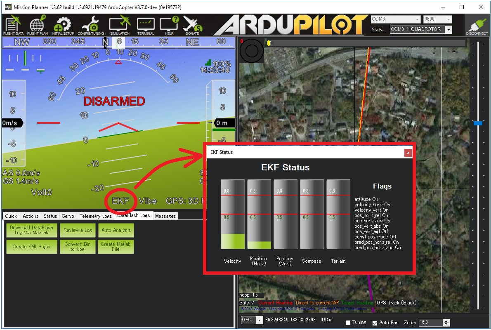
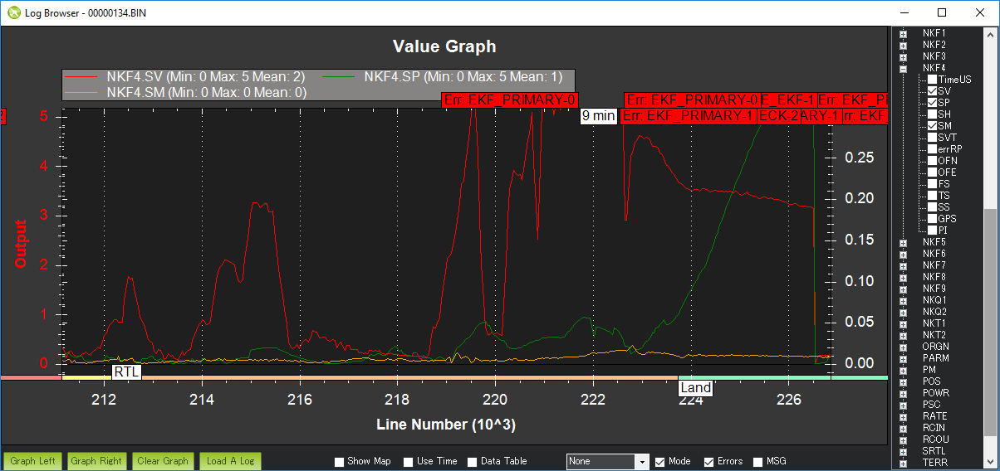

.. _common-ekf-inav-failsafe:

.. _ekf-inav-failsafe:

============
EKF Failsafe
============

[site wiki="copter"]

The EKF failsafe monitors the health of EKF (the position and attitude estimation system) to catch problems with the vehicle's position estimate (often caused by GPS glitches or compass errors) and prevent "flyaways".

[/site]

[site wiki="plane"]

The EKF failsafe monitors the health of EKF (the position and attitude estimation system) to catch problems with the vehicle's position estimate (often caused by GPS glitches or compass errors).

In fixed wing flight a bad EKF solution is handled by falling back to the DCM attitude estimator, so no failsafe action is taken. The EKF failsafe described on this page therefore only applies to QuadPlanes, and only while flying in a VTOL mode that requires a position estimate (QLOITER, QRTL, QLAND, QAUTOTUNE and VTOL AUTO). It is not active in QSTABILIZE, QHOVER or QACRO, nor in any fixed wing mode.

[/site]

[site wiki="rover"]

The EKF failsafe monitors the health of EKF (the position and attitude estimation system) to catch problems with the vehicle's position estimate (often caused by GPS glitches or compass errors) and prevent the vehicle driving off course under autonomous control.

[/site]

[site wiki="sub"]

The EKF failsafe monitors the health of EKF (the position and attitude estimation system) to catch problems with the vehicle's position estimate (caused by compass errors or velocity estimate errors) and prevent "swimaways".

[/site]

When will it trigger?
=====================

The EKF failsafe will trigger when any two of the EKF "variances" for compass, position or velocity are higher than the :ref:`FS_EKF_THRESH <FS_EKF_THRESH>` parameter value for 1 second.

These "variances" come from the EKF itself and are numbers indicating the EKF's confidence in its estimates.  The values are between 0 and 1 with 0 meaning the estimate is very trustworthy and 1.0 is very untrustworthy.

The EKF calculates these "variances" by comparing the results from multiple sensors.  So for example, if the GPS position suddenly jumps but the accelerometers do not show a sudden acceleration, the EKF variance for position would climb (i.e become less trustworthy)

The check only runs while the vehicle is armed.

[site wiki="plane"]

In addition, the check only runs while the QuadPlane is in a VTOL mode that requires a position estimate. Leaving such a mode clears the failsafe.

[/site]

The variances can be viewed in real-time on the ground station.  If using Mission Planner click on the "EKF" label on the HUD.

What will happen when the failsafe triggers?
============================================

- The autopilot's `LED will flash red-yellow or blue-yellow and the tone-alarm will sound <https://www.youtube.com/watch?v=j-CMLrAwlco&feature=player_detailpage&t=60s>`__
- "EKF variance" will appear on the ground station's HUD if telemetry is connected
- An EKF failsafe error will be written to the dataflash logs

[site wiki="copter"]

- In manual flight modes that do not require GPS (i.e. Stabilize, Acro, AltHold) nothing further will happen but the pilot will be unable to switch into autonomous flight modes (Loiter, PosHold, RTL, Guided, Auto) until the failure clears
- In autonomous modes that require GPS (i.e. Loiter, PosHold, RTL, Guided, Auto, etc) the :ref:`FS_EKF_ACTION <FS_EKF_ACTION>` controls the behaviour.  By default this is "1" meaning the vehicle will switch to :ref:`Land <land-mode>` mode.  This is a "pilot controlled" land meaning the pilot will have control of the roll and pitch angle but the vehicle will descend at the :ref:`LAND_SPD_MS <LAND_SPD_MS>`.  It will land and finally disarm its motors. Other options are to report only ("0"), hover (ALTHOLD) ("2") or LAND ("3") even if in STABILIZE mode if the EKF failsafe occurs.

After an EKF failsafe occurs, the pilot can re-take control (using the flight mode switch) in a manual flight mode such as :ref:`AltHold <altholdmode>` to bring the vehicle home.

[/site]

[site wiki="plane"]

- If the QuadPlane is flying a VTOL part of an AUTO mission the vehicle will switch to :ref:`QLAND <qland-mode>` mode, since the pilot is not controlling the vehicle with the sticks
- In any other VTOL mode requiring position (QLOITER, QRTL, QLAND, QAUTOTUNE) the vehicle will switch to :ref:`QHOVER <qhover-mode>` mode, which holds altitude and gives the pilot control of roll and pitch so the vehicle can be flown home manually

There is no ``FS_EKF_ACTION`` parameter on Plane, these actions are fixed. After an EKF failsafe occurs, the pilot can re-take control using the flight mode switch, either in QHOVER/QSTABILIZE or by transitioning back to fixed wing flight.

[/site]

[site wiki="rover"]

- In modes that do not require a position estimate (i.e. Manual, Acro, Steering, Hold) nothing further will happen, but the vehicle cannot be switched into a mode that requires position (Auto, Guided, RTL, SmartRTL, Loiter, Follow, Dock, Circle) until the failure clears
- In modes that require a position estimate the :ref:`FS_EKF_ACTION <FS_EKF_ACTION>` parameter controls the behaviour.  By default this is "1" meaning the vehicle will switch to :ref:`Hold <hold-mode>` mode and stop.  The other options are "0" to disable the failsafe entirely and "2" to report the failure to the ground station without changing mode

After an EKF failsafe occurs, the driver can re-take control (using the mode switch) in :ref:`Manual <manual-mode>` mode to drive the vehicle home.

[/site]

[site wiki="sub"]

- In manual modes that do not require position (i.e. Stabilize, Acro, AltHold) nothing further will happen but the pilot will be unable to switch into autonomous modes (PosHold, Guided, Auto) until the failure clears
- In autonomous modes that require position (i.e. PosHold, Guided, Auto, etc) the :ref:`FS_EKF_ACTION <FS_EKF_ACTION>` controls the behaviour.  By default this is "0" meaning the vehicle will take no action. "1" will send a GCS warning message. "2" will disarm the sub

After an EKF failsafe occurs, the pilot can re-take control (using the mode switch) in a manual mode such as Stabilize or AltHold to bring the vehicle home.

[/site]

Adjusting the Sensitivity of the failsafe
=========================================

The :ref:`FS_EKF_THRESH <FS_EKF_THRESH>` parameter can be adjusted to control the sensitivity of the failsafe

- Set :ref:`FS_EKF_THRESH <FS_EKF_THRESH>` = 0 to disable the EKF failsafe

[site wiki="copter"]

- Increase :ref:`FS_EKF_THRESH <FS_EKF_THRESH>` to values between 0.8 and 1.0 to reduce the chance of an EKF failsafe.  The downside of increasing this parameter value is that during a flyaway caused by a bad compass or GPS glitch, the vehicle will fly further away before the vehicle is automatically switched to LAND mode
- Decrease :ref:`FS_EKF_THRESH <FS_EKF_THRESH>` to values as low as 0.6 to increase the chance of an EKF failsafe triggering quickly.  The downside of lowering this value is the EKF failsafe could trigger a LAND during aggressive maneuvers

[/site]

[site wiki="plane"]

- Increase :ref:`FS_EKF_THRESH <FS_EKF_THRESH>` to values between 0.8 and 1.0 to reduce the chance of an EKF failsafe.  The downside of increasing this parameter value is that during a flyaway caused by a bad compass or GPS glitch, the vehicle will fly further away before it is automatically switched to QHOVER or QLAND
- Decrease :ref:`FS_EKF_THRESH <FS_EKF_THRESH>` to values as low as 0.6 to increase the chance of an EKF failsafe triggering quickly.  The downside of lowering this value is the EKF failsafe could trigger during aggressive VTOL maneuvers

[/site]

[site wiki="rover"]

- Increase :ref:`FS_EKF_THRESH <FS_EKF_THRESH>` to values between 0.8 and 1.0 to reduce the chance of an EKF failsafe.  The downside of increasing this parameter value is that when the position estimate is bad the vehicle will travel further off course before it is automatically switched to HOLD
- Decrease :ref:`FS_EKF_THRESH <FS_EKF_THRESH>` to values as low as 0.6 to increase the chance of an EKF failsafe triggering quickly.  The downside of lowering this value is the EKF failsafe could stop the vehicle unnecessarily, for example during hard turns or over rough ground

[/site]

[site wiki="sub"]

- Increase :ref:`FS_EKF_THRESH <FS_EKF_THRESH>` to values between 0.8 and 1.0 to reduce the chance of an EKF failsafe.  The downside of increasing this parameter value is that during a swimaway caused by a bad compass or positioning glitch, the vehicle will swim further away before the failsafe is activated
- Decrease :ref:`FS_EKF_THRESH <FS_EKF_THRESH>` to values as low as 0.6 to increase the chance of an EKF failsafe triggering quickly.  The downside of lowering this value is the EKF failsafe could trigger during aggressive maneuvers

[/site]

[site wiki="copter"]

Dataflash Log example
=====================

The EKF's innovations can be viewed by graphing a dataflash log's NKF4.SP (position innovation), NKF4.SV (velocity innovation) and NKF4.SM (compass innovation) values

The graph below show the EKF's innovations for position (green), velocity (red) and compass (yellow) during an actual EKF failsafe event.  During this incident external interference (probably from a high-powered radio tower nearby) caused the GPS to report inaccurate positions and velocities.  The vehicle switches to Land mode soon after both velocity and position innovations climb over the :ref:`FS_EKF_THRESH<FS_EKF_THRESH>` value of 0.8

[/site]

[site wiki="copter,plane,rover"]

EKF's Glitch Protection
=======================

The :ref:`EKF's <common-apm-navigation-extended-kalman-filter-overview>` glitch protection works as follows:

#. When new GPS position and velocity measurements are received, they are compared to
   a position predicted using IMU measurements.
#. If the position difference exceeds a statistical confidence level set by
   :ref:`EK3_POS_I_GATE <EK3_POS_I_GATE>` then the measurement won't be used.
   Similarly the velocity is checked using :ref:`EK3_VEL_I_GATE <EK3_VEL_I_GATE>`.
#. If the GPS glitch lasts long enough (usually about 7 seconds), the EKF's position
   and velocity estimates will be reset to the GPS position and velocity.
#. :ref:`EK3_GLITCH_RAD <EK3_GLITCH_RAD>` controls the maximum radial uncertainty
   in position between the value predicted by the filter and the value measured
   by the GPS before the filter position and velocity states are reset to the GPS.
   Making this value larger allows the filter to ignore larger GPS glitches but
   also means that non-GPS errors such as IMU and compass can create a larger error
   in position before the filter is forced back to the GPS position.
   If :ref:`EK3_GLITCH_RAD <EK3_GLITCH_RAD>` set to 0 the GPS innovations will be
   clipped instead of rejected if they exceed the gate size set by
   :ref:`EK3_VEL_I_GATE <EK3_VEL_I_GATE>` and :ref:`EK3_POS_I_GATE <EK3_POS_I_GATE>`
   which can be useful if poor quality sensor data is causing GPS rejection and
   loss of navigation but does make the EKF more susceptible to GPS glitches.
   If setting :ref:`EK3_GLITCH_RAD <EK3_GLITCH_RAD>` to 0 it is recommended to
   reduce :ref:`EK3_VEL_I_GATE <EK3_VEL_I_GATE>` and :ref:`EK3_POS_I_GATE <EK3_POS_I_GATE>` to 300

[/site]

[site wiki="copter"]

Video
=====

..  youtube:: zJbephAEFWQ
    :width: 100%

[/site]

[copywiki destination="copter,plane,rover,sub"]
