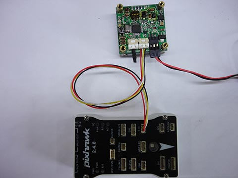
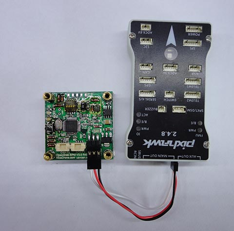
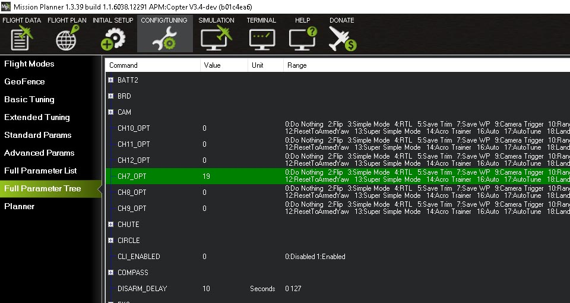
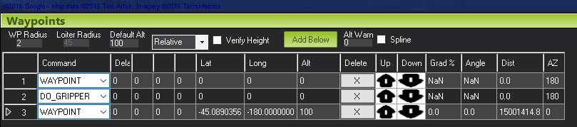
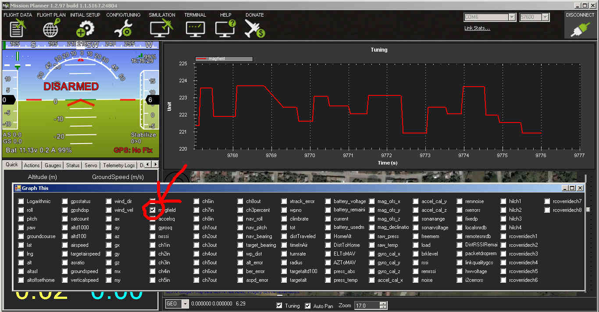

.. _common-electro-permanent-magnet-V3:

==================================================
Electro Permanent Magnet Gripper (OpenGrab EPM v3)
==================================================

This article shows how to use the `Electro Permanent Magnet Gripper (OpenGrab EPM v3) <http://nicadrone.com/index.php?id_product=66&controller=product>`__ with ArduPilot.

Overview
========

The *OpenGrab EPM v3* (from NicaDrone.com) is a small (less than 4cm x 4cm x 2cm) Electro Permanent Magnet gripper capable of 200N of force meaning it can hold about 15kg of cargo securely.  
The gripping and releasing of the cargo is accomplished by delivering a short pulse to an electromagnet which reverses it's field. 
Objects that it grips onto should be metal or have the included `thin steel target square <http://nicadrone.com/index.php?id_product=15&controller=product>`__ attached to them.

The device accepts a standard PWM servo input or UAVCAN and uses a 5V power supply.  
A significant amount of power is only required for about 1 second when it first grips or releases the cargo.

.. youtube:: ggvm-GQxwaY
    :width: 100%

Useful links
============

* `Documentation <https://docs.zubax.com/opengrab_epm_v3>`__
* `PCB / Schematic <https://upverter.com/ctech4285/b9557d6903c36f55/OpenGrab-EPM-V3R4B/>`__  (Revision is printed on PCB).
* `Source code <https://github.com/Zubax/opengrab_epm_v3>`__
* `Store <http://NicaDrone.com>`__
* `Report problems/issues <mailto:Andreas@NicaDrone.com?Subject=Problems/issues>`__

Connecting to a Pixhawk via UAVCAN
==================================

Notes:

- When Vin of the EPM drops below 5V the EPM will go into low power mode. Slowing down switching to prevent crashing the power rail.
- When Vin drops below 4.5V the green status LED will blink fast indicating an error condition.
- The Pixhawk UAVCAN connector power rail voltage is < 5V.
- External powering of the EPM is recommended (see image above).
- EPM UAVCAN cable set is required. `Clickmate -> DF13 <http://nicadrone.com/index.php?id_product=69&controller=product>`__.
- UAVCAN requires termination, terminator included in UAVCAN cable set.

Parameter setup
===============

   
#. You need to enable the UAVCAN. The :ref:`UAVCAN setup page is here <common-uavcan-setup-advanced>`. You also may check the configurations of the parameters :ref:`GRIP_UAVCAN_ID <GRIP_UAVCAN_ID>` and :ref:`GRIP_TYPE <GRIP_TYPE>` to set gripper ID and type.

#. Save the configurations and restart the boards. After about 5 seconds the RED CAN LED on the EPM will start blinking. This indicates that CAN frames are being received.
    
#. Set CH7_OPT: Channel 7 option = 19 (EPM) (Channel 7 - 12 maybe used) 

   .. image:: ../../../images/OpenGrabEPMV3_4.jpg
       :target: ../_images/OpenGrabEPMV3_4.jpg
    
All done! The EPM can be controlled via channel 7 or AUTO mission or MAVLink command.   

Connecting to a Pixhawk via PWM header
======================================

Connect the EPM to the Pixhawk the same as a :ref:`servo <common-servo>`.

Parameter setup 
===============

Set CH7_OPT: Channel 7 option = 19 (EPM) (Channel 7 - 12 maybe used).

    
    
All done. The EPM can be controlled via channel 7 or AUTO Mission or MAVLink command.

Auto mission
============

Add a *Do Gripper* command in your mission.
    

    
    
Magnetic interference and board voltage check
=============================================

The EPM can cause magnetic interference especially while gripping or
releasing the cargo or if left in the "on" state with no cargo attached.  
Magnetic interference is minimal at a distance of 10 cm

Testing the EPM impact on the compass is highly recommend when mounted close then 10 cm distance from flight computer

The EPM's impact on the compass can be tested in real-time by connecting
with the Mission Planner. Go to the Flight Data screen and click on the
"Tuning" checkbox at the bottom, middle.  Double click on the graph that
appears on the top right and when the "Graph This" window appears select "magfield".

Turning the EPM on and off and ensure the magfield length does not change by more than 10%.

    
