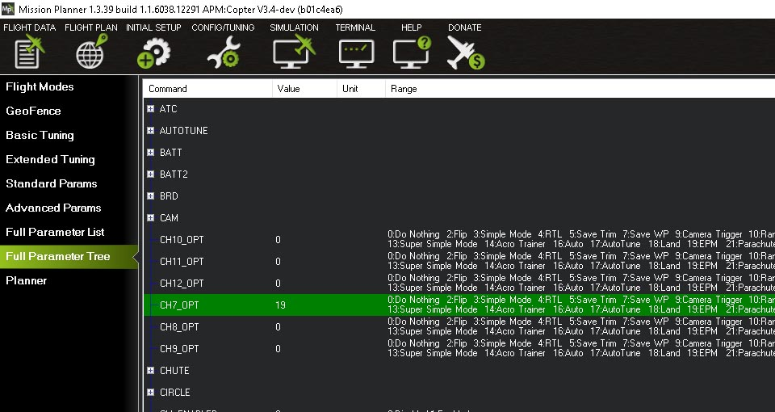

.. _common-electro-permanent-magnet-gripper:

=========================================
Electro Permanent Magnet Gripper (OpenGrab EPM v3)
=========================================

This article shows how to use the `Electro Permanent Magnet Gripper (OpenGrab EPM v3) <http://nicadrone.com/index.php?id_product=66&controller=product>`__
with ArduPilot.

`Problems issues feedback <mailto:Andreas@NicaDrone.com?Subject=Problems%20issues%20feedback>`__

Overview
========

The *OpenGrab EPM v3* (from NicaDrone.com) is a small (less than 4cm x 4cm x 2cm)
Electro Permanent Magnet gripper capable of 20kg of force meaning it can
hold about 15kg of cargo.  The gripping and releasing of the cargo if
accomplished by delivering a short pulse to an electromagnet which
reverses it's field.  Objects that it grips onto should be metal or have
the included `thin steel target square <http://nicadrone.com/index.php?id_product=15&controller=product>`__
attached to them.

The device accepts a standard PWM servo input or UAVCAN and uses a 5V power
supply.  Significant amounts of power are only required for about about 1
second when it first grips or releases the cargo.

`See demo **Video** of the product here <https://youtu.be/ggvm-GQxwaY>`__!

Usefull links
=============
`Documenation <https://docs.zubax.com/opengrab_epm_v3>`__

`PCB / Schematic <https://upverter.com/ctech4285/b9557d6903c36f55/OpenGrab-EPM-V3R4B/  ***Revision is printed on PCB>`__

`Source code <https://github.com/Zubax/opengrab_epm_v3>`__

`Store <http://NicaDrone.com>`__

Connecting to a Pixhawk via UAVCAN
==================================

Notes:

- When Vin of the EPM drops below 5V the EPM will go into low power mode. Slowing down switching to prevent crashing the power rail
- When Vin drops below 4.5V the green status LED will blink fast indicating an error condition
- The Pixhwak power rail voltage is <<5V
- External powering of the EPM is recommended see image above
- EPM UAVCAN cable set is required. `Clickmate -> DF13 <http://nicadrone.com/index.php?id_product=69&controller=product>`__
- UAVCAN requires termination, terminator included in UAVCAN cable set

Firmware setup
==============

1.       Download APM firmware `here: <https://files.zubax.com/3rdparty/APM/uavcan_epm/>`__
2.       Upload custom firmware via Mission Planner or QGC
 
***A pull request has been issued to include the changes in the next APM release. This documentation will be update when the request has been accepted. If this annoys you please write a comment `here <https://github.com/ArduPilot/ardupilot/pull/4361>`__

Parameter setup
===============

1.       Set BRD_CAN_ENABLE = 2 ( Enabled support for dynamic node ID allocation and firmware update.)

Save and restart the board. 
After about 5 seconds the RED CAN LED on the EPM will start blinking. Indicating that CAN frames are being received

.. image:: ../../../images/OpenGrabEPMV3_3.jpg
    :target: ../_images/OpenGrabEPMV3_3.jpg
    
2.       set CH7_OPT: Channel 7 option = 19 (EPM) (Channel 7 - 12 maybe used) 

    
All done, The EPM can be controlled via channal 7 or auto Mission or MAVLink command   

***auto Mission not tested

***MAVLink command not tested

Connecting to a Pixhawk via PWM header
======================================

Connect the EPM to the Pixhawk the same as a :ref:`servo <common-servo>`.

Parameter setup 
===============

***(not tested)

Set CH7_OPT: Channel 7 option = 19 (EPM) (Channel 7 - 12 maybe used) 

    
    
All done, The EPM can be controlled via channal 7 or auto Mission or MAVLink command     

Auto Mission
============

    Add a Do Gripper comamnd in your mission
    
    .. image:: ../../../images/OpenGrabEPMV3_7.jpg
    :target: ../_images/OpenGrabEPMV3_7.jpg
    
    
Magnetic interference and Board Voltage check
=============================================

The EPM can cause magnetic interference especially while gripping or
releasing the cargo or if left in the "on" state with no cargo
attached.  
Magnetic interferance is minimal at a distance of 10 cm

Testing the EPM impact on the compass is highly recomend when mounted close then 10 cm distance from flight computer

The EPM's impact on the compass can be tested in real-time by connecting
with the Mission Planner, go to the Flight Data screen and click on the
"Tuning" checkbox at the bottom, middle.  Double click on the graph that
appears on the top right and when the "Graph This" window appears select
"magfield".

Turning the EPM on and off and ensure the magfield length does not
change by more than 10%.

.. image:: ../../../images/mag_field.jpg
    :target: ../_images/mag_field.jpg
    
    

