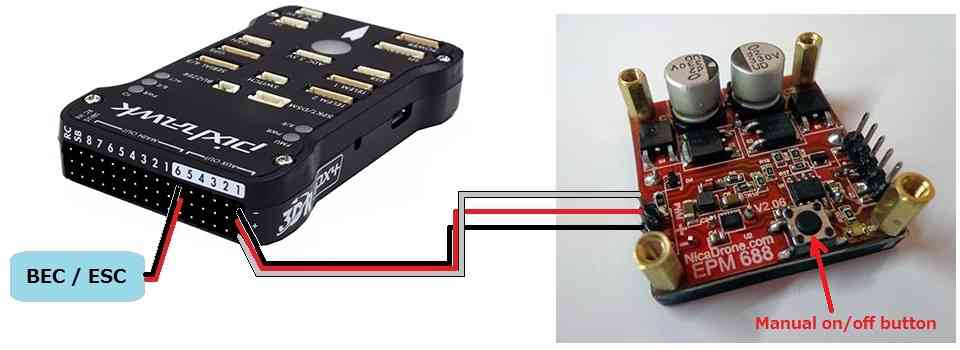
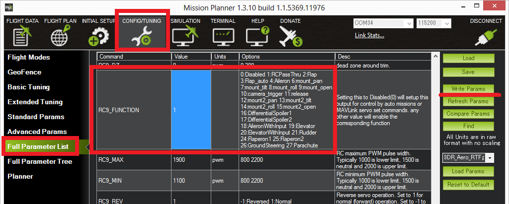
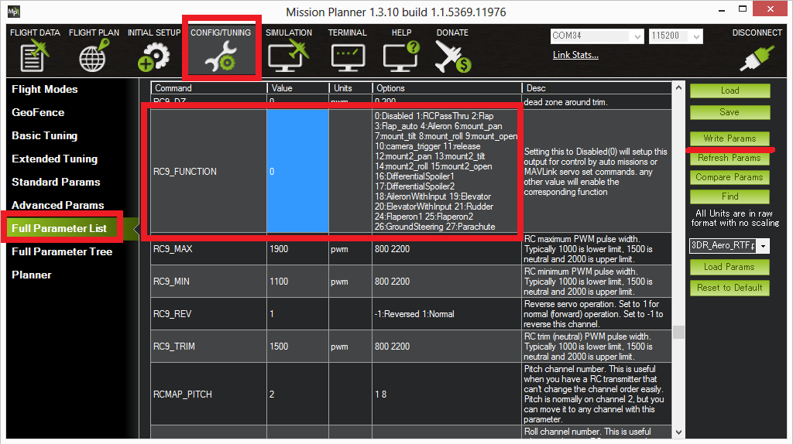
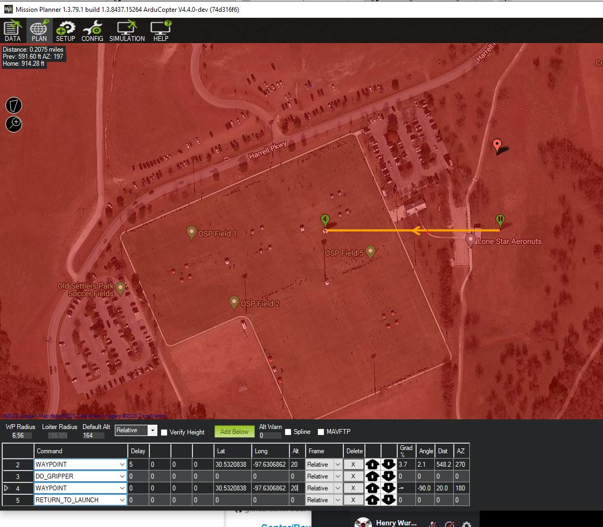
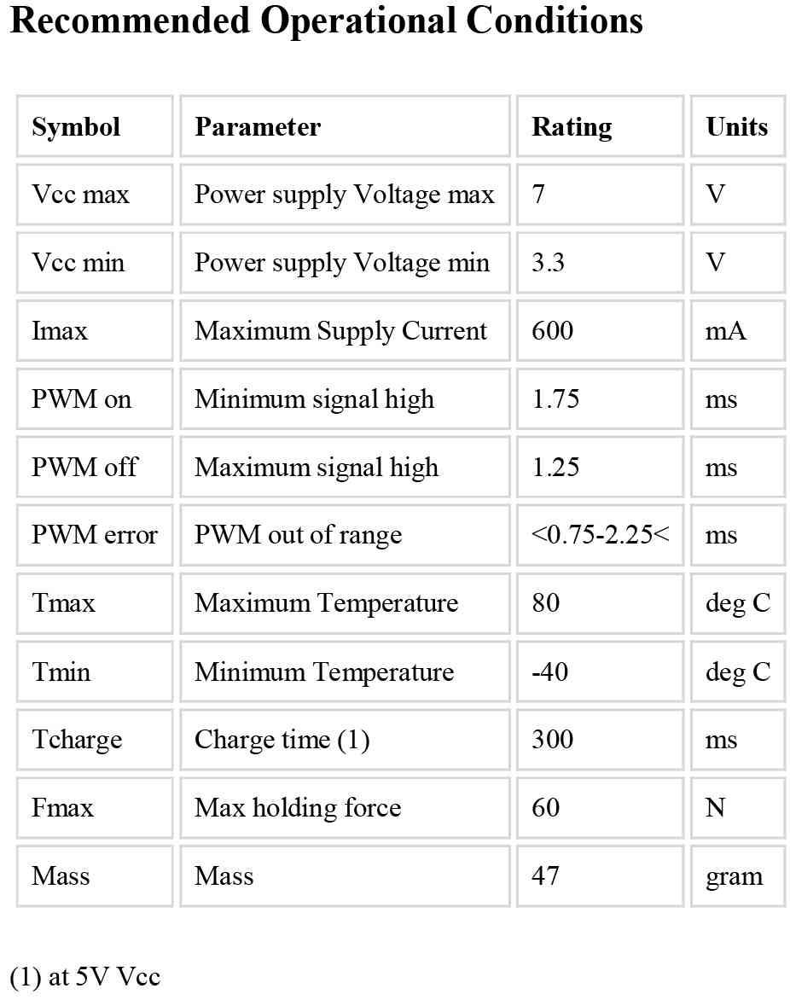

.. _common-electro-permanent-magnet-gripper:

=========================================
Electro Permanent Magnet Gripper (EPM688)
=========================================

This article shows how to use the `Electro Permanent Magnet Gripper (EPM688) <http://nicadrone.com/index.php?id_product=13&controller=product>`__
with ArduPilot.

Overview
========

The *EPM688* (from NicaDrone.com) is a small (less than 4cm x 4cm x 2cm)
Electro Permanent Magnet gripper capable of 7kg of force meaning it can
hold about 1kg of cargo.  The gripping and releasing of the cargo if
accomplished by delivering a short pulse to an electromagnet which
reverses its field.  Objects that it grips onto should be metal or have
the included `thin steel target square <http://nicadrone.com/index.php?id_product=15&controller=product>`__
attached to them.

The device accepts a standard PWM servo input and uses a 5V power
supply.  Significant amounts of power are only required for less than 1
second when it first grips or releases the cargo.

`See Kickstarter **Video** of the product here <https://www.kickstarter.com/projects/412473553/opengrab-open-hardware-electro-permanent-cargo-gri/widget/video.html>`__!

Connecting to a Pixhawk
=======================

The EPM is connected to the Pixhawk in the same way as a
:ref:`servo <common-servo>`.

-  If using Copter, Connect the EPM to AUX OUT 1, 2, 3 or 4.  MAIN OUT 1
   ~ 8 cannot be used because the EPM does not accept the 400hz update
   rate.  AUX OUT 5 an 6 cannot be used because they are reserved for
   :ref:`Relays <common-relay>`.
-  If using Plane or Rover where all pwm pins update at 50hz, any unused
   MAIN OUT or AUX OUT 1 ~ 4 may be used.
-  A BEC or ESC should be used that can provide 600milliamps of current
   at 5V for the short period that the gripper is first activated to
   latch onto the cargo.

Controlling from a transmitter using servo pass-through
=======================================================

Unfortunately with the latest versions of Copter, Plane and Rover the
EPM can be controlled either from the transmitter OR during missions. 
Either is possible but parameter changes are required meaning both
methods are not available during a single flight.  Below are
instructions for setting up manual control through a transmitter.

Control using the transmitter is accomplished by setting up "RC Pass
Through" which means the "input" channel from the transmitter is passed
through to the Pixhawk/APM's "output" channel of the same number.  For
Copter this means you must have a transmitter capable of 9 or more
channels because the EPM is connected to output ch9 (or higher).

Assuming the above is possible for your set-up, connect with the mission
planner.  Go to the Config/Tuning >> Full Parameters List and set the
:ref:`SERVO9_FUNCTION<SERVO9_FUNCTION>` (or RC9_FUNCTION) to "1" (i.e. "RCPassThru").  Note that if the EPM is
connected to AUX OUT 2 then :ref:`SERVO10_FUNCTION<SERVO10_FUNCTION>` should be set instead, etc.

On the transmitter set CH9 to be controlled from a 3-position switch and
the positions set as follows:

    -  *low position set to about **1100 pwm**.  This will release the
       cargo*
    -  *mid position set to about **1500 pwm**.  This is the neutral
       position, after pulling the switch high or low to grab or
       release, the switch should be returned to this position*
    -  *high position set to about **1900 pwm**.  This will activate the
       EPM so it grips onto the cargo.*

To grab onto the cargo, bring the cargo close to the EPM and momentarily
bring the switch high and then return the switch to neutral.

To release the cargo, momentarily bring the switch low and then return
it to neutral.

Note: the :ref:`Copter Ch7/Ch8 switch <copter:channel-7-and-8-options>`
includes options for the EPM but these unfortunately do not function
properly.

Note: it is also possible (if using an older style, non ppm-sum
receiver) to directly connect one signal wire from the receiver to the
EPM's PWM pin thus by passing the Pixhawk/APM2 completely.  The image
below shows the power line between the receiver and EPM connected but
this is not correct and is quite dangerous because power spikes could
pass through the receiver to the Pixhawk/APM2.  Only PWM and Ground
should be connected.  The EPM should be powered from a BEC (not shown
below).

.. image:: ../../../images/EPM-with-receiver.jpg
    :target: ../_images/EPM-with-receiver.jpg
    :width: 450px

Controlling during missions and from GCS
========================================

As mentioned above, the EPM can be controlled either through a
transmitter or from the ground station (including during missions,
aka \ :ref:`AUTO mode <copter:auto-mode>`) but
not both during the same flight. Below are instructions for setting up
control through the ground station.

Connect with the mission planner. Go to the Config/Tuning >> Full
Parameters List and set the :ref:`SERVO9_FUNCTION<SERVO9_FUNCTION>` (or RC9_FUNCTION) to "0" (its default value).
Note that if the EPM is connected to Pixhawk's AUX OUT 2 then
:ref:`SERVO10_FUNCTION<SERVO10_FUNCTION>` (or RC10_FUNCTION) should be set instead, etc.

Create the mission you wish to fly and add pairs of ``DO_SET_SERVO``
commands to grip or release the cargo and then return the EPM to
neutral.

-  "Ser No" should be set according to which output the EPM is connected
   to (i.e. "9" = Pixhawk's AUX OUT 1, "10" = APM2's RC10).
-  "PWM" should be set to **1100ms** to release the cargo, **1500ms** to
   return to neutral, and \ **1900ms** to grip the cargo.

In the example above the vehicle takes off to 20m, flies west 150m where
it delays for 5 seconds, releases the cargo, delays another 5 seconds
and then returns home.

In order to pick up the cargo before the mission begins, push the round
black button on the EPM to momentarily turn it on.  A cumbersome
alternative is to use the Mission Planner’s Flight Data screen's Servo
tab to momentarily set the output to 1900 pwm (i.e. "High" in the image
below) and then back to neutral (i.e. 1500 or "Low" in the image below).

.. image:: ../../../images/EPM_MPFlightData_ServoTab.jpg
    :target: ../_images/EPM_MPFlightData_ServoTab.jpg

Specifications and more info
============================

The EPM has an onboard PIC12F MCU with an in circuit programming header
to allow easy reflashing.

When first gripping or releasing the cargo it consumes 400mA for 0.4
seconds.  The majority of the energy is consumed to move the target into
place and the rest realigns the magnets.  The on-board LED will blink
rapidly 4 times when a switching cycle is being executed

On-board tactile push button: Allows toggle testing the EPM on/off 
having only the power connected

Full bridge Thyrisotor drive circuit increases efficiency and reduces
capacitor size .

Reduced magnetic interference allows mounting within 5cm of a compass
(please test it with your application)

- `Paper by Ara Nerses Knaian <http://www.hizook.com/files/users/3/Electropermanent_Magnets_Knaian.pdf>`__
- `Datasheet <http://nicadrone.com/img/Datasheet%20EPM688-V2.0.pdf>`__
- `Schematics and PCB files <https://upverter.com/eda/#tool=schematic,designId=5466622af0d942e4>`__
- `Git repository for Parts Drawing PCB Masks Pic12F source code <https://github.com/ctech4285/EPM_688_V2>`__
- `User Group (Help) <https://groups.google.com/forum/#%21forum/opengrab>`__

Magnetic interference and Board Voltage check
=============================================

The EPM can cause magnetic interference especially while gripping or
releasing the cargo or if left in the "on" state with no cargo
attached.  Make sure to mount the EPM at least 10cm from the flight
controller's compass.

The EPM's impact on the compass can be tested in real-time by connecting
with the Mission Planner, go to the Flight Data screen and click on the
"Tuning" checkbox at the bottom, middle.  Double click on the graph that
appears on the top right and when the "Graph This" window appears select
"magfield".

Turning the EPM on and off and ensure the magfield length does not
change by more than 10%.

.. image:: ../../../images/mag_field.jpg
    :target: ../_images/mag_field.jpg

In addition to magnetic interference, if a weak BEC is used a voltage
drop may be noticed.  For example the BEC in a 3DR ESC leads to a drop
of 0.4V when the EPM is activated.  This is normally not a concern
because the BEC should only be powering the servo rail of the
Pixhawk/APM2 and so the CPU's voltage should be unaffected.  This can be
tested by graphing the "hwvoltage" field in the same way the "magfield"
was checked above.  Ideally this test should be performed when connected
via :ref:`Telemetry <common-telemetry-landingpage>`\ because a USB cable
will also provide power the CPU and may hide any voltage disturbance.

User Video
==========

..  youtube:: _iyTo9H7HAk#t=190
    :width: 100%
