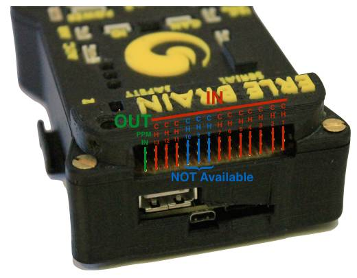
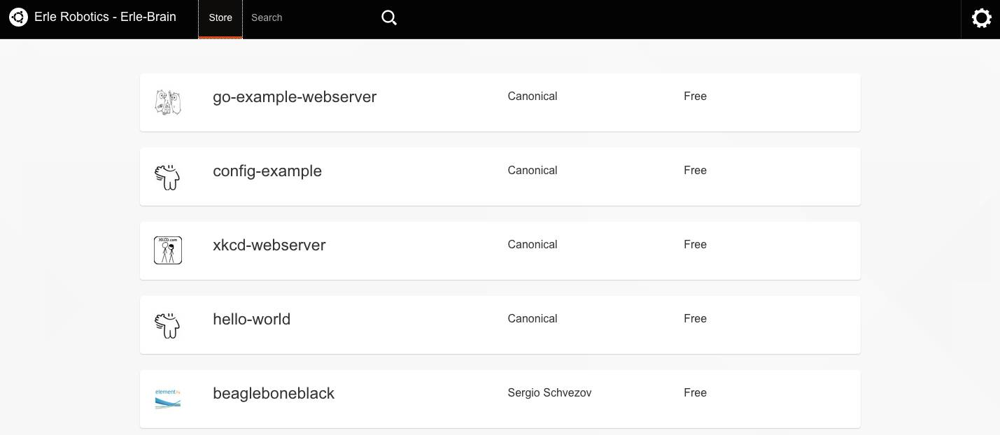

.. _common-erle-brain-linux-autopilot:

==========================================
Archived Topic: Erle-Brain Linux Autopilot
==========================================

This page presents the `Erle-Brain <https://erlerobotics.com/blog/product/erle-brain/>`__ Linux autopilot — an ArduPilot autopilot and :ref:`companion computer <dev:companion-computers>` in a single package.

Currently there are two versions of this Linux based Autopilot and a
shield:

-  *Erle-Brain 2*: The new generation of artificial robotic brains for drones and robots that use DroneCode Foundation Tools, ROS and many other tools.
-  *PXFmini*: An open autopilot shield for the Raspberry Pi, :ref:`placed here  <common-pxfmini>`.
-  *Erle-Brain 1 (*Discontinued*)*: The first Open-Source Linux Autopilot that runs ArduPilot and ROS natively.

Erle-Brain based drones can be assembled as discussed in the `official documentation <https://erlerobotics.com/docs/Robots/Erle-Copter/index.html>`__.
Erle-Brain based drones can also be purchased from the Erle Robotics
official store in both `ready to use <https://erlerobotics.com/blog/product-category/robots/>`__ and `DIY kit <https://erlerobotics.com/blog/product-category/robots/kits/>`__
form.

Erle-Brain 2
============

`Erle-Brain 2 <https://erlerobotics.com/blog/product/erle-brain-v2/>`__
is the second generation of Linux-based artificial robotic brain for
making robots and drones with official support for the Robot Operating
System (ROS) and access to the app store.

It combines an embedded Linux computer (Raspberry Pi 2) and a daughter board containing several sensors, IO and power electronics. It is a Linux embedded device that runs ArduPilot as well many other frameworks and services for robotic application development.

Some *Erle-Brain 2* features include:

-  Linux File Systems (`Debian and Ubuntu Snappy Core <https://erlerobotics.gitbooks.io/erle-robotics-erle-brain-a-linux-brain-for-drones/content/en/software/update.html>`__)
-  WiFi-enabled
-  ROS focus (Indigo available)
-  `ROS packages <https://github.com/erlerobot?utf8=%E2%9C%93&query=ros>`__
   for sensors and peripherials
-  `DroneKit-Python <http://python.dronekit.io/>`__ support
-  Snappy Ubuntu app store supported
-  MAVProxy can automatically bridge MAVLink packets to your WiFi
   network.
-  Sensors: Gravity sensor, gyroscope, digital compass, Pressure sensor
   and tempertature sensor, ADC for battery sensing.
-  Optional WiFi and Bluetooth.
-  Optional Camera: MP Fixed focus lens, 2592 x 1944 pixel static
   images, supports 1080p30, 720p60 and 640x480p60/90 video record.

The following images show the main ports/features available to
Erle-Brain version 2.

.. image:: ../../../images/erlebrain2_2.jpg
    :target: ../_images/erlebrain2_2.jpg

The next image shows the software characteristics that Erle-Brain 2 can
handle:

   Erle-Brain v2Development Stack

Quick start
-----------

The easiest way to get started is to SSH into Erle-Brain 2 and play
around with it:

If connected by WiFi:
~~~~~~~~~~~~~~~~~~~~~

::

    #password is holaerle.
    $ ssh erle@erle-brain-2.local

If connected by Ethernet
~~~~~~~~~~~~~~~~~~~~~~~~

::

    #password is holaerle.
    $ ssh erle@erle-brain-2.local
    #Use ifconfig and nmap -sn commands to check the net 
    $ ssh erle@192.168.*.*
    #password is holaerle.

Get more info in `our docs <http://erlerobotics.com/docs/Artificial_Brains_and_Autopilots/Erle-Brain_2/Intro.html>`__

Erle-Brain can be purchased from the \ `Erle Robotics store <https://erlerobotics.com/blog/product/erle-brain-v2/>`__.

Hardware setup
--------------

Typical hardware setup for flying drones is:

.. image:: http://erlerobotics.com/docs/img/Artificial_Brains/Erle_Brain2/Hardware/Erle-Brain_Componentes.jpg
    :target: ../_images/Erle-Brain_Componentes.jpg

If you wish more info about hardware connections, go to our
`docs <http://erlerobotics.com/docs/Artificial_Brains_and_Autopilots/Erle-Brain_2/Hardware/Typical_Hardware_Setup.html>`__

Building ArduPilot on Erle-Brain 2
----------------------------------

Run the following instructions in the bash command prompt to build ArduPilot on Erle-Brain 2:

::

    $ git clone https://github.com/erlerobot/ardupilot
    $ cd ardupilot
    $ git submodule update --init --recursive

::

    $ cd ArduCopter

::

    $ make erlebrain2 -j4

Camera
------

Camera images are fed into ROS directly using the ``raspicam_node`` that
it's automatically launched. To be able to see the images, in your
Erle-Brain 2:

::

    $ rosservice call /camera/start_capture

On you Desktop computer (or wherever you wish to visualize the images),
and after configuring appropriately the ``ROS_MASTER_URI`` environmental
variable:

::

    $ rosrun image_view image_view image:=/camera/image _image_transport:=compressed

Erle-Brain can be purchased from the `Erle Robotics store <https://erlerobotics.com/blog/product/erle-brain-v2/>`__.

Erle-Brain 1 (*Discontinued*)
=============================

*Erle-Brain* combines an embedded Linux computer (the BeagleBone Black)
and the PixHawk Fire cape — a daughter board containing several sensors,
IO and power electronics. It is an open hardware Linux embedded
device that runs ArduPilot as well many other frameworks and services for
robotic application development.

.. image:: ../../../images/Captura-de-pantalla-2015-04-03-a-las-11.00.37.jpg
    :target: ../_images/Captura-de-pantalla-2015-04-03-a-las-11.00.37.jpg

Some *Erle-Brain* features include:

-  Linux File Systems (`Debian and Ubuntu Snappy Core <https://erlerobotics.gitbooks.io/erle-robotics-erle-brain-a-linux-brain-for-drones/content/en/software/update.html>`__)
-  WiFi-enabled
-  ROS focus (Hydromedusa and Indigo available)
-  `ROS packages <https://github.com/erlerobot?utf8=%E2%9C%93&query=ros>`__
   for sensors and peripherals
-  `DroneKit-Python <http://python.dronekit.io/>`__ support
-  Snappy Ubuntu app store supported
-  MAVProxy can automatically bridge MAVLink packets to your WiFi
   network.
-  3 IMUs (LSM9D, MPU9250, MPU6000)

Erle-Brain can be purchased from the \ `Erle Robotics store <https://erlerobotics.com/blog/product/erle-brain/>`__.

..  youtube:: ZbcIjelaFgM
    :width: 100%

Quick start
-----------

The easiest way to get started is to SSH into Erle-Brain and play around
with it:

If connected by WiFi:
~~~~~~~~~~~~~~~~~~~~~

::

    $ ssh 11.0.0.1

If connected by USB:
~~~~~~~~~~~~~~~~~~~~

::

    $ ssh 192.168.7.2

Hardware setup
--------------

General setup
~~~~~~~~~~~~~

RC out and in
~~~~~~~~~~~~~

\ |PWM_setup|

Please note that the GND is in the lower pin of the header:

.. image:: ../../../images/PWMsetup.jpg
    :target: ../_images/PWMsetup.jpg

Connecting the D4R-II receiver
~~~~~~~~~~~~~~~~~~~~~~~~~~~~~~

Many might be interested in using this popular receiver so here's an
image that shows how to do it:

.. image:: ../../../images/RCsetup.jpg
    :target: ../_images/RCsetup.jpg

Building ArduPilot on Erle-Brain
--------------------------------

Run the following instructions in the bash command prompt to build ArduPilot on Erle-Brain:

::

    $ sudo apt-get install gawk gcc-arm-linux-gnueabihf g++-arm-linux-gnueabihf

::

    $ git clone https://github.com/erlerobot/ardupilot
    $ cd ardupilot
    $ git submodule update --init --recursive

::

    $ cd ArduCopter

::

    $ make configure

::

    $ make pxf

Snappy Ubuntu Core store
========================

Erle-Brain comes with full support for `Snappy Ubuntu Core <http://www.ubuntu.com/internet-of-things>`__. Just fetch one of the `available images <http://erlerobotics.com/docs/Artificial_Brains_and_Autopilots/Operating_System_images/Ubuntu.html>`__
(for the microSD card) and start developing *snaps*.

.. note::

       Snappy Ubuntu Core is a new rendition of Ubuntu with transactional
       updates - a minimal server image with the same libraries as today’s
       Ubuntu, but applications are provided through a simpler mechanism.
       The snappy approach is faster, more reliable, and lets us provide
       stronger security guarantees for apps and users — that’s why we call
       them “snappy” applications.

   |Captura de pantalla 2015-04-03 a las 11.39.07| 

Snappy "hello world" example
----------------------------

The bash commands below show how to install and run a basic "Hello
World" app using *Snappy*:

::

    $ snappy-go install hello-world

::

    $ echo.hello-world.canonical 
    Hello World!

Additional information about Snappy Ubuntu Core can be found
`here <https://erlerobotics.gitbooks.io/erle-robotics-erle-brain-a-linux-brain-for-drones/content/en/store/appinstall.html>`__.

DroneKit
--------

3DR's Python DroneKit runs perfectly in Erle-Brain. Full documentation
for the Kit and API can be found at the
`python.dronekit.io <http://python.dronekit.io/>`__.

The commands below summarise how to install the kit and its dependencies
on Erle-Brain:

::

    $ sudo apt-get install pip python-numpy python-opencv python-serial python-pyparsing python-wxgtk2.8

::

    $ sudo pip install droneapi

DroneKit "hello world" example
------------------------------

::

    # fetch the code
    $ git clone https://github.com/ArduPilot/droneapi-python.git

    $ cd droneapi-python/example

    # Start MAVProxy (install if not present)
    $ mavproxy.py --master=udp:192.168.7.2:6000

    MANUAL> module load droneapi.module.api 
    DroneAPI loaded 
    MANUAL>

Now run the example:

::

    MANUAL> api start small_demo.py
    Mode: VehicleMode:MANUAL
    Location: Location:lat=21.2938874,lon=-157.8501416,alt=0.189999997616,is_relative=None
    Attitude: Attitude:-0.286077767611,-3.01412272453,0.261489063501
    GPS: GPSInfo:fix=1,num_sat=0
    Param: 75.0
    waiting for download
    Requesting 10 waypoints t=Mon Mar 31 09:41:39 2014 now=Mon Mar 31 09:41:39 2014
    Home WP: MISSION_ITEM {target_system : 255, target_component : 0, seq : 0, frame : 0, command : 16, current : 1, autocontinue : 1, param1 : 0.0, param2 : 0.0, param3 : 0.0, param4 : 0.0, x : 21.2921352386, y : -157.848922729, z : 89.1800003052}
    APIThread-0 exiting...
    APM: Non-Nav command ID updated to #255 idx=1
    waypoint 1
    AUTO>

Further documentation
=====================

More information about Erle-Brain is available in `its official documentation <http://erlerobotics.com/docs/>`__ or from `Erle Robotics forum <http://forum.erlerobotics.com>`__.

[site wiki="planner"]

.. toctree::
    :maxdepth: 1

    Erle-Brain2 Wiring Quick Start <common-erle-brain2-wiring-quick-start>
[/site]

