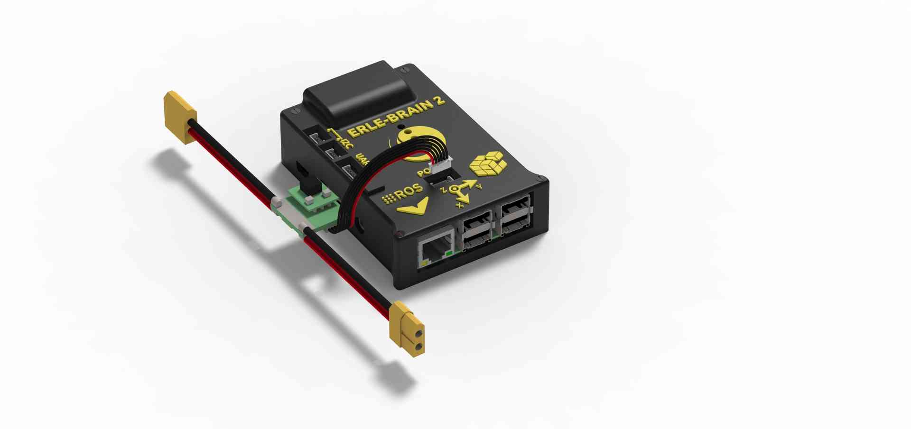
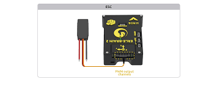
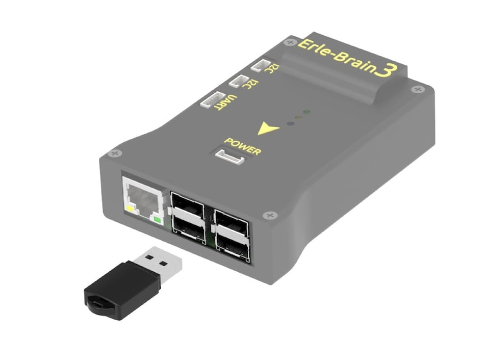

.. _common-erle-brain2-wiring-quick-start:

==============================================
Archived Topic: Erle-Brain2 Wiring Quick Start
==============================================

This article provides high level information about how to power
:ref:`Erle-Brain2 <common-erle-brain-linux-autopilot>` and connect its most
important peripherals.

.. _common-erle-brain2-wiring-quick-start_erle-brain2_wiring_chart:

Erle-Brain2 Wiring Chart
========================

.. image:: ../../../images/EB2_chart.jpg
    :target: ../_images/EB2_chart.jpg

[site wiki="copter"]
Copter users should also see the 
`official setup documentation <http://docs.erlerobotics.com/erle_robots/erle_copter>`__.
[/site]

Power Erle-Brain2
=================

Erle-Brain2 is typically powered via its "power" port, as shown in the
picture below. The power port simultaneously powers Erle-Brain2 and
reads voltage and current analog measurements.

Additionally, for developing/configuration purposes, it can be powered
using a micro USB charger (2A recommended), as shown in the below
picture.

.. image:: ../../../images/Erle-Brain_MiniUSB.jpg
    :target: ../_images/Erle-Brain_MiniUSB.jpg

.. warning::

   Always use a power module to feed Erle-Brain2 while flying your
   drone

Connect remote control inputs
=============================

Erle-Brain2 is compatible with PPM remote control (RC) receivers. For
traditional single-wire-per-channel (PWM) receivers a PPM encoder can be
used to convert the receiver outputs to PPM-SUM.

For more information see :ref:`Compatible RC Transmitter and Receiver Systems (Erle-Brain 2) <common-compatible-rc-transmitter-and-receiver-systems-erle-brain-2>`.

.. figure:: ../../../images/FRSkyTaranis.jpg
   :target: ../_images/FRSkyTaranis.jpg

   FRSky Taranis Transmitter

GPS+Compass
===========

The `uBlox GPS + Compass Module <https://erlerobotics.com/blog/product/gpscompass-ublox-neo-m8n-gps-with-compass-kit/>`__
is the recommended GPS for Erle-Brain2. The GPS port is connected with
the six-position DF13 cable, and the Compass port is connected to the
I2C port with the four-position DF13 cable, as shown in the 
:ref:`wiring chart above <common-erle-brain2-wiring-quick-start_erle-brain2_wiring_chart>`.

Connect Motors
==============

.. note::

   Be aware of how you connect ESCs wires to PWM rail. The signal
   wire (white or orange color) should be connected at the top, the ground
   wire (black or brown color) at the bottom.

[site wiki="copter"]

For Copter see :ref:`Connect ESCs and Motors <copter:connect-escs-and-motors>`.

In overview, for copters connect each signal wire from the PDB to the
main output signal (S) pins by motor number:

-  Pin 1 = Motor 1 - - Pin 5 = Motor 5
-  Pin 2 = Motor 2 - - Pin 6 = Motor 6
-  Pin 3 = Motor 3 - - Pin 7 = Motor 7
-  Pin 4 = Motor 4 - - Pin 8 = Motor 8

[/site]

[site wiki="plane"]

For planes connect the control channel wires to the main output signal
pins:

-  Pin 1 = Aileron
-  Pin 2 = Elevator
-  Pin 3 = Throttle
-  Pin 4 = Rudder

[/site]

[site wiki="rover"]

For Rovers connect the throttle and steering wires to the main output
signal pins:

-  Pin 3 = Throttle
-  Pin 1 = Steering

[/site]

USB ports
=========

Erle-Brain2 has four USB ports. Some of the devices you can connect are
listed in the following section.

WiFi dongle
-----------

Use a (regular or high gain) WiFi dongle to create a hotspot that can,
for example, be used for sending telemetry data and commands to a Ground
Station. Erle-Brain2 automatically generates a WiFi hotspot when the
dongle is connected.

.. note::

   Edimax AC (regular and high gain) are the officially supported
   dongles. These can be purchased from Erle-Brain with your
   autopilot/vehicle.

Bluetooth dongle
----------------

Use a Bluetooth dongle to connect additional devices, such as joysticks.

.. note::

   You will need to configure BlueTooth interface to make it
   work

Connect other peripherals
=========================

Depending on your hardware there may be any number of other peripherals
attached, including sensors, cameras, grippers etc. These can be found
as sub-pages of the topic :ref:`Optional Hardware <common-optional-hardware>`.

More information in `official documentation <http://erlerobotics.com/docs/Artificial_Brains_and_Autopilots/Additional_Sensors/Lidar.html>`__.

Related information
===================

`Erle Robotics official documentation <http://docs.erlerobotics.com/>`__ includes
additional information about how to use Erle-Brain2.

.. toctree::
    :maxdepth: 1

    Compatible RC Transmitter and Receiver Systems (Erle-Brain 2) <common-compatible-rc-transmitter-and-receiver-systems-erle-brain-2>

