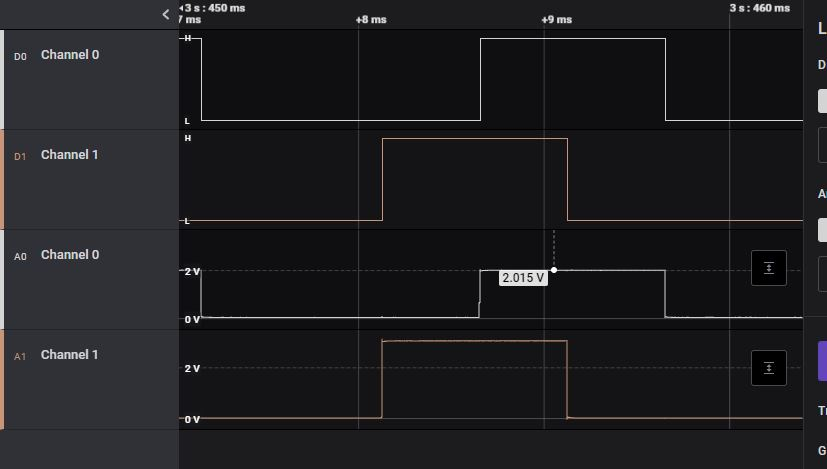
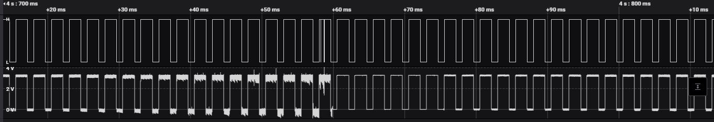
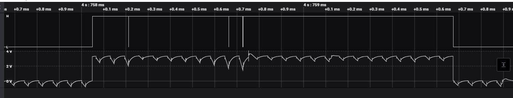

.. _common-esc-issues:

=====================
ESC Signalling Issues
=====================

This page discusses several potential issues with ESC signaling that can result in unreliable operation or even crashes on takeoff. These primarily occur with larger QuadPlanes that have long runs to their ESCS from power and the autopilot.

Inadequate Signaling Level
==========================

Most autopilots use TTL/CMOS compatible signaling on their outputs, but usually only at 3.3V levels. This can ultimately result in poor signaling waveforms or levels at the ESC, resulting in unreliable operation. Contributing factors to that are:

- High impedance (either resistive or reactive) wiring runs
- ESC input loading is too heavy

For large, high-value vehicles, its always good to check the ESC signal levels for each ESC with a scope to assure clean signaling. This is best done with a ground runup to at least 70% throttle, either physically securing the vehicle or mounting its props reversed temporarily.

Below is an example scope trace for two ESC signals for ESCs presenting too high an input load or too much wiring resistance. As shown, the second ESC's analog level is about 3V, which is a little marginal, but the first ESC trace is only about 2V and is too low for reliable operation.

It is also possible to see poor rise and fall times, but with adequate voltage levels due to high reactance in the connection. This will also affect timing and performance and should be corrected.

Possible Solutions:
-------------------

- lower wiring impedance with larger wiring or shorter runs
- use ESCs that do not present such high input loading
- add buffers to autopilot outputs to provide 5v signaling and higher drive currents
- some autopilots have the option of increasing their signal levels from 3.3V to 5V using the :ref:`BRD_PWM_VOLT_SEL<BRD_PWM_VOLT_SEL>` = 1. See the following list of autopilots that support this:

Autopilots with :ref:`BRD_PWM_VOLT_SEL<BRD_PWM_VOLT_SEL>`
~~~~~~~~~~~~~~~~~~~~~~~~~~~~~~~~~~~~~~~~~~~~~~~~~~~~~~~~~

- :ref:`CubeOrange<common-thecubeorange-overview>`
- :ref:`CubeYellow<common-thecubeyellow-overview>`
- `mRo Control Zero Classic <https://store.mrobotics.io/product-p/m10048d.htm>`__
- :ref:`mRo Pixracer Pro<common-pixracer-pro>`

Induced Noise
=============

On large vehicles, the power or motor phase lines usually run in parallel with the signal lines which provides an opportunity for high frequency noise coupling. This can sometimes drastically impair the ESC operation as show below in this video:

.. youtube:: oZ2iVPXEjEg

Here are scope traces of the above situation:

As the current ramps, noise is being induced into the analog signal until it finally is corrupt enough to be interpreted by the ESC as shutdown pulse width, which it does, allowing the signaling to recover and repeat the cycle.

Expanding the section where the shutdown occurs, you can see that the analog signal finally gets noisy enough for its digital logic level to be incorrectly interpreted.

Solutions
---------

- Physically separate the signal wiring from the power wiring to the ESCs
- Place a small toroidal choke (designed for the 1-10MHz range) in each ESC signal line
- Add capacitor banks to power inputs of ESC. See next section.

ESC Overvoltage Spikes
======================

Long power cabling runs from the battery to the ESC on larger vehicles can produce large voltage spikes due to the lead inductance. These spikes not only increase noise, increasing the potential for noise coupling to the signal control lines of the ESC, but also can be potentially directly damaging to the ESC. This can be reduced or eliminated by adding low ESR capacitance at the ESC power inputs. An example of the typical capacitor bank for these applications is offered by `Advanced Power Drives <https://powerdrives.net/cap-bank>`__.