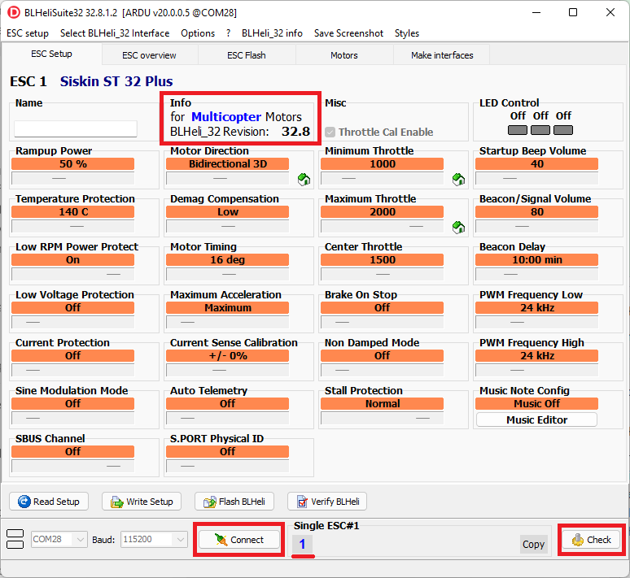

.. _common-esc-telemetry:

=============
ESC Telemetry
=============

.. _blheli32-esc-telemetry:

If the ESC has this capability, it allows monitoring and logging of performance data that previously required additional sensors (like power modules and RPM sensors). The detailed data provided by every ESC allows real-time decisions and individual ESC or motor performance tuning and failure analysis. Note that a given ESC may or may not have a specific sensor type's data transmitted via telemetry. It is common for 4 in 1 escs to provide voltage and current sensors but not transmit the data via telemetry, but rather by direct connection to the autopilot. Check the ESC data sheet and connection information for details.

Telemetry data may be conveyed to the autopilot either by a separate wire connection to an autopilot's UART RX pin or across the signal wire used to convey motor speed information (Bi-Directional DShot) or CAN messages for CAN based ESCs. For non-CAN ESCs, this capability is available primarily in selected BLHeli ESCs running stock or BlueJay firmware. But it is possible for an ESC not to implement the BLHeli firmware and still provide this capability. Currenly, ArduPilot only supports this for BLHeli/BlueJay telemetry compatible ESCs.

ESC telemetry of motor rpm is especially useful for controlling the center frequency of harmonic notch filters to control noise. See :ref:`common-esc-telem-based-notch` for more information.

.. note:: ArduPilot does not currently support the polling of the ESCs for telemetry data via throttle idle messages over the signal line in non DShot protocols.

Connecting the ESCs Telemetry wire
==================================

.. image:: ../../../images/dshot-pixhawk.jpg
    :target: ../_images/dshot-pixhawk.jpg
    :width: 600px

Connect all ESC telemetry wires to a single serial port's RX pin on the autopilot (above diagram uses Serial5 as an example).  A pin or wire for ESC telemetry is pre-soldered on most BLHeli32 ESCs. If the wire isn't pre-soldered you will need to solder it yourself. CubePilot serial port pinsouts can be found :ref:`here <common-thecube-overview>`.

Set the following parameters to enable BLHeli32 telemetry feedback to the autopilot's serial port:

- :ref:`SERIALx_PROTOCOL <SERIAL5_PROTOCOL>` 16 (= ESC telemetry) where "x" is the autopilot serial port number connected to the ESCs telemetry wire.  The mapping between serial port numbering and UART physical ports for you autopilot should be documented in its description page linked :ref:`here <common-autopilots>`.

- :ref:`SERVO_BLH_TRATE <SERVO_BLH_TRATE>` defaults to 10 and normally does not need to be changed. this enables telemetry at a 10Hz update rate from the ESC.  If using the :ref:`harmonic notch feature <common-imu-notch-filtering>` this can be raised to 100.

- :ref:`SERVO_BLH_POLES <SERVO_BLH_POLES>` defaults to 14 which applies to the majority of brushless motors and normally does not need to be changed.  Adjust as required if you're using motors with a pole count other than 14 to calculate true motor shaft RPM from ESC's e-field RPM.

.. note:: using the rpm value reported using single wire telemetry for the center frequency adjustment of the :ref:`harmonic notch feature <common-imu-notch-filtering>`  works well, but the responsiveness is slower than using telemetry provided by Bi_directional DShot. See  next section.

Bi-directional DShot
====================

Newer versions of BLHeli32 (32.7 and higher) and BLHeli_S (16.73 and higher) support returning motor RPM values over the DShot signal line. Supporting bi-directional DShot requires exclusive use of one or more DMA channels and thus not all autopilots support it. Versions that support bi-directional DShot have this stated in their wiki pages, see :ref:`common-autopilots` for your autopilot.

Some autopilots with IOMCUs can not only support Dshot on their "Main" outputs (see :ref:`common-dshot-escs` for setup and more information), but also bi-directional DShot on their first four outputs. Currently, this is limited only to Pixhawk6X/C autopilots.

Setup
-----

First ensure that you have an appropriate version of BLHeli32 or BLHeli_S installed on your ESCs. The majority of ESCs do not come pre-installed with these versions. The official 32.7 version of BLHeli32 supports bi-directional DShot. Official versions of BLHeli_S do not support bi-directional DShot, you will need to either buy a version from `BLHeli_S JESC <https://jflight.net/index.php?route=common/home&language=en-gb>`__ or use `BLHeli_S BlueJay <https://github.com/mathiasvr/bluejay>`__ . If you try and enable bi-directional DShot with the wrong firmware version then unpredictable motor operation can occur. ESC rpm telemetry is especially useful for controlling the center frequencies of harmonic notch noise filters, see :ref:`common-esc-telem-based-notch`

Set the following parameters to enable BLHeli32 and BLHeli_S bi-directional DShot:

- :ref:`SERVO_BLH_BDMASK <SERVO_BLH_BDMASK>`: a bitmap used to enable BLHeli32 or BLHeli_S bi-directional DShot support. On autopilots without IOMCU this would normally be set to 15 to indicate four active channels. On autopilots with an IOMCU this can be set to 3840 to indicate four active AUX channels (bi-directional DShot will only work on the AUX outputs).

- :ref:`SERVO_BLH_POLES <SERVO_BLH_POLES>` defaults to 14 which applies to the majority of brushless motors and normally does not need to be changed. Adjust as required if you're using motors with a pole count other than 14 to calculate true motor shaft RPM from ESC's e-field RPM (small motors might have 12 poles).

- :ref:`SERVO_DSHOT_ESC<SERVO_DSHOT_ESC>` must be set to the type of Dshot ESC you are using.

ESC Telemetry Logging and Reporting
===================================

The autopilot requests status information from one ESC at a time, cycling between them. This information is logged to the onboard log's ESCn messages and can be viewed in any :ref:`ArduPilot compatible log viewer <common-logs>`.

- RPM
- Voltage
- Current
- Temperature
- Total Current

The RCOU messages are also written to the onboard logs which hold the requested output level sent to the ESCs expressed as a number from 1000 (meaning stopped) to 2000 (meaning full output).

This data can also be viewed in real-time using a ground station.  If using the Mission Planner go to the Flight Data screen's status tab and look for esc1_rpm.

.. image:: ../../../images/dshot-realtime-esc-telem-in-mp.jpg
    :target: ../_images/dshot-realtime-esc-telem-in-mp.jpg
    :width: 450px

.. note::

   Sending BLHeli32 telemetry data to the GCS requires the telemetry connection use MAVLink2.  ArduPilot uses MAVLink2 by default on the USB port but if another port is used it may be necessary to set the SERIALx_PROTOCOL parameter to 2 (where "x" is the serial port number used for the telemetry connection).

In addition, some telemetry values can be displayed on the integrated :ref:`on-board OSD <common-osd-overview>`, if your autopilot has one.

.. _esc-telemetry-based-battery-monitor:

Use as Battery Monitor
======================

By setting a battery monitor instance to BLHeli32 ESC type (for example :ref:`BATT2_MONITOR<BATT2_MONITOR>` = 9), all connected BLHeli32 ESCs with connected telemetry wiring to the configured autopilot serial port, will be aggregated as a single source. The voltages reported will be averaged, the currents totaled, and the consumed current accumulated.

.. _bidir-dshot:

