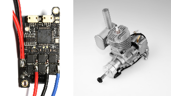

.. _common-escs-and-motors:

===============
ESCs and Motors
===============

ArduPilot supports a wide variety of ESCs and motors.  The pages below provide setup instructions for the most popular types

.. toctree::
    :maxdepth: 1

    Brushless ESC Related Configuration <common-dshot>
[site wiki="copter,rover"]
    Brushed motors <common-brushed-motors>
[/site]
[site wiki="copter"]
    Booster motor <booster-motor>
[/site]
    Brushless ESCs <common-brushless-escs>
    ICE (Internal Combustion Engines) <common-ice>
    KDE CAN ESCs <common-kde-can-escs>
[site wiki="rover"]
    Thrusters (for boats) <thrusters>
[/site]
    Toshiba CAN ESCs <common-toshiba-can-escs>
[site wiki="rover"]
    Trolling motors <trolling-motor>
[/site]
    UAVCAN ESCs <common-uavcan-escs>
