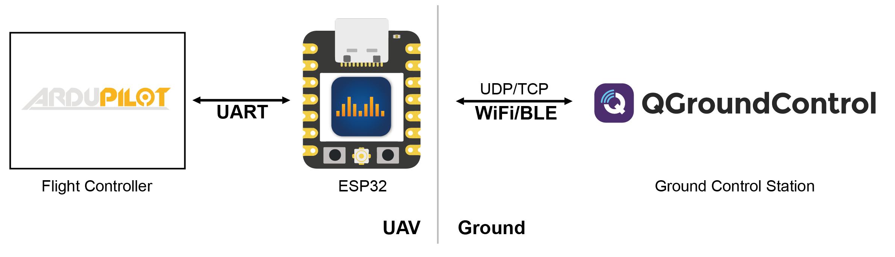
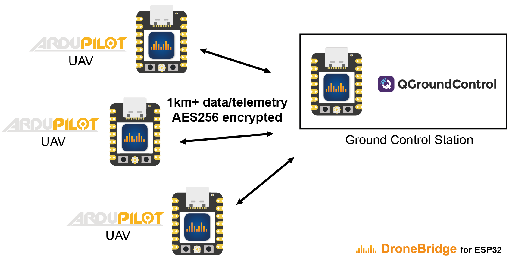
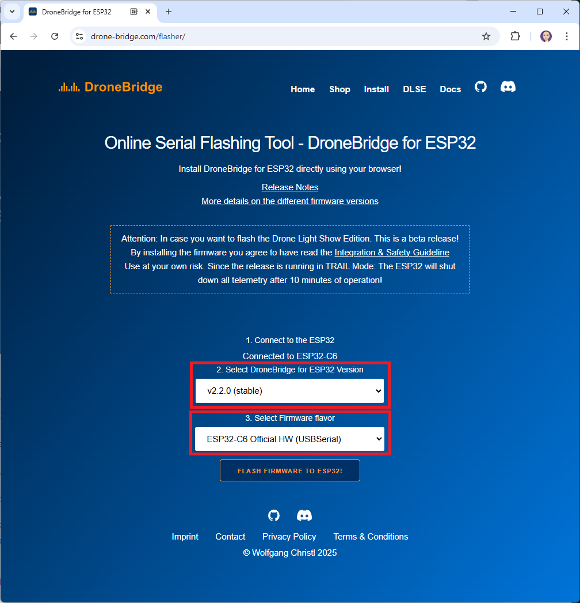
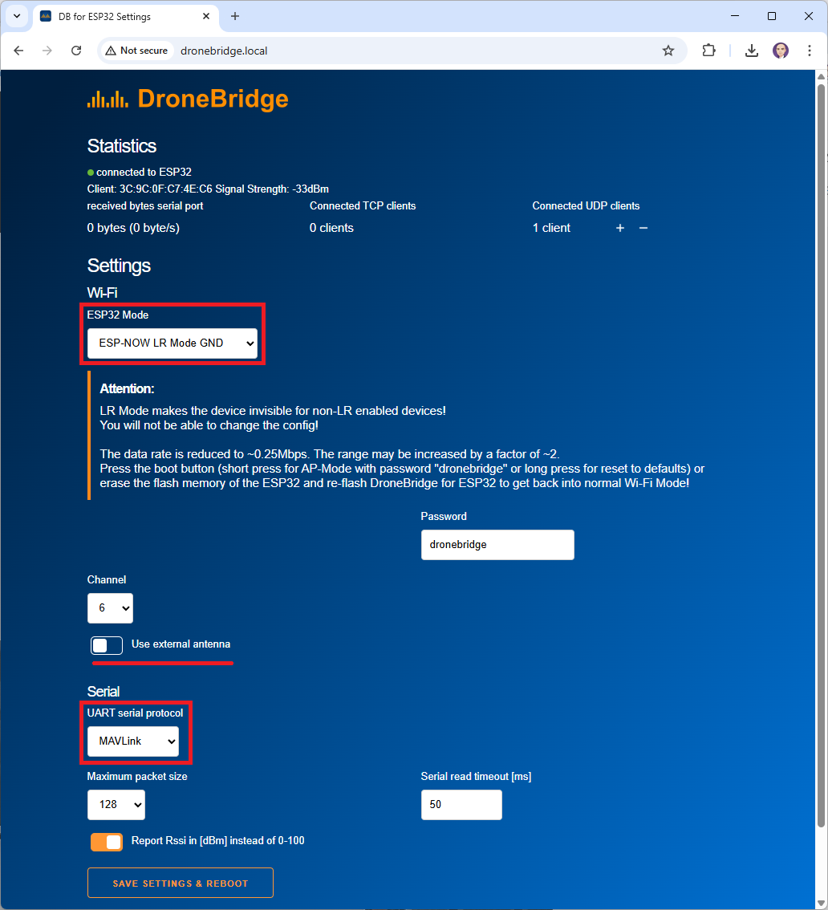
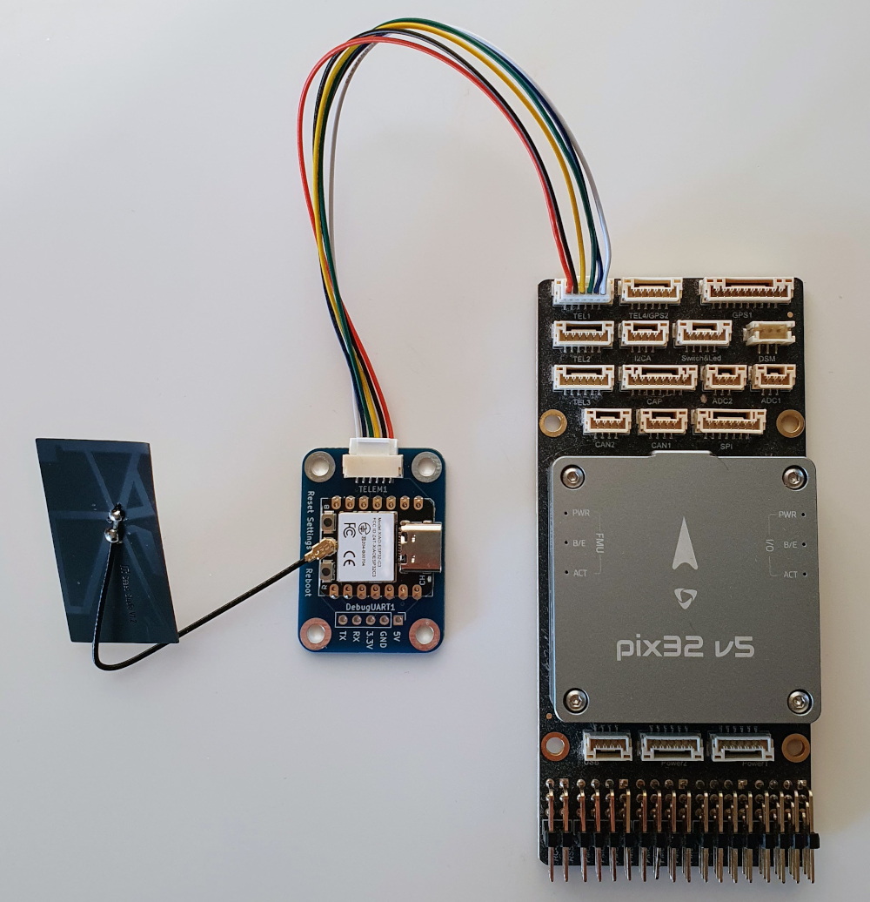
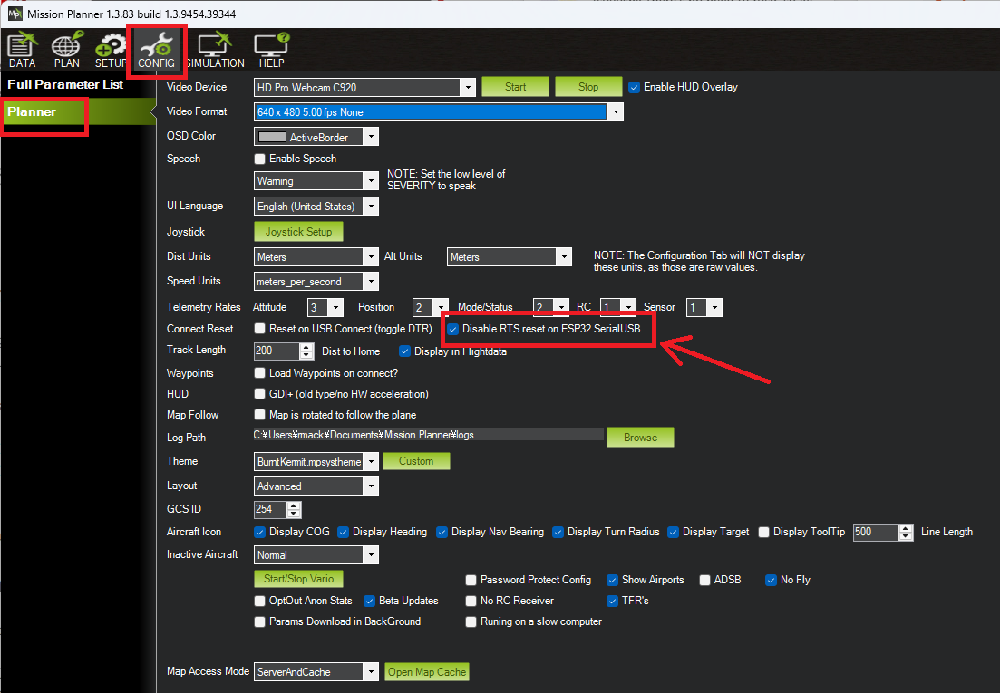

.. _common-esp32-telemetry:
[copywiki destination="plane,copter,rover,blimp,sub"]
=====================
DroneBridge for ESP32
=====================

**DroneBridge for ESP32** allows an ESP32 to be used as a bi-directional telemetry radio using Wifi or Bluetooth LE at ranges up to 1km.

DroneBridge for ESP32 supports standard WiFi connections to an access point but can also operate as a standalone access point.

Three operating modes are available:

- Standard Wifi has a range of 150m+
- ESP-NOW mode offers a connectionless and encrypted alternative to traditional WiFi. While the data rate is reduced to ~250 kbit/s the range is increased up to 1 km. This mode has no limit on how many clients are connected on the autopilot side. Only channel capacity and processing capacity limit the number of clients. This mode requires ESP32 devices on the GCS side as well as on the autopilot side.
- `Drone Light Show Edition <https://dronebridge.gitbook.io/docs/dronebridge-for-esp32-drone-light-show-edition/overview-drone-light-show-edition>`__ is a specialised build optimised for Skybrush drone shows

More information available on the official `DroneBridge <https://drone-bridge.com>`__ website.

Features
========

-  Bidirectional: serial-to-WiFi, serial-to-WiFi Long-Range (LR), serial-to-ESP-NOW link
-  150m+ range using standard WiFi depending on the access point
-  Up to 1km of range using ESP-NOW or Wi-Fi LR Mode
-  Fully encrypted in WiFi & ESP-NOW (AES-GCM 256 bit)
-  High data rates (250kbit ESP-NOW & 11Mbit WiFi mode)
-  Bluetooth LE connections for short range configuration of your UAV
-  Support for MAVLink, MSP & LTM telemetry
-  Support for any payload using transparent option
-  Supported by QGroundControl, Mission Planner, mwptools, impload etc.
-  Easy to set up: Power connection + UART connection to flight controller
-  Fully configurable through an easy-to-use web interface
-  Parsing modes for reduced packet loss
-  Ideal for central drone swarm control
-  Reliable, Low latency, Affordable
-  Weight: <8g

Where to Buy
============

- Official DroneBridge ESP32 hardware is available directly from `DroneBridge <https://drone-bridge.com/shop/>`__
- (Optionally) `2.4GHz Rod Antenna <https://www.seeedstudio.com/2-4GHz-2-81dBi-Antenna-for-XIAO-ESP32C3-p-5475.html>`__ (ESP32-C3 or ESP32-C6)
- (Optionally) `2.4GHz FPC Antenna A-01 <https://www.seeedstudio.com/FPC-Antenna-A-01-for-XIAO-ESP32C3-C5-p-6439.html>`__ (ESP32-C3 only)

While not recommended, `unofficial hardware can also be used <https://dronebridge.gitbook.io/docs/dronebridge-for-esp32/hardware-and-wiring#other-boards>`__.

Flash the DroneBridge Firmware
==============================

To flash the latest firmware to the ESP32:

- Connect your PC to the ESP32's USB port
- Open a web browser and connect to the `online flashing tool at drone-bridge.com/flasher <https://drone-bridge.com/flasher/>`__
- Press the "Connect to ESP32" button
- From the "Select DroneBridge for ESP32 Version" drop-down:

  - For Wifi, Bluetooth LE or ESP-NOW, select the latest "Stable" version
  - For Drone Light Show Edition, select the latest "Drone Light Show Edition" version

- From the "Select Firmware flavor" drop-down:

  - If using official hardware:

    - For the vehicle telemetry unit, select, "ESP32-xx Official HW"
    - For the ground station telemetry unit, select, "ESP32-xx Official HW (USBSerial)"

  - If using unofficial hardware:

    - For the vehicle telemetry unit, select, "ESP32-xx"
    - For the ground station telemetry unit, select, "ESP32-xx (USBSerial)"

- Push the "Flash Firmware to ESP32!" button

For more details see the `DroneBridge Docs Installation Guide <https://dronebridge.gitbook.io/docs/dronebridge-for-esp32/installation>`__.

Configuring DroneBridge for ESP32
=================================

After powering on the ESP32, connect your PC's wifi to the WifiAP, "DroneBridge for ESP32" with password "dronebridge"

Open a web browser and connect to one of the following URLs:

- `http://dronebridge.local <http://dronebridge.local>`__
- `192.168.2.1 <http://192.168.2.1>`__

For outdoor use ESP-NOW is recommended:

- Set "ESP32 Mode" to "ESP-NOW LR Mode GND" for the ground station unit
- Set "ESP32 Mode" to "ESP-NOW LR Mode AIR" for the vehicle unit

If an external antenna is used move the "Use external Antenna" slider to the right

"UART serial protocol" should be left at "MAVLink" and "UART baud" should be left at "115200"

Press "Save Settings & Reboot"

Once configured to use ESP-NOW, the WifiAP will not appear after startup unless the "boot" button is short pressed.  Alternatively long-press the "boot" button to reset all settings back to the defaults.

For more details see `DroneBridge Docs Configuration Guide <https://dronebridge.gitbook.io/docs/dronebridge-for-esp32/configuration>`__.

Connecting to the Autopilot
===========================

If using the official hardware, use a JST-GH 6-pin cable to connect the ESP32 to one of the autopilot's serial ports (e.g.. TELEM1 or TELEM2)

For unofficial hardware see the `DroneBridge Docs Hardware & Wiring Guide <https://dronebridge.gitbook.io/docs/dronebridge-for-esp32/hardware-and-wiring#seeed-studio-xiao-esp32c3-and-esp32c6>`__

Set the autopilot's serial protocol and baud rate to match the DroneBridge settings.  If connected to Serial2 (aka Telem2) these parameters should be:

- :ref:`SERIAL2_PROTOCOL <SERIAL2_PROTOCOL>` = 2 (MAVLink2)
- :ref:`SERIAL2_BAUD <SERIAL2_BAUD>` = 115 (115200 baud)
- (Optionally) :ref:`BRD_SER2_RTSCTS <BRD_SER2_RTSCTS>` = 0 to disable flow control

Connection to the GCS
=====================

To connect using a USB cable:

- Connect the ESP32 to the PC using a USB cable
- Start the GCS (e.g. Mission Planner, QGC) and connect to the COM port

For use with Mission Planner it may be neessary to check the Config, Planner, "Disable RTS reset on ESP32 SerialUSB" checkbox as shown below

Alternatively if the vehicle unit is configured to use Wifi, connect the PC to the WifiAP and enter the password (e.g. "dronebridge")

QGroundControl or Mission Planner should auto-detect the connection and no further action should be required but if necessary connect manually using UDP or TCP:

-  UDP unicast on port ``14550`` to all connected devices.
-  TCP on port ``5760``

APIs,Troubleshooting & Support
==============================

`For more detailed information please visit the official Wiki!`_

.. _You can find all the latest information on the official boards on the website.: https://dronebridge.github.io/ESP32/
.. _For more detailed information please visit the official Wiki!: https://dronebridge.gitbook.io/docs/dronebridge-for-esp32/untitled
