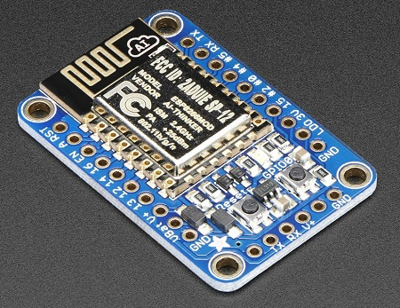
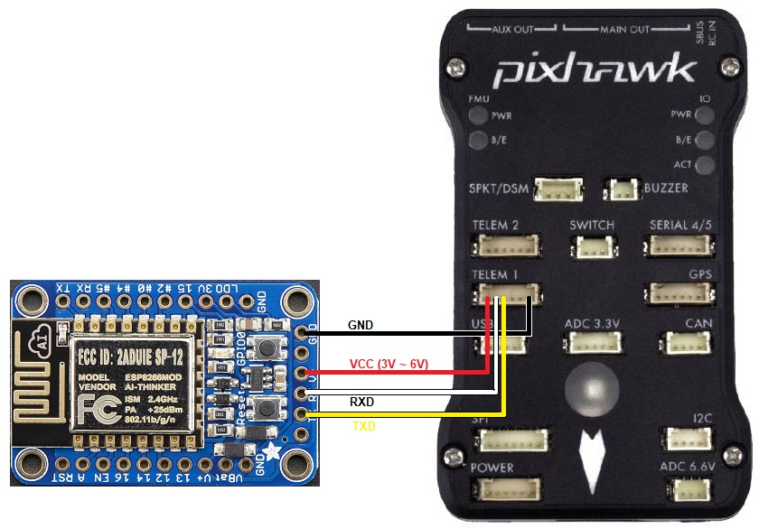

.. _common-esp8266-telemetry:

======================
ESP8266 wifi telemetry
======================

The ESP8266 wifi module is an inexpensive programmable wifi modules available from many sources.  It also comes included with most :ref:`Pixracers <common-pixracer-overview>`.

Where to Buy
------------

The `adafruit HUZZAH ESP8266 breakout board <https://www.adafruit.com/product/2471>`__ is recommended because it can be connected to a flight controller without the need for 3.3V regulator or level shifters.

Connecting to a flight controller
---------------------------------

If connected to Serial1/Telem1 these parameters should be set on the flight controller (if using another telemetry port, replace the "1" in the parameter name with the telemetry port's number):

- :ref:`SERIAL1_PROTOCOL <SERIAL1_PROTOCOL>` = 2 (MAVLink2) or 1 (MAVLink1)
- :ref:`SERIAL1_BAUD <SERIAL1_BAUD>` = 921 (921600 baud)

If you have problems connecting, it may help to set :ref:`BRD_SER1_RTSCTS <BRD_SER1_RTSCTS>` = 0 to disable flow control although this is not normally necessary

Connecting from a Ground Station
--------------------------------

- load the MAVESP8266 firmware to the device if you haven't already (see below)
- on your PC, open the wifi network connections screen and select the wifi access point (normally "ardupilot" or "PixRacer")
- on the ground station, set the connection type to UDP and press "Connect"

If all is well the ground station will connect, download parameters and the HUD should move as the vehicle is moved.

Flashing the device with the MAVESP8266 firmware
------------------------------------------------

We recommend flashing the ArduPilot specific version of MAVESP8266 (`binaries <http://firmware.ardupilot.org/Tools/MAVESP8266/latest/>`__, `source code <https://github.com/tridge/mavesp8266>`__) over the original `MAVESP8266 <https://github.com/dogmaphobic/mavesp8266>`__ because it includes two additional features:

- mavlink2 support
- subsequent firmware uploads can be done over wifi
- simple configuration web interface

An `FTDI Cable like this one from SparkFun <https://www.sparkfun.com/products/9717>`__ is required for at least the first time the firmware is upload to the device.

If you are using the Adafruit HUZZAH ESP8266 board and are flashing from a Windows PC then you should:

- solder a 6pin header to the narrow end of the board that has the TX, RX, VCC and GND pins
- connect the device to your computer using the FTDI cable
- download the ArduPilot specific version of MAVESP8266 from `this directory <http://firmware.ardupilot.org/Tools/MAVESP8266/latest/>`__

  - `firmware-esp01_1m.bin <http://firmware.ardupilot.org/Tools/MAVESP8266/latest/firmware-esp01_1m.bin>`__ is for boards with 1MB of flash (most boards)
  - `firmware-esp01.bin <http://firmware.ardupilot.org/Tools/MAVESP8266/latest/firmware-esp01.bin>`__ is for boards with only 512KB of flash (very old boards)
  - `firmware-esp12e.bin <http://firmware.ardupilot.org/Tools/MAVESP8266/latest/firmware-esp12e.bin>`__ is for boards with 4MB of flash
- Windows users should download and run the NodeMCU flasher (`64bit <https://github.com/nodemcu/nodemcu-flasher/blob/master/Win64/Release/ESP8266Flasher.exe>`__ or `32bit <https://github.com/nodemcu/nodemcu-flasher/blob/master/Win32/Release/ESP8266Flasher.exe>`__)

  - on the Advanced page ensure the Flash size is set to 4MByte
  - on the Config page push the gear and select the firmware downloaded above
  - on the Operation page select the "COM Port" and push the "Flash" button.  If successful the blue bar will slowly stretch from left to right and the icon on the bottom left will turn green.

    .. image:: ../../../images/esp8266-telemetry-flash.jpg
        :target: ../_images/esp8266-telemetry-flash.jpg

- Mac and Linux users should use the `esptool <https://github.com/espressif/esptool>`__

Changing the Wifi SSID and Password
-----------------------------------

- connect from your PC to the wifi access point
- open a browser to `192.168.4.1 <http://192.168.4.1/>`__ and a simple web interface will appear like below
- click on the "Setup" link
- set the "AP SSID" and "AP Password" fields (both must between 8 and 16 characters), push the "Save" button and reboot the device

    .. image:: ../../../images/esp8266-telemetry-web-setup.png
        :target: ../_images/esp8266-telemetry-web-setup.png

Thanks to `Ray's blog <https://rays-blog.de/2016/10/21/224/adding-wi-fi-telemetry-to-pixhawk-flight-controller-with-esp8266-module/>`__ which was the source for some of this page's advice.
