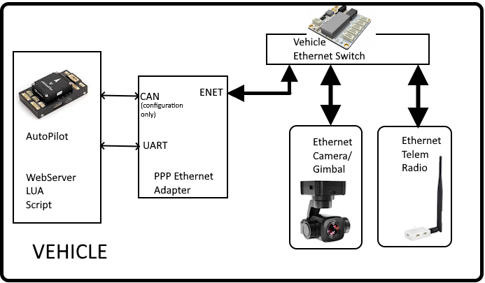
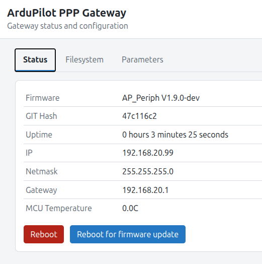
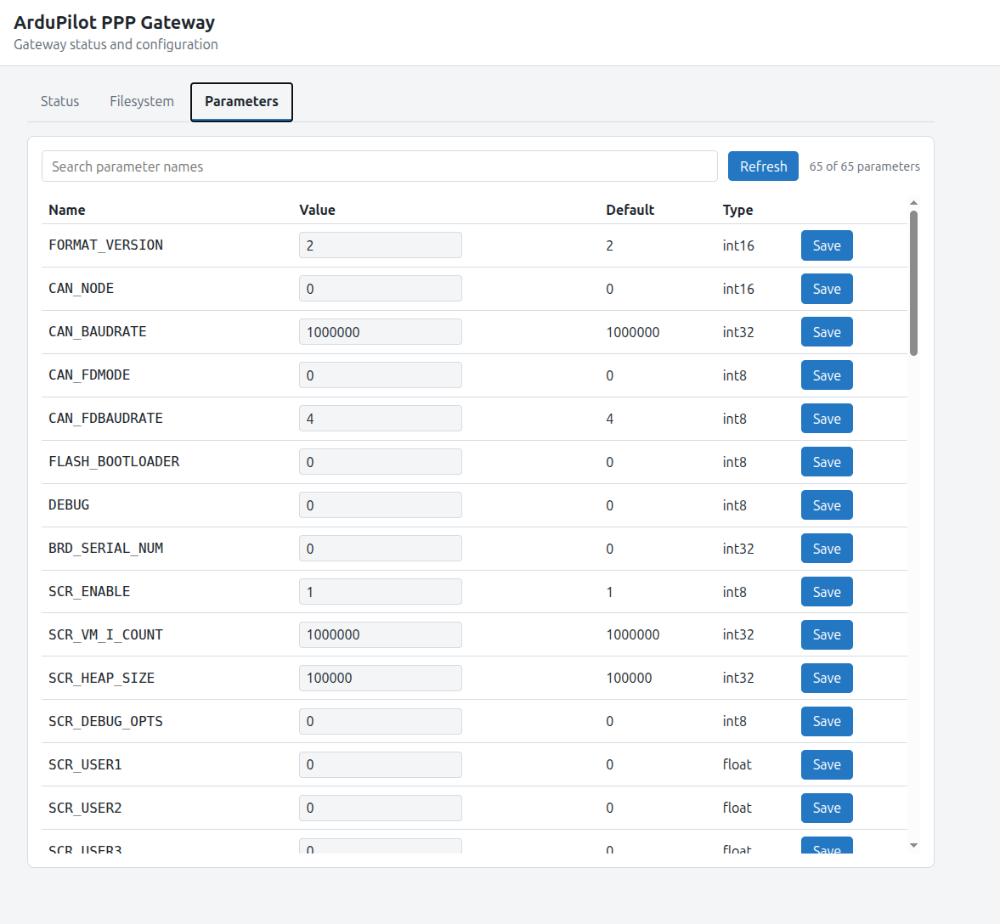

.. _common-ethernet-adapters:

==============================
Ethernet Adapters and Switches
==============================

Ardupilot has the ability to use Ethernet peripherals and networking (see :ref:`common-network`).  This page includes various switches and adapters known to work

Most H7 based autopilots do not include native ethernet support but ethernet networking capability can be added using an Ethernet Adapter (see :ref:`BotBlox DroneNet <common-botblox-dronenet>` and :ref:`CubePilot CubeNode ETH <common-cubepilot-cubenodeeth>` below) which provide connectivity using :ref:`PPP protocol <ppp-config>` over the autopilot's serial port.

Hardware
========

- `BlueRobotics Ethernet Switch <https://bluerobotics.com/store/comm-control-power/tether-interface/ethswitch/>`__ : 5-port ethernet switch designed in collaboration with BotBlox
- `BotBlox SwitchBlox for Ardupilot <https://botblox.io/switchblox-for-ardupilot/>`__ : ethernet switch to allow connecting multiple devices together
- :ref:`BotBlox DroneNet for Ardupilot <common-botblox-dronenet>`: ethernet switch with CAN, USART, RS485, and GPIO/PWM adapters allowing non-ethernet devices including autopilots to work over ethernet
- `BotBlox SwitchBlox Cable Adapter for Ardupilot <https://botblox.io/switchblox-cable-adapter-for-ardupilot/>`__ : adapter to ease the ethernet port differences across different device manufacturers
- :ref:`CubePilot CubeNode ETH <common-cubepilot-cubenodeeth>`: serial to ethernet adapter to allow non-ethernet autopilots to work over ethernet using PPP
- `CubePilot CubeLAN 8-Port Switch <https://docs.cubepilot.org/user-guides/switch/cubelan-8-port-switch>`__ : ethernet switch using the CubePilot preferred 5-pin connector

.. _pppgw-web-interface:

PPP Gateway Web Interface
=========================

Ethernet adapters which run ArduPilot's PPP gateway firmware (including the :ref:`BotBlox DroneNet <common-botblox-dronenet>` and :ref:`CubePilot CubeNode ETH <common-cubepilot-cubenodeeth>`) provide a built-in web server which can be used to check the adapter's status, access its files, edit its parameters and put it into firmware update mode.

To open it:

- Connect a PC to the adapter's ethernet
- Set the PC's IP address to be in the same subnet as the adapter (e.g. 192.168.144.99 if the adapter is using 192.168.144.14)
- Open a web browser and enter the adapter's IP address as the URL (e.g. "192.168.144.14")

.. note:: the web server is provided by a LUA script running on the adapter and is controlled by its ``WEB_ENABLE`` (default 1) and ``WEB_BIND_PORT`` (default 80) parameters.  If the port has been changed it must be included in the URL (e.g. "192.168.144.14:8080"), and if ``WEB_ENABLE`` is 0 the web server does not run.

.. note:: the tabbed interface described below, including the parameter editor, requires AP_Periph firmware which includes `this change <https://github.com/ArduPilot/ardupilot/pull/34157>`__, meaning the `latest AP_Periph builds <https://firmware.ardupilot.org/AP_Periph/latest/>`__ and the releases which follow them.  Earlier firmware provides a simpler page holding the status table, a filesystem link and a firmware update link.

Status
------

The "Status" tab shows the adapter's firmware version and git hash, uptime, IP, netmask and gateway addresses and MCU temperature, and updates about once per second.  Two buttons are provided:

- "Reboot" restarts the adapter
- "Reboot for firmware update" restarts it holding in the bootloader so that new firmware can be uploaded over the network

Filesystem
----------

The "Filesystem" tab lists the files stored on the adapter and allows them to be downloaded with the browser.  The filesystem browser is read-only, so files cannot be uploaded through it.

Parameters
----------

The "Parameters" tab lists the adapter's parameters along with their current value, default value and type.  This allows the adapter to be configured from a browser, without connecting a ground station to it over CAN.

- Type into the "Search parameter names" box to narrow the list
- Edit the value and push that row's "Save" button to set and save it.  Parameters which differ from their default value are highlighted
- Push "Refresh" to re-read all values from the adapter

.. note:: some parameters are only read during startup, so the adapter should be rebooted (see the "Reboot" button on the "Status" tab) after changing them

.. toctree::
    :hidden:

    BotBlox DroneNet <common-botblox-dronenet>
    CubePilot CubeNodeETH <common-cubepilot-cubenodeeth>
