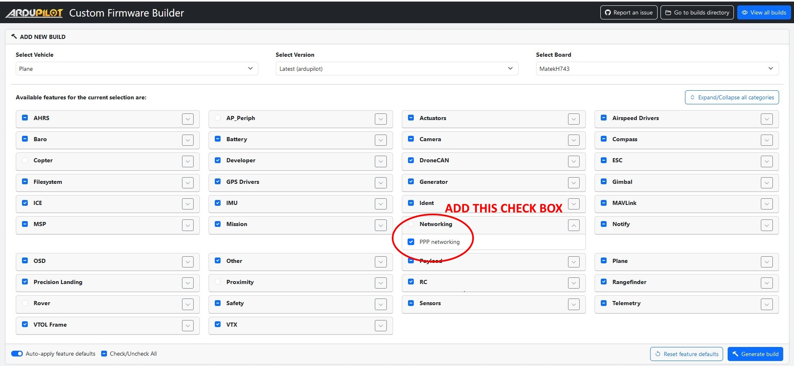

.. _common-ethernet-adapters:

=================
Ethernet Adapters
=================

Ardupilot has the ability to use Ethernet peripherals and networking (see :ref:`common-network`), but most H7 based autopilots do not include the Ethernet controller. Ethernet networking capability can be added using an Ethernet Adapter which provides connectivity to the autopilot using PPP protocol over a serial port of the autopilot.

.. image:: ../../../images/Net_Adapter.png
    :target: ../_images/Net_Adapter.png

Requirements
============

- PPP capability is not included by default on standard H7 autopilot firmware, so the `Custom Firmware Build Server <https://custom.ardupilot.org/>`__ must be used to include it.

.. note:: if using a local build environment (:ref:`building-the-code`), you can include PPP capability by using the ``--enable-ppp`` waf configuration option when building the code for an autopilot locally.

- H7 based autopilot with an unused, flow controlled (for optimum transfer speeds) SERIAL port. (SERIAL2 used in the following setup examples)
- Ethernet to PPP adapter (see below)

Autopilot Setup
===============

See ``PPP configuration`` and ``ArduPilot Port Configuration`` sections of :ref:`common-network`. Be sure to set :ref:`NET_ENABLE<NET_ENABLE>` = 1 and reboot first. The Ethernet MAC configuration is internal to the Adapter itself.

Adapter Setup
=============

Currently available adapters use :ref:`DroneCAN <common-uavcan-setup-advanced>` to change or setup the Ethernet interface parameters such as MAC and IP addresses, NET mask, etc. Once setup/changed, the DroneCAN connection can be removed, if desired. When attached to a DroneCAN enabled port on the autopilot, you can use :ref:`Mission Planner<dronecan-uavcan-slcan>` or the :ref:`DroneCAN GUI <dronecan-uavcan-slcan>` tool to explore/change its Ethernet parameters.

In addition, it may implement its own Web Browser interface for status and configuration on the network similar to:

.. image:: ../../../images/PPP_web_server.jpg
    :target: ../_images/PPP_web_server.jpg

Adapters
========

- `BotBlox DroneNet adapter and Ethernet Switch <https://botblox.io/dronenet-for-ardupilot/>`__

.. image:: ../../../images/BotBlox_DroneNet.jpg
    :target: ../_images/BotBlox_DroneNet.jpg

Video
=====

.. youtube:: bN6iDP4Zjzg

