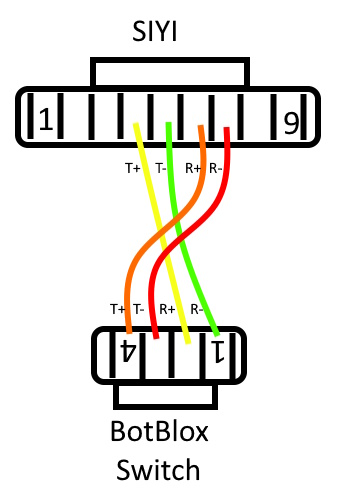

.. _common-ethernet-vehicle:

==================================
Ethernet Connected Vehicle Example
==================================

.. image:: ../../../images/ethernet-vehicle-system.jpg
    :target: ../_images/ethernet-vehicle-system.jpg

This is to illustrate an actual ArduPilot Ethernet-based Vehicle and its setup. The example vehicle will include an HD Video Stabilized Gimbal with video transmission to the ground controller and a long-range radio control system with a ground controller that displays the HD video, provides vehicle control, displays vehicle telemetry, and controls the gimbal and camera, as well as rebroadcasts to other ground control stations like a laptop. An Ethernet-capable autopilot running ArduPilot 4.5 is used.

System Configuration
====================

Equipment Used
--------------

(donated by CUAV , SIYI, CubePilot, and BotBlox for this article)

- Hexsoon EDU650 Multicopter from CubePilot
- :ref:`CUAV Pixhawk V6X <common-cuav-pixhawkv6X>`
- :ref:`SIYI A8 Mini Gimbal/HD Camera <common-siyi-zr10-gimbal>`
- :ref:`CubePilot Herelink Telemetry System <common-herelink>`
- `BotBlox ArduPilot Ethernet Switch <https://botblox.io/switchblox-for-ardupilot/>`__

Note: many other brands of gimbals/cameras/radio control systems/autopilots are Ethernet capable and can be used in similar configurations

Ethernet Switch
---------------

Since there are more than 2 Ethernet devices in the system, it is truly a network and to provide interconnectivity an Ethernet Switch is used. It forms the "heart" of the system. In this case, it's a small BotBlox switch specifically designed for ArduPilot applications with convenient JST_GH 1.25mm connectors:

The gimbal, autopilot, and wireless air unit all plug into this and the Ethernet traffic between them is automatically routed.

AutoPilot Basic Setup
---------------------
To enable Ethernet on the autopilot the following parameters are set (other NET params stay at default) and reboot the autopilot

- :ref:`NET_ENABLE<NET_ENABLE>` = 1

then set the autopilot's IP address, it must be in the 192.168.144.x to be in the Herelink's listening range..this will drive other addresses to be set later also:

- :ref:`NET_IPADDR0<NET_IPADDR0>` = 192
- :ref:`NET_IPADDR1<NET_IPADDR1>` = 168
- :ref:`NET_IPADDR2<NET_IPADDR2>` = 144
- :ref:`NET_IPADDR3<NET_IPADDR3>` = 26 <- arbitrarily chosen but must not be 11 (Herelink fixed address)
- :ref:`NET_NETMASK<NET_NETMASK>` = 24 <- this says we are in a subnet with addresses 192.168.144.1 to 192.168.144.254

if the autopilot needs to communicate with IP addresses outside this range it will use a "gateway" in the subnet...we wont be doing this but it still needs to be set:

- :ref:`NET_GWADDR0<NET_GWADDR0>` = 192
- :ref:`NET_GWADDR1<NET_GWADDR1>` = 168
- :ref:`NET_GWADDR2<NET_GWADDR2>` = 144
- :ref:`NET_GWADDR3<NET_GWADDR3>` = 1 <- typical address of subnet gateway

Now basic Ethernet for the autopilot is enabled

Gimbal Camera Setup
-------------------
Set :ref:`CAM1_TYPE<CAM1_TYPE>` = 4 to allow camera control of shutter, etc.

The gimbal/camera must be set up to use the Ethernet for video streaming and its IP param setup. To do this download the `SIYI Assistant <https://siyi.biz/en/index.php?id=downloads&asd=22>`__ and use it to set the following:

.. image:: ../../../images/SIYI-Assistant.jpg
    :target: ../_images/SIYI-Assistant.jpg

save and power cycle the gimbal.

This sets the gimbal's IP address within the Herelink's listening range for passthru to the ground controller to display video and sets its video output to Ethernet with an H.264 encoded stream that the ground station can decode. Now the camera will be streaming video over Ethernet, through the switch, and the Herelink air unit will transmit it down to the ground controller.

.. note:: As of this writing, the SIYI A8 camera has about 1 second image latency over Ethernet which makes its use for realtime FPV guidance not viable. I also have a mini HDMI cable attached from the SIYI HDMI port to the Herelink's HDMI1 input and switch the source in the SIYI Assistant to HDMI rather than Ethernet (source = "Close") when I actually fly. Other gimbals from SIYI or others may or may not have this issue. Also the Herelink Air Unit uses better bandwidth management if the HDMI input is used. But the setup illustrates the method for use in other device combinations.

Gimbal Control
--------------

Control of the gimbal (pan/tilt/camera start/stop,etc.) over Ethernet is obtained from the autopilot which interprets MAVLink commands (also AUX switch inputs) and sends them to the gimbal. First, we must set up ArduPilot to control the Mount/Camera:

- :ref:`MNT1_TYPE<MNT1_TYPE>` = 8 This selects the SIYI mount type

then reboot to see all the MNT params and set:

- :ref:`MNT1_YAW_MAX<MNT1_YAW_MAX>` = 135
- :ref:`MNT1_YAW_MIN<MNT1_YAW_MIN>` = -135

which is the limit of the yaw that SIYI can accommodate.

Then we need to set up an Ethernet mechanism to communicate. Using the NET_P1 params we will create a "virtual" serial port to talk to the mount/camera, just as if we were using a UART (which the SIYI could also use instead of Ethernet control, but why add wires?). Set:

- :ref:`NET_P1_TYPE<NET_P1_TYPE>` = 1 <- UDP Client type of port

reboot for the params to show:

- :ref:`NET_P1_IP0<NET_P1_IP0>` = 192
- :ref:`NET_P1_IP1<NET_P1_IP1>` = 168
- :ref:`NET_P1_IP2<NET_P1_IP2>` = 144
- :ref:`NET_P1_IP3<NET_P1_IP3>` = 25   <- the IP address we set for the Gimbal previously
- :ref:`NET_P1_PORT<NET_P1_PORT>` = 37260 <- this is the port that Gimbal listens for commands
- :ref:`NET_P1_PROTOCOL<NET_P1_PROTOCOL>` = 8 <- Gimbal serial protocol

Now gimbal/camera commands from the autopilot (MAVLink or AUX functions translated to SIYI commands) will be sent to the SIYI gimbal

Telemetry Setup
---------------
In order to display telemetry and communicate MAVLink commands to/from the GCS app running on the Herelink ground controller, we must set up a MAVLink path from the autopilot to Herelink air unit. We will use another "virtual" serial port (NET_P2) on Ethernet to talk from/to the autopilot to/from the Herelink air unit:

- :ref:`NET_P2_TYPE<NET_P2_TYPE>` = 1 <-UDP Client

rebooot for the params to show:

- :ref:`NET_P2_IP0<NET_P2_IP0>` = 192
- :ref:`NET_P2_IP1<NET_P2_IP1>` = 168
- :ref:`NET_P2_IP2<NET_P2_IP2>` = 144
- :ref:`NET_P2_IP3<NET_P2_IP3>` = 11 <- this is the IP address of the Herelink air unit
- :ref:`NET_P2_PORT<NET_P2_PORT>` = 14550 <- on this port
- :ref:`NET_P2_PROTOCOL<NET_P2_PROTOCOL>` = 2 <- using MAVLink2 protocol

now telemetry will be sent to/from the Herelink ground unit. Opening the GCS app on the ground controller should automatically connect to the UDP telemetry stream.

Herelink Ground Controller
--------------------------

Setup the ground unit according to the OEM instructions, in this case, see the `Herelink User Guide <https://docs.cubepilot.org/user-guides/herelink/herelink-user-guides>`__

QGC Video Setup
---------------

To see the video stream on the Herelink ground controller when using the QGC app, go to Application Settings/Video settings and select the RSTP source and enter this URL:
"**rstp://192.168.144.25:8554/main.264**" video should now appear in QGC. Likewise, this source can be used in other GCS apps to display the video.

.. note:: if you decide to use HDMI (recommended), then leave the setting in QGC at its default setting of "Autoconnect Video Streams"

The Tower of Babel: Physical wiring
===================================
The physical interconnects between the devices is a challenge.  Most device suppliers provide some way to cable out the Ethernet from their device. Unfortunately, this usually involves providing a cable with either a large RJ-45 male or female plug/jack, requiring bulky CAT5 cabling for interconnects. And the device end that uses smaller gauge wires to that RJ-45 termination have non-standarized connectors, sometimes 5 pin, sometimes 4 pin JST-GH. 

With the aid of something like this BotBlox adapter which has many of the connector that are used wired in parallel, you can usually rig up a bulky set up on the bench for testing:

But this is not viable for actual vehicle use. In this case, I created small 6" cables with JST-GH connectors. This can be done by obtaining either the appropriate pre-made cables for each pin count and cutting and soldering them together or making them directly with jst-gh connector kits like this: 

`JST-GH Connector Kit <https://www.googleadservices.com/pagead/aclk?sa=L&ai=DChcSEwjPoYSiv5KGAxV2OtQBHT4YBoMYABAJGgJvYQ&gclid=Cj0KCQjw3ZayBhDRARIsAPWzx8rMSj_O3MBoFRAwBQPcSkhUk40Ecxhq1TsyhpLlm3aw2LPAiYhM5DwaAqAGEALw_wcB&ohost=www.google.com&cid=CAESVuD2zyxxWXp3hmt37m65lY3k6qnCH239PE4QZeVhoKJWIadtox7IVEIC3RJSCOk0yXfyOjujljkmD7qTvIDzK0ZcCqsRF7nQOGf7mrwj4Gz1lA2gdeh-&sig=AOD64_07KlOigavZZp94-roQz78iW0ZSkg&ctype=5&q=&ved=2ahUKEwjct_yhv5KGAxUK5MkDHdzvBnAQ9aACKAB6BAgFEBY&adurl=>`__

Here are the ones I made:

Notes on cabling
----------------

- You do not have to use twisted pairs for TX and RX if the cables are short (~<12 inches)
- 28 gauge wire is sufficient
- When you interconnect Ethernet devices, hosts(in our case the autopilot, gimbal, and Herelink) connect to switches with "crossover cabling" , ie device TX pairs go to RX pairs on the switch, and vice versa. In the above cables you will note that the SIYI cable does this, but the others do not. That is because the CUAV autopilot and Herelink have an advanced Ethernet IC that autodetects if the cabling is not "crossover" and internally accommodates this ("Auto MDX"). The SIYI gimbal does not.

The Finished Vehicle
--------------------

