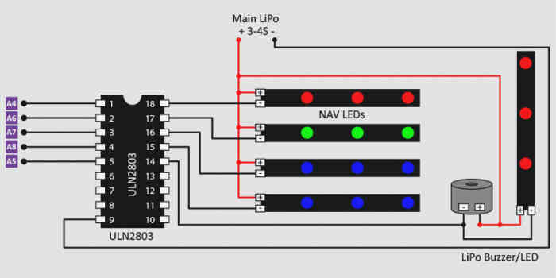

.. _common-external-leds:

=============
External LEDs
=============

This article shows how to connect external LEDs.

External LED for Pixhawk
========================

An external Pixhawk LED can be added by connecting it to the Pixhawk's
I2C port. Because most users use an `Ublox GPS and Compass module <https://store.3dr.com/products/3dr-gps-ublox-with-compass>`__,
an `I2C splitter <http://store.jdrones.com/Pixhawk_I2C_splitter_p/dstpx4i2c01.htm>`__
is recommended.  Once connected the similar LED on the center of the
Pixhawk will no longer light up.

.. image:: ../../../images/ExternalLED_PixhawkLED.jpg
    :target: ../_images/ExternalLED_PixhawkLED.jpg

[site wiki="copter" heading="off"]

Two External LED solutions for APM2 (Copter only)
=================================================

There are two recommended solutions for adding LEDs.

-  the `JDrones I/O board <http://store.jdrones.com/jD_IOBoard_p/jdioboard11.htm>`__
   (`video here <https://www.youtube.com/watch?feature=player_embedded&v=Q2oT808mJnQ>`__)
   and `LED strips <http://store.jdrones.com/Night_Flying_LED_Drivers_s/94.htm>`__
   listens to the mavlink messages on the APM/PX4's telemetry port (much
   like the :ref:`minimOSD <common-minim-osd-quick-installation-guide>`) 
   and updates the LEDs.  The board includes a voltage regulator so it
   takes power directly from the battery
-  the APM's A4 ~ A11 pins can be used to control LEDs directly.  `This is an example of a community members solution <http://diydrones.com/forum/topics/apm-2-x-led-buzzer-modules>`__
   you can purchase or you can build your own by purchasing a Darlington
   Driver DIP chip (`like this one from Sparkfun <https://www.sparkfun.com/products/312>`__) to allow you to
   power the LEDs from the battery.  See this `blog post <http://diydrones.com/profiles/blogs/adding-external-led-indicators-and-a-piezo-beeper-for-arm-and-gps>`__
   for more details.

If you choose to control the pins directly from the APM, you must choose
LEDs which have a current draw lower than the maximum permissible
current of the AVR chip on the APM: 40mA.

For **AC3.1.5**, the pinout of the APM is as follows:

-  A4 : AUX led
-  A5 : Beeper - can drive a piezo buzzer directly (see below)
-  A6 : GPS - will flash with no GPS lock, solid with GPS lock
-  A7 ~ A11 : Motor LEDs

Which LEDs are active and when they blink is somewhat configurable
through the LED_MODE parameter which can be set from the Mission
Planner's CONFIG/TUNING > Standard Params > Copter LED Mode drop down.

For **AC3.2**, the LED_MODE parameter is removed but all the following
reduced set of pins are always active:

-  A4 : Motor LED
-  A5 : Beeper - can drive a piezo buzzer directly (see below)
-  A6 : GPS - will flash with no GPS lock, solid with GPS lock
-  A7: Arming LED

[/site]
