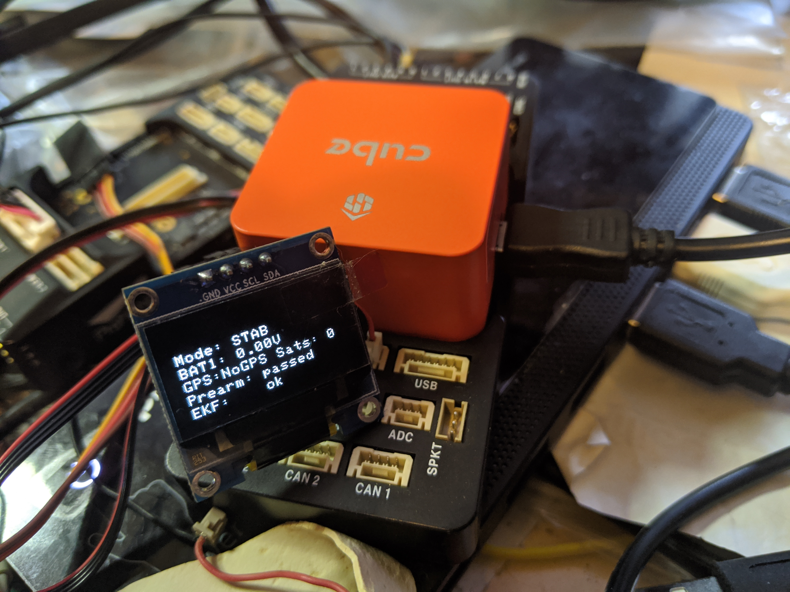

.. _common-external-leds:

=============
External LEDs
=============

An external LED or LED Display can be added by connecting it to the autopilot's
I2C port or, in 4.0 and later versions, if a serially programmed device, via a GPIO capable pin using the SERVOx_FUNCTION for that output. UAVCAN LEDs on the CANBUS are also supported (See :ref:`UAVCAN Setup <common-uavcan-setup-advanced>` ).

.. note:: On Pixhawk style architecture autopilots which use an IOMCU for the PWM1-8 outputs, only the "AUX" outputs are GPIO capable. See :ref:`common-gpios`. Note that the same grouping restrictions which apply to setting outputs to different PWM rates and/or DShot, apply to LEDs also since the timer associated with each group of outputs cannot be used for different rates. See also  :ref:`common-dshot` 

RGB LEDs/Displays with I2C Connection
=====================================

Two types of I2C devices are supported: IC2 connected RGB LEDS using an LED driver chip and OLED displays.

RGB LEDs/drivers supported are:

- Toshiba LEDs (no longer manufactured)
- PCA9685 driver
- NCP5623 driver

OLED Displays supported are SSH1106 and SSD1306 with 128x64 pixel displays.

Because most users use an external :ref:`GPS and Compass module <common-positioning-landing-page>`, an I2C splitter is recommended, such as shown below. The :ref:`NTF_LED_TYPES<NTF_LED_TYPES>` parameter should be set to the controller type used.

.. image:: ../../../images/ExternalLED_PixhawkLED.jpg
    :target: ../_images/ExternalLED_PixhawkLED.jpg

Serially Connected Devices
==========================

Currently, Ardupilot supports the Neopixel style RGB LED and strings. They can be used for NTF notifications from the autopilot on status and warnings like other RGB LEDs, or be programmed in unlimited ways using LUA scripts on the autopilot's SD card. See :ref:`common-lua-scripts` for more use examples using LUA scripts.

.. image:: ../../../images/neopixel-string.jpg

A "NeoPixel" style (WS2812B compatible) RGB LED can be attached to any GPIO capable output by setting its SERVOx_FUNCTION to one of the ``NeoPixelx`` output functions and setting :ref:`NTF_LED_TYPES<NTF_LED_TYPES>` parameter to ``NeoPixel``. Multiple ``NeoPixelx`` output functions are provided for connecting multiple strings (up to 4).

If used for notification purposes, be sure to set :ref:`NTF_LED_TYPES<NTF_LED_TYPES>` to "Neopixel" (8).

LED Meaning
===========

The meaning of the colors and flash patterns are shown in :ref:`common-leds-pixhawk` if the ``standard`` default protocol is set for :ref:`NTF_LED_OVERRIDE<NTF_LED_OVERRIDE>`. 

The brightness of the LED can be controlled by modifying the :ref:`NTF_LED_BRIGHT <NTF_LED_BRIGHT>`

