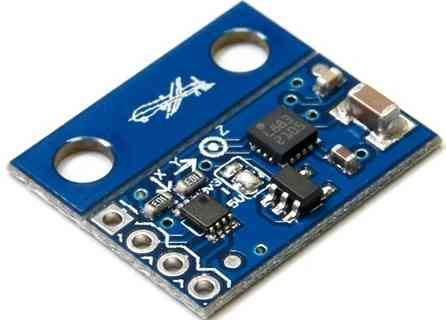
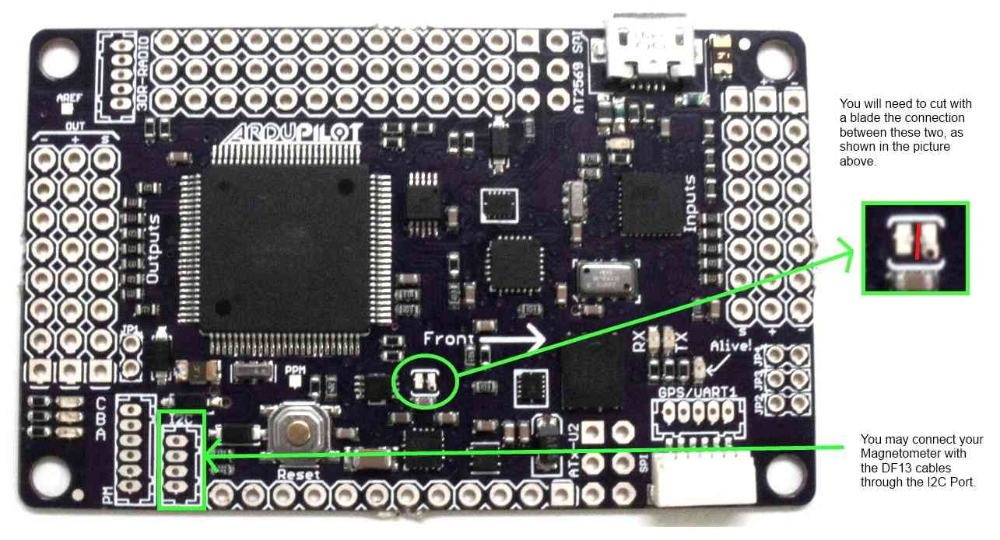
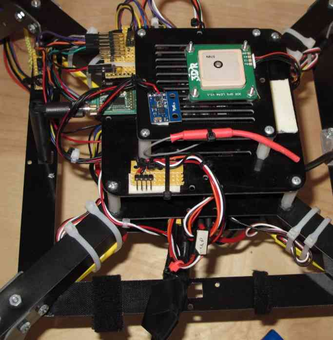
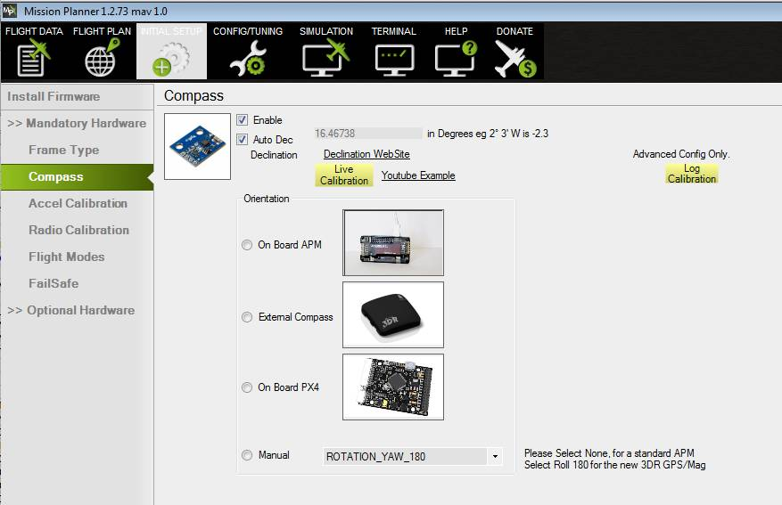

.. _common-external-magnetometer-for-improved-performance:

==========================
Archived: External Compass
==========================

.. warning::

   **ARCHIVED ARTICLE**

   Almost everyone has moved to :ref:`GPS+compass module <common-installing-3dr-ublox-gps-compass-module>`.

This page covers the installation of a stand-alone external compass
( hmc5883l-triple-axis-magnetometer).  You may alternatively use the
combined :ref:`GPS+Compass module <common-installing-3dr-ublox-gps-compass-module>`.

Overview
========

The 3DR external compass should only be used with the APM series of
autopilots, its 5 volt signal output is not compatible with Pixhawk which require 3.3 volts. 
For the Pixhawk use the :ref:`3DR combination GPS / Magnetometer module <common-installing-3dr-ublox-gps-compass-module>`.

#. If you're having trouble with magnetic noise affecting your
   compass on-board the APM 2.5 board, you may want to switch to an
   external compass that you can mount further away from noise sources
   such as motors and your power wiring and batteries.
#. Magnetometers are most strongly influenced by DC magnetic fields and
   your batteries and the ESC primary power wiring are the worst
   offenders.
#. Your primary goal is to distance the magnetometer from batteries, DC
   battery wiring and the wiring to your ESCs.
#. It will also help to twist the battery and ESC power and ground wires
   wires together where possible.
#. It is also important to keep the magnetometer distanced from magnetic
   metallic objects (use nylon or non magnetic stainless screws and
   hardware in its vicinity and use aluminum or nylon standoffs.).

**Notes:**

-  If the Magnetometer board is mounted in its forward facing direction
   (Drone logo on the tab facing forward and in the opposite direction
   of the Y arrow) the (:ref:`COMPASS_ORIENT<COMPASS_ORIENT>` ) parameter will need to be set
   to (Normal) or "0".

   -  If you have the Y arrow pointing to the front (Drone on tab
      pointing to the back), set (:ref:`COMPASS_ORIENT<COMPASS_ORIENT>` ) to (Yaw 180).

-  You will need to set the Magnetometer Orientation Parameter
   (:ref:`COMPASS_ORIENT<COMPASS_ORIENT>` ) in the Mission Planner Advanced Parameter List
   correctly to accommodate the Magnetometer's orientation.
-  If the Autopilot board is used in an alternate orientation
   (or upside down), the (:ref:`COMPASS_ORIENT<COMPASS_ORIENT>` ) parameter will need to also
   be adjusted to accommodate the Autopilot boards orientation
   as well as its own. (They are additive).
-  It can be confusing, but all orientations in 45 degree increments and
   even upside down can be accommodated.

   #. This **Quick Setup Procedure** will always work and allow you to
      set up your compass even if you use a non-3DR magnetometer.
   #. Set the (:ref:`COMPASS_ORIENT<COMPASS_ORIENT>` ) **Yaw** parameter so the direction your
      airframe is currently pointing agrees with the **HUD** in Mission
      Planner.
   #. Now turn your air frame right or left and if the compass correctly
      follows the direction it is pointed you are done.
   #. If the compass turned in the opposite direction of your airframe
      set (:ref:`COMPASS_ORIENT<COMPASS_ORIENT>` ) **Roll** to **180** (flips the compass
      over).
   #. If you need to set **Roll** to **180** (:ref:`COMPASS_ORIENT<COMPASS_ORIENT>` ) will also
      need to include the **Yaw** from **B.** above **(Example: Yaw 180
      Roll 180)**.

Connecting to the APM 2.5
=========================

**1.** Purchase an \ *HMC5883L magnetometer breakout board*. Ensure the
magnetometer board is set to use 3.3 volts (the APM 2.5’s I2C port uses
3.3 volts, not 5 volts). The magnetometer board is supplied with the 5
volt pad solder bridged and must be modified as shown below.

.. image:: ../../../images/MagnetometerJumper3v3.jpg
    :target: ../_images/MagnetometerJumper3v3.jpg

**2.** Looking at the below picture, cut the jumper trace in the middle
of the APM 2.5 board. This disables the SDA line to the board’s internal
magnetometer, rendering it inert.

**3.** The APM 2.5 I2C connector needs a 4 pin DF13 connector. Cut off
one and and strip and tin the four wires.

**4.** Connect the DF13’s 4 wires to the compass breakout board. Note
that the wires will not be one to one. Pin 1 on the DF13 connector will
not go to pin 1 of the compass board. The standard 3DR cable has one red
wire and three black wires. Substitute your wire colors accordingly.
Solder the wires as follows:

-  **Red wire** on end of connector (+3.3v) goes to the VCC (or +3.3v)
   pad on the compass board (see labels on board for location). This is
   the wire closest to the interior on the APM 2.5 board.
-  **Wire next to red wire** (SCL) goes to the SCL pad on the compass
   board.
-  **Wire next to wire next to red wire** (SDA) goes to the SDA pad on
   compass board.
-  **Black wire on end of connector** (ground) goes to ground pad on
   compass board. This is the wire closest to the edge of the APM 2.5
   board.

**5. The photo below depicts a MultiCopter with the Magnetometer mounted
on top away from the DC magnetic fields generated by the Power Wiring
and ESCs.**

-  Double-sided foam tape works well for this.
-  The GPS modules antenna must be on top.
-  In the picture below, we've mounted the board “components up with
   pins forward”.
-  Autopilot board orientation and magnetometer orientation must
   be used to calculate the :ref:`COMPASS_ORIENT<COMPASS_ORIENT>` parameter.

Connecting to the APM2.0
========================

The APM 2.0 requires the cutting of the SDA trace on the top of the GPS
/ Magnetometer / SDA carrier board.

.. image:: ../../../images/apm2_mag_cut_2.jpg
    :target: ../_images/apm2_mag_cut_2.jpg

Also, leave the pads on the external Magnetometer board bridged for 3.3
volts rather than switching it to 5 volts..

The remainder of the procedure is exactly as explained for the APM 2.5.

Setup through the Mission Planner
=================================

