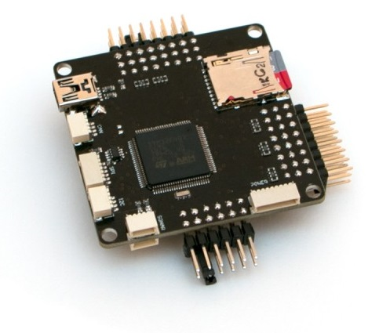

.. _common-f4by:

========
F4BY FMU
========

*above image and some content courtesy of* `Swift-Flyer <http://swift-flyer.com/?page_id=83>`__ *and* `MicroHobby.ru <https://microhobby.ru/polyotnyy-kontroller-f4by>`__

.. note::

   Support for this board will be released with Copter-3.6.  More info available from `Swift-Flyer.com <http://swift-flyer.com/?page_id=83>`__

Specifications
==============

-  **Processor**

   -  single 32-bit ARM Cortex M4 core with FPU STM32 F407

-  **Sensors**

   -  InvenSense MPU6000 IMU (accel, gyro)
   -  MS5611 barometers
   -  HMC5983 compass

-  **Power**

   -  3x separate 3,3v LDO for CPU, Sensors, CAN
   -  Servo rail backup power diode
   -  reverse voltage and overvoltage power protection
   -  board voltage and servo rail voltage sensors

-  **Interfaces**

   -  5x UART serial ports, 1 with inverter for frsky telemertry
   -  Up to 12x PWM outputs
   -  Spektrum DSM/DSM2/DSM-X Satellite input
   -  Futaba S.BUS input support (with external inverter)
   -  PPM sum signal
   -  RSSI (PWM or voltage) input
   -  I2C, SPI,  CAN, USB
   -  3.3V and 6.6V ADC inputs

-  **Dimensions**

   -  50mm x 50mm

-  **Other**

   -  micro SD card (for logs)
   -  Fram memory for parameters

Where to Buy
============

- Available from `MicroHobby.ru <https://microhobby.ru/polyotnyy-kontroller-f4by>`__

