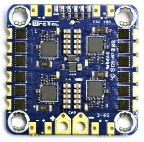

.. _common-fettec-onewire:

===================
FETtec OneWire ESCs
===================

.. note::

   This feature is available on firmware revisions 4.1.1 and higher

OneWire is an `ESC bi-directional communication protocol <https://github.com/ArduPilot/ardupilot/tree/master/libraries/AP_FETtecOneWire>`_ from FETtec.

FETtec OneWire ESC's telemetry information is sent back to the autopilot:

- Motor revolutions per minute (RPM)
- Input voltage (V)
- Current draw (A)
- Power consumption (W)
- Temperature (°C)
- Summed CRC errors

The autopilot uses it to:

- log the status of each ESC to the SDCard or internal Flash, for :ref:`post flight analysis<common-logs>`
- send the status of each ESC to the Ground Station or companion computer for :ref:`real-time monitoring<planner:mission-planner-telemetry-logs>`
- optionally dynamically change the center frequency of the notch filters used to reduce frame vibration noise in the gyros. See optional configuration information below.
- optionally measure battery voltage and power consumption. See optional configuration information below.

------------
Where to buy
------------

Multiple OneWire supported ESCs are also available at `FETtec <https://fettec.net>`_

----------
Connecting
----------

The protocol supports up-to 24 ESCs, but ArduPilot's device driver implementation currently limits this to 12.
Connect the ``TLM`` telemetry output from the ESC to the serial ``RX`` of your flight-controller.
The signal-pins ``S1``, ``S2``, ``S3``, ``S4`` from the ESC are used to receive the commands from the flight-controller, so the serial ``TX`` from the flight-controller must be connected to 
every signal-input in parallel. On CubeOrange the GPS2 port has been successfully tested and it is recommended that you use that serial port.

-----------
Configuring
-----------

FETtec ESC configurator software
================================

The `FETtec ESC configurator <https://github.com/FETtec/ESC-Configurator/releases>`_ can change all ESC's settings and do ESC firmware updates.
Use it to make sure, that your ESC Firmware Version is 2.17 (September 2021) or later.
Typically a FETtec autopilot can be used as a USB<->OneWire bridge so that the *FETtec ESC configurator* can communicate with the ESCs.
ESC's parameter changes and ESC firmware updates are also made via OneWire so a serial passthrough is possible.
Often used parameters are for example: 

- **Motor direction** - If your motor spins in the wrong direction you can change it easily without rewiring
- **Motor beeps** - Enables or disables motor beeps
- **Soft brake** - If you have props that "unscrew" if they are stopped too fast you can use the softbreak option. 
- **ESC IDs** - The IDs of each ESC. These must start at 1, be unique and be contiguous.

IDs inside the ESCs
===================

Each ESC has it's own ID, which can be configured by the FETtec ESC Configuration tool described above.
These IDs must start at ID 1 and increase without a gap (be in a single contiguous block).
Duplicate IDs are invalid.
If two or more 4in1 ESCs should be connected, the IDs of the second and third ESC have to be changed before they are connected, otherwise you will have duplicated IDs.

The function of the servo can be set like described below.

The following parameters have to be changed in MissionPlanner under *CONFIG* -> *Full Parameter List* or with other Mavlink capable ground control station software.

Serial connection port
======================

Set the SERIALx_PROTOCOL parameter to ``FETtec_OneWire`` (38) and SERIALx_OPTIONS parameter to ``FullDuplex`` (0), where x is the number of the serial port you are using.
Make sure the serial port you use has DMA activated

For example, a connection to SERIAL4 (recommended) port would need:

- :ref:`SERIAL4_PROTOCOL<SERIAL4_PROTOCOL>` = 38 (FETtec_OneWire)
- :ref:`SERIAL4_OPTIONS<SERIAL4_OPTIONS>` = 0 (default, full duplex)

Output type
===========

This digital protocol can use the full 1000 to 2000 range. Do set these parameters as well:

- :ref:`MOT_PWM_MAX<MOT_PWM_MAX>` = 2000
- :ref:`MOT_PWM_MIN<MOT_PWM_MIN>` = 1000

Functions to output
===================

Change SERVOx_FUNCTION parameters according to the number of motors and their order. e.g. for a quadcopter:

- :ref:`SERVO1_FUNCTION<SERVO1_FUNCTION>` = 33
- :ref:`SERVO2_FUNCTION<SERVO2_FUNCTION>` = 34
- :ref:`SERVO3_FUNCTION<SERVO3_FUNCTION>` = 35
- :ref:`SERVO4_FUNCTION<SERVO4_FUNCTION>` = 36

FTW Mask
========

The :ref:`SERVO_FTW_MASK<SERVO_FTW_MASK>` parameter selects which servo outputs, if any, will be routed to FETtec ESCs.
You need to reboot after changing this parameter.
Only SERVO1_FUNCTION to SERVO12_FUNCTION can be routed using the :ref:`SERVO_FTW_MASK<SERVO_FTW_MASK>`.
You do not need to change the FETtec IDs inside the ESCs if you change the servo output assignments inside ArduPilot the using the :ref:`SERVO_FTW_MASK<SERVO_FTW_MASK>` parameter.

After that you must set the servo output channels you want to use in the :ref:`SERVO_FTW_MASK<SERVO_FTW_MASK>` parameter, and again restart your autopilot. For example, a quadcopter using the first four motors would need the first four bits of the bitmask set:

:ref:`SERVO_FTW_MASK<SERVO_FTW_MASK>` = 15

Each bit of the mask describes whether a motor is attached and should be used with oneWire. The value is configured decimal and is the sum of the decimal equivalent of each set bit. Bit 1 corresponds to 2^1 = 1, Bit 2 corresponds to 2^2 = 2,... . E.g. if you have connected Motor 1,2,3,4 the mask is 1+2+4+8 = 15.  

Simply sum the decimal values for the motors connected or read it from the list below.

+------------+----+
|Motor Count |Mask|
+------------+----+
|1           |1   |
+------------+----+
|2           |3   |
+------------+----+
|3           |7   |
+------------+----+
|4           |15  |
+------------+----+
|5           |31  |
+------------+----+
|6           |63  |
+------------+----+
|7           |127 |
+------------+----+
|8           |255 |
+------------+----+
|9           |511 |
+------------+----+
|10          |1023|
+------------+----+
|11          |2047|
+------------+----+
|12          |4095|
+------------+----+

Reverse motor direction mask
============================

The :ref:`SERVO_FTW_RVMASK<SERVO_FTW_RVMASK>` parameter selects which outputs, if any, will reverse their rotation.
This parameter effects the outputs immediately when changed and the motors are not armed.
This parameter is only visible if the :ref:`SERVO_FTW_MASK<SERVO_FTW_MASK>` parameter has at least one bit set.

To leave to motors with their default rotation direction do:

:ref:`SERVO_FTW_RVMASK<SERVO_FTW_RVMASK>` = 0

Each bit of the mask describes whether a motor is rotation direction should be reversed.
The value is configured decimal and is the sum of the decimal equivalent of each set bit.
Bit 0 (first ESC) corresponds to 2^0 = 1, Bit 1 (second ESC) corresponds to 2^1 = 2, ... .  

Number of motor electrical poles
================================

The :ref:`SERVO_FTW_POLES<SERVO_FTW_POLES>` parameter selects Number of motor electrical poles.
It is used to calculate the motors RPM
This parameter effects the RPM calculation immediately when changed.
This parameter is only visible if the :ref:`SERVO_FTW_MASK<SERVO_FTW_MASK>` parameter has at least one bit set.

-----------------
Optional features
-----------------

Optional features can be configured using the instructions at their respective wiki page:

- dynamically change the center frequency of the :ref:`notch filters used to reduce frame vibration noise in the gyros<esc-telemetry-based-dynamic-notch-filter>`
- measure :ref:`battery voltage, current and power consumption<esc-telemetry-based-battery-monitor>`

---------------
SITL simulation
---------------

The ESCs can be simulated in SITL by adding ``--serial5=sim:fetteconewireesc`` to the SITL command line and setting the following additional parameters:

- :ref:`SERIAL5_PROTOCOL<SERIAL5_PROTOCOL>` = 38
- ``SIM_FTOWESC_ENA`` = 1

This assumes you use SERIAL5 for simulation.
If you want to use another one you need to adjust both the SITL command line argument and the `SERIAL*_PROTOCOL` parameter.

---------------
Troubleshooting
---------------

- ESCs keep initializing
   If the flight-control is not receiving telemetry signals from every ESC, and it is unarmed it reinitializes the ESCs until every ESC is configured correctly.
   The FTW mask is used to determine the motor count that must be found. Double check if the :ref:`SERVO_FTW_MASK<SERVO_FTW_MASK>` is calculated correctly to fit the actual motor count.
- The ESCs are not initializing.
   Check if the parameters are correct. Also make sure the telemetry pin is connected, as it will not work without it. 
- ESCs are not found in FETtec configurator.
   A halfduplex 2MBaud/s serial connection is required for the use with the FETtec configurator, which is currently not supported by ArduPilot. You need to use a external serial  device like a FETtec FC or a USB serial adapter. Please disconnect the ArduPilot FC from the ESCs to find it in the FETtec configurator.
   

