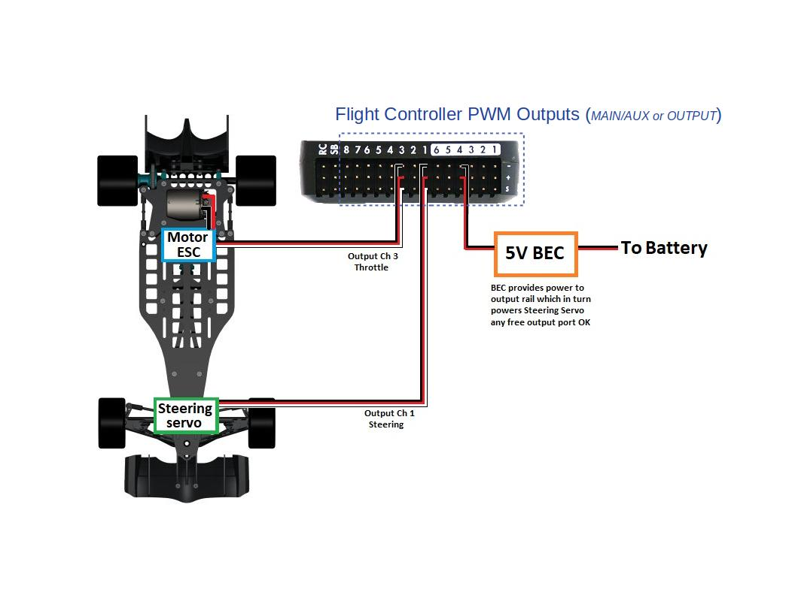

.. _common-flight-controller-wiring:

====================================
Typical Autopilot Wiring Connections
====================================

.. image:: ../../../images/fc-io.jpg
  :width: 450px

This topic covers the wiring/connection of basic/mandatory peripherals to the autopilot. For detailed explanations about each autopilot port/connector, see :ref:`common-flight-controller-io`

GPS/Compass
-----------

GPS is mandatory in all vehicles. Compass is mandatory for Copter and Rover and QuadPlane types of Plane, but not for Conventional Planes, however it is highly recommended.

.. image:: ../../../images/gps-connection.jpg
  :width: 450px

.. note:: TX and RX are swapped from autopilot to GPS module.

.. note:: Usually GPS is attached to the logical Serial Port 3 by default in ArduPilot. However, which  physical UART is assigned to ArduPilot's Serial Port 3 on the autopilot is documented in the autopilots :ref:`documentation <common-autopilots>`

As an wiring example, the topic :ref:`3DR UBlox GPS + Compass Module <common-installing-3dr-ublox-gps-compass-module>` shows how to connect to a Pixhawk autopilot and includes additional configuration and mounting information.

RC input
--------

Radio Control Receivers are normally used for pilot control. While exclusive pilot control via ground stations using telemetry is possible, it is not recommended.
(However, it is possible to control the vehicle via ground station software using a joystick. See :ref:`Joysticks <common-joystick>` .

.. image:: ../../../images/rx-connection.jpg
  :width: 450px
  
Ardupilot autodetects the following serial RC receiver protocols:

   #. PPM remote control (R/C) receivers
   #. SBus receivers
   #. FPort receivers (see :ref:`common-FPort-receivers` )
   #. Spektrum DSM and DSM2 receivers
   #. Spektrum DSM-X Satellite receivers
   #. IBUS receivers
   #. MULTIPLEX SRXL version 1 and version 2 receivers.

For traditional single-wire-per-channel (PWM) receivers a PPM encoder
can be used to convert the receiver outputs to PPM. 

.. tip:: As of Ardupilot 4.0 versions of firmware, any autopilot UART may be used as an input for an RC receiver, instead of the designated RCin or SBUS input pin, by setting that port's ``SERIALx_PROTOCOL`` to 23. However, some serial protocols require inversion (SBUS,FPort) and the UART must be capable of using the ``SERIALx_OPTIONS`` parameter to invert the RX input, otherwise, an external inverter will be required. This also allows a second RC receiver to be attached to the autopilot for redundancy. If the first receiver (first detected valid after boot) fails, then the second will be used. Note that whatever RC input ranges and trims were calibrated will be used for the second when it becomes active. Both receivers MUST be set to send no pulses in failsafe for this to work properly.

.. tip::

   Information about compatible receivers and how they are connected can be found in :ref:`common-rc-systems`. Also see :ref:`common-multiple-rx` for use of multiple RC receivers

.. figure:: ../../../images/FRSkyTaranis.jpg
   :target: ../_images/FRSkyTaranis.jpg
   :width: 450px
  
   FRSky Taranis Transmitter

Motor/Servo Connections
-----------------------

Motor ESCs and/or PWM Servos are attached to the PWM outputs of the autopilot.

They are labeled either as MAIN/AUX outputs or just as OUTPUTs. These outputs provide the PWM or Dshot signals for motor ESC or servo control of flight surfaces. They can also be sometimes used as general purpose I/O pins for controlling relays, parachutes, grippers, etc.

Those controllers with MAIN/AUX output labels usually indicate that a IOMCU co-processor is being employed. These provide outputs intended for use as the motor/servo outputs and provide a redundant means of control via RC if the main autopilot fails. The MAIN outputs come from this co-processor, while the AUX designated outputs are controlled directly from the autopilot. Most board level autopilots do not use an IOMCU and have outputs only labeled OUTPUTx or Mx.

This distinction is important, since AUX outputs(and OUTPUTs from autopilots without an IOMCU) can be used as GPIOs as well as PWM or Dshot. While MAIN outputs can only be used for PWM.

.. note:: A few autopilots that do NOT use an IOMCU label their outputs as MAIN, so actually do have the capability of use as GPIOs and/or Dshot ESC control outputs. CUAV V5 Nano and Holybro Pixhawk 4 Mini are examples.

Often these outputs are provided on 3 pin connector strips supplying or distributing servo power and ground, in addition to the individual output signals. This power is usually provided externally, such as by the ESC or a BEC, although some autopilots provide this power from internal regulators.

An connection example for Rover

An example for Copters using only motors. In this case, only ESC signal lines are being connected.

.. image:: ../../../images/pixhawk_motor_outputs.jpg
    :target: ../_images/pixhawk_motor_outputs.jpg
    :width: 450px
    
[site wiki="copter"]
For Copter see :ref:`Connect ESCs and Motors <copter:connect-escs-and-motors>`.

In overview, for copters connect each signal wire from the PDB to the
main output signal (S) pins by motor number:

-  Output 1 = Motor 1 - - Output 5 = Motor 5
-  Output 2 = Motor 2 - - Output 6 = Motor 6
-  Output 3 = Motor 3 - - Output 7 = Motor 7
-  Output 4 = Motor 4 - - Output 8 = Motor 8

[/site]

[site wiki="plane"]
For planes connect the control channel wires to the main output signal
pins:

-  Output 1 = Aileron
-  Output 2 = Elevator
-  Output 3 = Throttle
-  Output 4 = Rudder

[/site]

[site wiki="rover"]
For Rovers connect the throttle and steering wires to the main output
signal pins. The default settings are:

-  Output 3 = Throttle
-  Output 1 = Steering

The skid-steer output function parameters are used to configure vehicles that have fixed wheels and steer like tank tracks (ie. do not use servos to steer the wheels but rather use differential speed between the left and right wheels). The SERVOx_FUNCTION for the outputs used for each side's motor are set using the ``Throttle Left`` and ``Throttle Right`` output functions. See :ref:`Rover Motor Functions <rover-motor-and-servo-configuration>` 
[/site]

Connect buzzer and safety switch
================================

The buzzer and safety switch button are optional but recommended, if the autopilot provides those connections (many closed source autopilots do not). Connect to the BUZZER and SWITCH ports as shown.

.. image:: ../../../images/safetysw-connection.jpg
  :width: 450px

.. warning::

   Mount the beeper at least 5cm away from the flight
   controller or the noise may upset the accelerometers.

Connect other peripherals
=========================

Depending on your hardware there may be any number of other peripherals
attached, including sensors, cameras, grippers etc. These can be found
as sub-pages of the topic :ref:`Optional Hardware <common-optional-hardware>`.

Information about connecting these peripherals to the autopilot is found in
those respective pages.

Related information
===================

.. toctree::
    :maxdepth: 1

    Autopilot I/O <common-flight-controller-io>
    Wiring Example using Pixhawk <common-pixhawk-wiring-and-quick-start>
    Powering the Pixhawk <common-powering-the-pixhawk>
    Compatible RC Tx/Rx Systems <common-rc-systems>

[site wiki="copter"]
    Advanced Pixhawk Quadcopter Wiring Chart <advanced-pixhawk-quadcopter-wiring-chart>
[/site]

