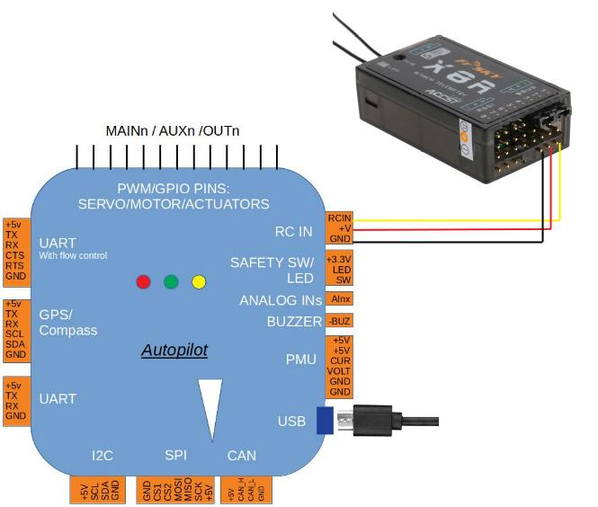
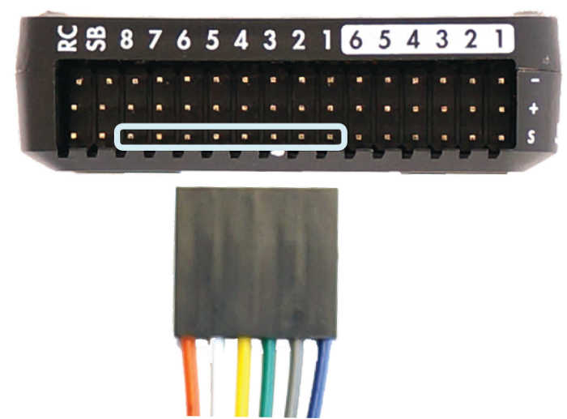

.. _common-flight-controller-wiring:

============================================
Typical Flight Controller Wiring Connections
============================================

.. image:: ../../../images/fc-io.jpg

This topic covers the wiring/connection of basic/mandatory peripherals to the flight controller. For detailed explanations about each flight controller port/connector, see :ref:`common-flight-controller-io`

GPS/Compass
-----------

GPS is mandatory in all vehicles. Compass is mandatory for Copter and Rover and QuadPlane types of Plane, but not for Conventional Planes, however it is highly recommended.

.. image:: ../../../images/gps-connection.jpg

.. note:: TX and RX are swapped from flight controller to GPS module.

.. note:: Usually GPS is attached to the logical Serial Port 3 by default in ArduPilot. However, which  physical UART is assigned to ArduPilot's Serial Port 3 on the flight controller is documented in the flight controllers :ref:`documentation <common-autopilots>`

As an wiring example, the topic :ref:`3DR UBlox GPS + Compass Module <common-installing-3dr-ublox-gps-compass-module_connecting_to_pixhawk>` shows how to connect to a Pixhawk flight controller and includes additional configuration and mounting information.

RC input
--------

Radio Control Receivers are normally used for pilot control. While exclusive pilot control via ground stations using telemetry is possible, it is not recommended.

Ardupilot autodetects the following serial RC receiver protocols:

   #. PPM remote control (R/C) receivers
   #. SBus receivers
   #. Spektrum DSM and DSM2 receivers
   #. Spektrum DSM-X Satellite receivers
   #. IBUS receivers
   #. MULTIPLEX SRXL version 1 and version 2 receivers.

For traditional single-wire-per-channel (PWM) receivers a PPM encoder
can be used to convert the receiver outputs to PPM-SUM. 

.. tip::

   Information about compatible receivers and how they are connected can be found in :ref:`Compatible RC Transmitter and Receiver Systems <common-pixhawk-and-px4-compatible-rc-transmitter-and-receiver-systems>`.

.. figure:: ../../../images/FRSkyTaranis.jpg
   :target: ../_images/FRSkyTaranis.jpg

   FRSky Taranis Transmitter

Motor/Servo Connections
-----------------------

Motor ESCs and/or PWM Servos are attached to the PWM outputs of the flight controller.

They are labeled either as MAIN/AUX outputs or just as OUTPUTs. These outputs provide the PWM or Dshot signals for motor ESC or servo control of flight surfaces. They can also be sometimes used as general purpose I/O pins for controlling relays, parachutes, grippers, etc.

Those controllers with MAIN/AUX output labels usually indicate that a IOMCU co-processor is being employed. These provide outputs intended for use as the motor/servo outputs and provide a redundant means of control via RC if the main flight controller fails. The MAIN outputs come from this co-processor, while the AUX designated outputs are controlled directly from the flight controller. Most board level flight controllers do not use an IOMCU and have outputs only labeled OUTPUTx or Mx.

This distinction is important, since AUX outputs(and OUTPUTs from flight controllers without an IOMCU) can be used as GPIOs as well as PWM or Dshot. While MAIN outputs can only be used for PWM.

.. note:: A few flight controllers that do NOT use an IOMCU label their outputs as MAIN, so actually do have the capability of use as GPIOs and/or Dshot ESC control outputs. CUAV V5 Nano and Holybro Pixhawk 4 Mini are examples.

Often these outputs are provided on 3 pin connector strips supplying or distributing servo power and ground, in addition to the individual output signals. This power is usually provided externally, such as by the ESC or a BEC, although some flight controllers provide this power from internal regulators.

An connection example for Rover

.. image:: ../../../images/servo-motor-connection.jpg

An example for Copters using only motors. In this case, only ESC signal lines are being connected.

[site wiki="copter"]
For Copter see :ref:`Connect ESCs and Motors <copter:connect-escs-and-motors>`.

In overview, for copters connect each signal wire from the PDB to the
main output signal (S) pins by motor number:

-  Pin 1 = Motor 1 - - Pin 5 = Motor 5
-  Pin 2 = Motor 2 - - Pin 6 = Motor 6
-  Pin 3 = Motor 3 - - Pin 7 = Motor 7
-  Pin 4 = Motor 4 - - Pin 8 = Motor 8

[/site]

[site wiki="plane"]
For planes connect the control channel wires to the main output signal
pins:

-  Pin 1 = Aileron
-  Pin 2 = Elevator
-  Pin 3 = Throttle
-  Pin 4 = Rudder

[/site]

[site wiki="rover"]
For Rovers connect the throttle and steering wires to the main output
signal pins:

-  Pin 3 = Throttle
-  Pin 1 = Steering

The skid-steer parameters are used to configure vehicles that have fixed wheels and steer like tank tracks (do not use servos to steer the wheels but rather use differential speed between the left and right wheels). The parameters are: SKID_STEER_OUT and SKID_STEER_IN. When enabled, flight controller's output RC1 is used for the left track control, and output RC3 is used for right track control.
[/site]

Connect buzzer and safety switch
================================

The buzzer and safety switch button are optional but recommended, if the flight controller provides those connections (many closed source flight controllers do not). Connect to the BUZZER and SWITCH ports as shown.

.. image:: ../../../images/safetysw-connection.jpg

.. warning::

   Mount the beeper at least 5cm away from the flight
   controller or the noise may upset the accelerometers.

Connect other peripherals
=========================

Depending on your hardware there may be any number of other peripherals
attached, including sensors, cameras, grippers etc. These can be found
as sub-pages of the topic :ref:`Optional Hardware <common-optional-hardware>`.

Information about connecting these peripherals to the flight controller is found in
those respective pages.

Related information
===================

.. toctree::
    :maxdepth: 1

    Flight Controller I/O <common-flight-controller-io>
    Wiring Example using Pixhawk <common-pixhawk-wiring-and-quick-start>
    Powering the Pixhawk <common-powering-the-pixhawk>
    Compatible RC Tx/Rx Systems <common-pixhawk-and-px4-compatible-rc-transmitter-and-receiver-systems>

[site wiki="copter"]
    Advanced Pixhawk Quadcopter Wiring Chart <advanced-pixhawk-quadcopter-wiring-chart>
[/site]

