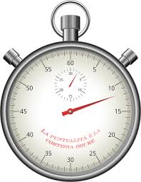

.. _common-flight-time-recorder:

[copywiki destination="copter,plane,rover"]

====================
Flight Time Recorder
====================

ArduPilot includes a flight time recorder which records the board's total flight time, total run time and number of times the board has been rebooted.  These are stored in user resettable parameters meaning they are not protected from being tampered with.

Parameter Details
=================

-  :ref:`STAT_BOOTCNT <STAT_BOOTCNT>` holds the number of times the board has been booted
-  :ref:`STAT_FLTTIME <STAT_FLTTIME>` holds the total number of seconds that the board/vehicle has been flying (including all previous flights)
-  :ref:`STAT_RUNTIME <STAT_RUNTIME>` holds the total number of seconds that the board has been powered up (including all previous flights)
-  :ref:`STAT_RESET <STAT_RESET>` hold the number of seconds after epoch (1st Jan 1970) since the statistics were reset if the board has a GPS to provide a real time.  Without a GPS the time will be something close to 1st Jan 1970.  The user can trigger a reset of all statistic by setting this parameter to "0".  This parameter will then immediately be reset again to the current time since epoch and all other parameters set back to zero.

When will counters be reset?
============================

The STAT parameters will not be cleared when upgrading/downgrading firmware versions of a particular vehicle type (i.e. upgrading from Copter-3.4 to 3.5 will not clear the parameters).

The parameters are not protected meaning they can be changed by the user.  In addition they may be reset when:

-  a different vehicle code is written to the board which clears all parameters (i.e. loading a copter firmware onto a board which was running the plane firmware)
-  user performs a :ref:`parameter reset <common-parameter-reset>`
