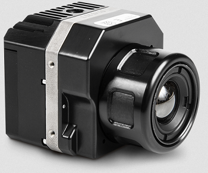
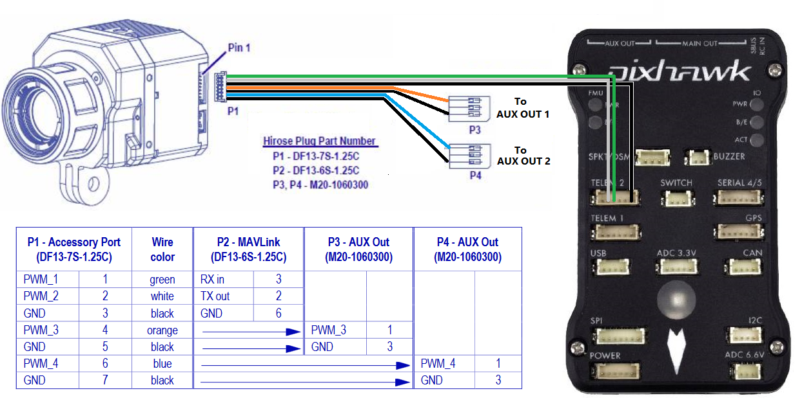
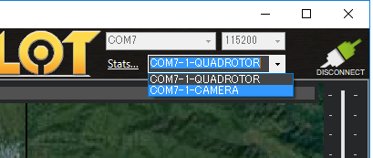
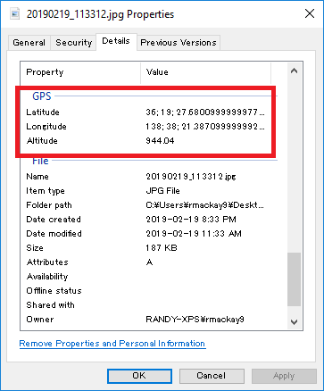

.. _common-flir-vue-pro:

============
FLIR Vue Pro
============

The `FLIR Vue Pro <https://www.flir.com/products/vue-pro/>`__ infrared camera supports MAVLink which allows the camera to add position and attitude information to each image stored on its internal SD card

*image courtesy of flir.com*

Some of these instructions are based on information from the `FLIR Vue Pro User Guide <https://www.flir.com/globalassets/imported-assets/document/436-0013-10-vue-pro-and-r-user-guide.pdf>`__ and `Tuffwing.com <http://www.tuffwing.com/support/Flir_Vue_Pro_Pixhawk_Installation.html>`__

Recommended Hardware
--------------------

- Flir Vue Pro is available directly from `flir.com <https://www.flir.com/products/vue-pro/>`__
- `Flir Cable Accessory Cable <https://www.flir.com/products/4142156_cable-accessory-port/>`__ (for Pixhawk1 using DF13 connectors) or `Tuffwing.com's Flir Vue Pro trigger and geotag cable <http://www.tuffwing.com/store/store.html#flir_vue_cable>`__ (for most other autopilots using JST connectors)

Connecting and Configuring
--------------------------

Plug one end of the accessory cable into the camera's 7-pin DF13 connector (found next to the micro USB port) and then the other 6-pin connector to one of the autopilot's telemetry ports.  In this example Telem2 is used.

Set the following parameters on the autopilot (assuming Telem2/Serial2 is used):

-  :ref:`SERIAL2_PROTOCOL <SERIAL2_PROTOCOL>` = 1 (MAVLink 1)
-  :ref:`SERIAL2_BAUD <SERIAL2_BAUD>` = 57 (57200 baud)
-  :ref:`SR2_POSITION <SR2_POSITION>` = 5 to send the vehicle's position to the camera at 5hz

To allow triggering the taking of pictures during a mission or from a transmitter's auxiliary switch connect the "P3" 3-pin servo connector to the one of the autopilot's servo outputs.  In this example AUX OUT 1 (aka SERVO9) is used.  Then set the following parameters

- :ref:`SERVO9_FUNCTION <SERVO9_FUNCTION>` = 10 (Camera Trigger)
- :ref:`CAM_SERVO_ON <CAM_SERVO_ON>` = 1900
- `CH8_OPT`` or :ref:`RC8_OPTION <RC8_OPTION>` = 9 (Camera Trigger) to enable triggering from transmitter switch 8

Configure the Phone
-------------------

`As described on Tuffwing.com <http://www.tuffwing.com/support/Flir_Vue_Pro_Pixhawk_Installation.html>`__, install the Flir UAS app on your phone (`android <https://play.google.com/store/apps/details?id=com.flir.vuepro&hl=en>`__ or `iPhone <https://itunes.apple.com/us/app/flir-uas/id1051901140?mt=8>`__), power up the camera and connect from your phone using BlueTooth.  Set the following options for the Accessory Port:

- Serial Protocol: MAVLink
- Serial Data Rate: 57600
- Channel 1 : MAVLink TX
- Channel 3: Record Start/Stop

Testing
-------

- Power up the camera and autopilot in a location where the vehicle can get a GPS lock.
- Connect with a ground station (like Mission Planner) and check that the vehicle appears on the map
- If the serial connection between the autopilot and camera is working then shortly after the camera is powered on, it will begin sending heartbeats to the autopilot and ground station which, if using the Mission Planner, will make it appear as "CAMERA" in the top-right drop-down.  Selecting the CAMERA will not work though because the camera does not respond to requests for parameters

- Trigger taking a picture using the transmitter's auxiliary switch or by right-mouse-button-clicking on the map and selecting "Trigger Camera NOW".  The camera should beep
- Connect the camera to your computer using a USB cable (or remove the camera's SD card) and check that an image has been captured
- Check the file properties to ensure the latitude, longitude and altitude have been recorded with the image

