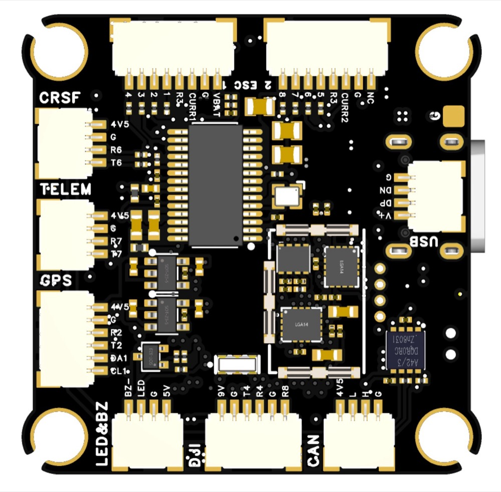
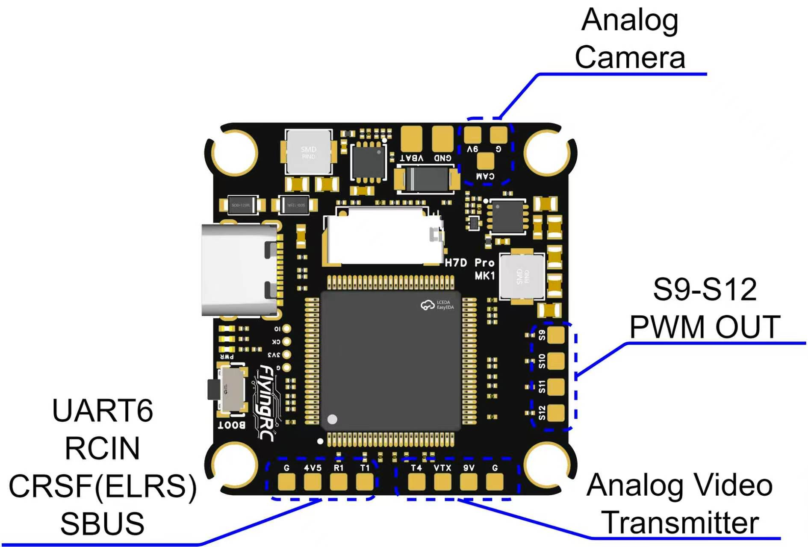
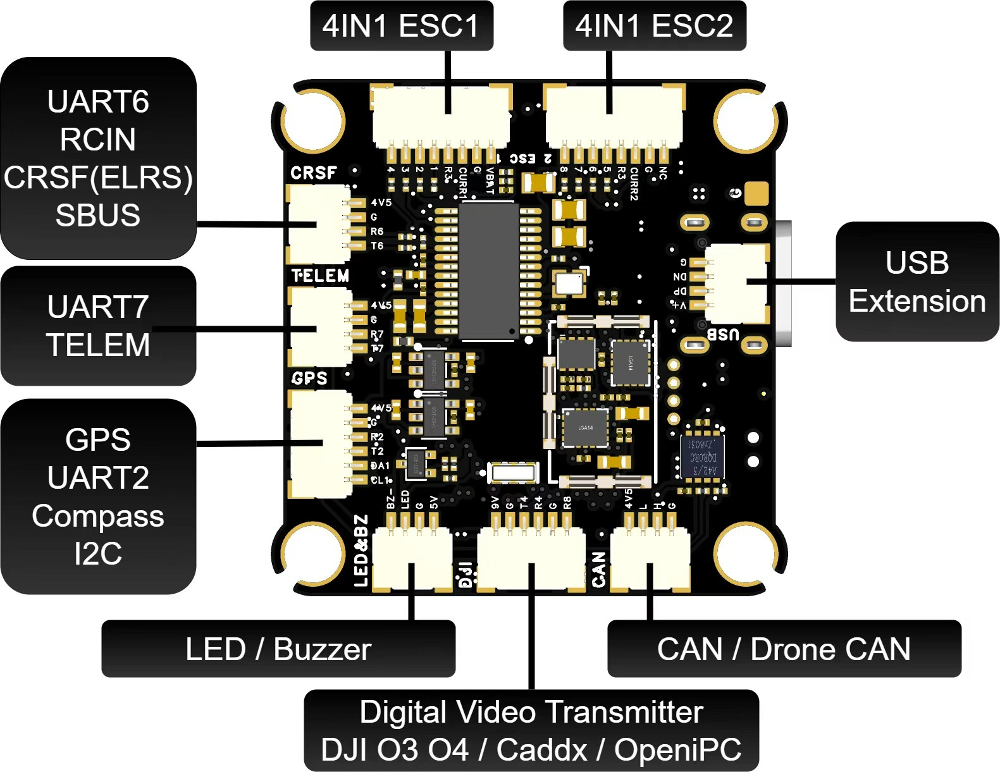

.. _common-flyingrc-h7d-pro:

================
FlyingRC H7D Pro
================

The FlyingRC H7D Pro is an STM32H743-based FPV flight controller for feature-rich multirotor builds.

Product documentation and wiring references are available from the `FlyingRC H7D Pro product page <https://flyingrc-official.github.io/en/products/h7d-pro/>`__.

Where to Buy
============

The FlyingRC H7D Pro is available from the `FlyingRC Taobao store <https://e7wgwo2ehnynhjklw2knt535zmlw176.world.taobao.com/shop/view_shop.htm?appUid=RAzN8HAiDiXrnbmP2phqB88hKp1Wt>`__.

.. image:: ../../../images/FlyingRCH7DPro_front.jpg
   :target: ../_images/FlyingRCH7DPro_front.jpg
   :width: 45%

Specifications
==============

-  **Processor**

   -  STM32H743 microcontroller
   -  AT7456E analog OSD
   -  microSD card support

-  **Sensors**

   -  Dual ICM42688-P IMUs
   -  DPS310 / SPL06 barometer on I2C2
   -  External compass probing on I2C through the GPS connector ``DA1``/``CL1`` pins

-  **Power**

   -  Onboard voltage and current sensing
   -  12 V to 28 V DC / 3S to 6S LiPo input
   -  Switchable onboard 9 V VTX/camera BEC controlled by PINIO1 / User1

-  **Interfaces**

   -  USB
   -  CAN1
   -  8 serial ports including USB
   -  12 PWM outputs
   -  PWM13 / S13 WS2812 LED output
   -  Digital VTX connector on UART4 (``T4``/``R4``, ArduPilot ``SERIAL6``)
   -  DJI digital VTX SBUS input on UART8 (``R8``, ArduPilot ``SERIAL5``)

Pinout
======

Firmware Targets
================

Two ArduPilot firmware targets are provided:

-  ``FlyingRCH7DPro``: standard target for PWM, OneShot, and DShot outputs.
-  ``FlyingRCH7DPro-bdshot``: bi-directional DShot target with the timer and DMA remapping required for BDShot.

The BDShot target reuses the standard ``FlyingRCH7DPro`` bootloader.

UART Mapping
============

ArduPilot SERIAL numbers do not match the board UART labels one-to-one. The DMA column lists RX/TX DMA availability for the standard target first and notes any BDShot-target difference.

.. list-table::
   :widths: 14 14 25 22 25
   :header-rows: 1

   * - ArduPilot port
     - Hardware port
     - Board label / use
     - Default protocol
     - DMA
   * - SERIAL0
     - USB OTG1
     - USB
     - MAVLink2
     - N/A
   * - SERIAL1
     - UART7
     - Telem1
     - MAVLink2
     - RX and TX
   * - SERIAL2
     - USART1
     - Telem2
     - MAVLink2
     - RX and TX
   * - SERIAL3
     - USART2
     - GPS1
     - GPS
     - RX and TX
   * - SERIAL4
     - USART3
     - R3, ESC telemetry
     - ESC telemetry
     - RX only
   * - SERIAL5
     - UART8
     - DJI VTX SBUS input, R8
     - None
     - RX only, interrupt-driven
   * - SERIAL6
     - UART4
     - Digital VTX, T4/R4
     - MSP DisplayPort
     - Standard: RX and TX; BDShot: TX only
   * - SERIAL7
     - USART6
     - UART6 RCIN, R6/T6
     - RCIN
     - RX and TX; standard ALT(1) uses timer RCIN

Both 4-in-1 ESC connectors expose the same ``R3`` signal, which is ``USART3_RX``/PD9 (``SERIAL4``). It is an RX-only ESC telemetry input; there is no ``T3`` pad and this port is not assigned as GPS2. Connect only one telemetry source to the shared ``R3`` signal.

RC Input
========

The receiver connector is labelled ``UART6 RCIN`` and exposes ``4V5``, ``G``, ``R6``, and ``T6``. Both targets default to the full USART6 UART with :ref:`SERIAL7_PROTOCOL<SERIAL7_PROTOCOL>` = 23 (RCIN), so CRSF/ELRS can use ``R6`` and ``T6`` for bidirectional telemetry without changing :ref:`BRD_ALT_CONFIG<BRD_ALT_CONFIG>`. USART6 RX and TX both have DMA.

On the standard target, set :ref:`BRD_ALT_CONFIG<BRD_ALT_CONFIG>` = 1 to change ``R6``/PC7 to timer-based RC input for single-wire receiver protocols such as SBUS and PPM. This alternate configuration does not provide bidirectional UART receiver telemetry. The BDShot target uses TIM3 for motor outputs, so it always keeps ``R6``/``T6`` in USART6 mode and does not support PPM on this connector.

For common serial receiver configurations:

-  FPort: set :ref:`SERIAL7_OPTIONS<SERIAL7_OPTIONS>` = 15.
-  CRSF/ELRS: connect both ``R6`` and ``T6`` and set :ref:`SERIAL7_OPTIONS<SERIAL7_OPTIONS>` = 0.
-  SRXL2: connect the receiver to ``T6`` and set :ref:`SERIAL7_OPTIONS<SERIAL7_OPTIONS>` = 4.

The DJI digital VTX connector also exposes its SBUS output on ``R8``, which is UART8 RX (``SERIAL5``). To use it as an alternate RC input, set :ref:`SERIAL5_PROTOCOL<SERIAL5_PROTOCOL>` = 23 and :ref:`SERIAL5_OPTIONS<SERIAL5_OPTIONS>` = 3 for the standard inverted SBUS signal from a DJI air unit. UART8 is RX-only on this board and uses interrupt-driven input rather than DMA. See :ref:`common-rc-systems` for receiver-specific setup.

OSD Support
===========

The FlyingRC H7D Pro supports onboard analog OSD using :ref:`OSD_TYPE<OSD_TYPE>` = 1 for the MAX7456-compatible driver.

The Digital VTX connector ``T4``/``R4`` is UART4 (``SERIAL6``). Both targets default :ref:`SERIAL6_PROTOCOL<SERIAL6_PROTOCOL>` to MSP DisplayPort and :ref:`OSD_TYPE2<OSD_TYPE2>` = 5. The standard target has DMA on both UART4 directions; the BDShot target keeps DMA on UART4 TX and uses interrupt-driven RX so the IMU and motor-timer DMA allocations remain conflict-free.

PWM Outputs
===========

The standard target provides 12 PWM outputs plus PWM13 for the WS2812 LED pad.

.. list-table::
   :widths: 15 15 25 35
   :header-rows: 1

   * - Output
     - Board label
     - Standard target
     - BDShot target
   * - PWM1
     - 1 ESC: 1
     - TIM8_CH2N
     - TIM3_CH3, BIDIR
   * - PWM2
     - 1 ESC: 2
     - TIM8_CH3N
     - TIM3_CH4
   * - PWM3
     - 1 ESC: 3
     - TIM5_CH1
     - TIM2_CH1, BIDIR
   * - PWM4
     - 1 ESC: 4
     - TIM5_CH2
     - TIM2_CH2
   * - PWM5
     - 2 ESC: 5
     - TIM5_CH3
     - TIM5_CH3, BIDIR
   * - PWM6
     - 2 ESC: 6
     - TIM5_CH4
     - TIM5_CH4
   * - PWM7
     - 2 ESC: 7
     - TIM4_CH1
     - TIM4_CH1, BIDIR
   * - PWM8
     - 2 ESC: 8
     - TIM4_CH2
     - TIM4_CH2
   * - PWM9
     - S9
     - TIM4_CH3
     - TIM4_CH3
   * - PWM10
     - S10
     - TIM4_CH4
     - TIM4_CH4
   * - PWM11
     - S11
     - TIM15_CH1
     - TIM15_CH1
   * - PWM12
     - S12
     - TIM15_CH2
     - TIM15_CH2
   * - PWM13
     - S13
     - TIM1_CH1
     - TIM1_CH1, WS2812 LED

In the BDShot target, M1/M3/M5/M7 carry the ``BIDIR`` timer-capture definitions needed for the M1-M8 bi-directional DShot motor set. DMA sharing is constrained with ``DMA_NOSHARE SPI1* SPI4* TIM3* TIM2* TIM5* TIM4*`` so the IMU SPI buses do not share DMA with the BDShot motor timer groups.

Battery Monitoring
==================

Default battery monitor settings are:

-  :ref:`BATT_MONITOR<BATT_MONITOR>` = 4
-  :ref:`BATT_VOLT_PIN<BATT_VOLT_PIN__AP_BattMonitor_Analog>` = 10
-  :ref:`BATT_CURR_PIN<BATT_CURR_PIN__AP_BattMonitor_Analog>` = 11
-  :ref:`BATT_VOLT_MULT<BATT_VOLT_MULT__AP_BattMonitor_Analog>` = 21.0
-  :ref:`BATT_AMP_PERVLT<BATT_AMP_PERVLT__AP_BattMonitor_Analog>` = 100.0

Verify the actual power wiring and current-sensor calibration before flight.

PINIO / VTX Power
=================

``PINIO1`` is assigned to PD10 / GPIO81 and is intended for VTX BEC power switch control. The product documentation describes this as a switchable onboard 9 V VTX/camera BEC controlled through PINIO1/User1.

Compass and IMUs
================

The board has no built-in compass in this hwdef. An external compass can be connected to the GPS connector's ``DA1`` (PB7/I2C1 SDA) and ``CL1`` (PB6/I2C1 SCL) pins; external compass probing is enabled on that I2C bus.

The current ArduPilot target probes the two ICM42688-P IMUs with these orientations:

.. code-block:: none

   IMU Invensensev3 SPI:icm42688_1 ROTATION_YAW_270
   IMU Invensensev3 SPI:icm42688_2 ROTATION_YAW_180

Loading Firmware
================

For an initial DFU flash, hold the boot button while plugging in USB and load a ``*_with_bl.hex`` firmware image. After the bootloader is installed, firmware can normally be updated from an ArduPilot-compatible ground station with the ``.apj`` file for the matching target.

Use the target that matches the build:

-  Standard DShot / PWM builds: ``FlyingRCH7DPro``
-  Bi-directional DShot builds: ``FlyingRCH7DPro-bdshot``

Always verify board target, wiring, sensor orientation, motor order, and battery monitor calibration before flight.
