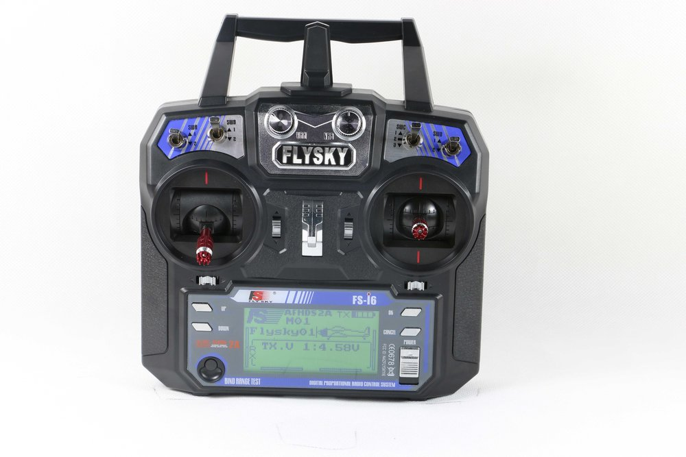

.. _common-flysky-rc:
[copywiki destination="plane,copter,rover,blimp"]
=================
Flysky RC Systems
=================

`Flysky product page <https://www.flysky-cn.com/plane>`__

Flysky Receivers
----------------

Flysky has many compatible receivers. Some ouput PWM, some i-BUS/SBus. Many offer telemetry through the i-BUS protocol. For more information about i-BUS telemetry, refer to the :ref:`i-BUS Telemetry page <common-ibus-telemetry>`.

    Flysky iA6B receiver