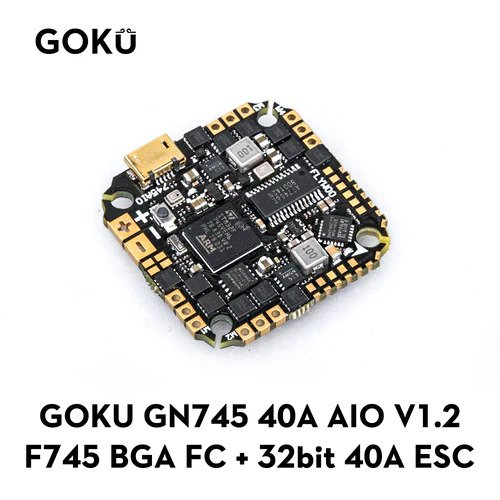
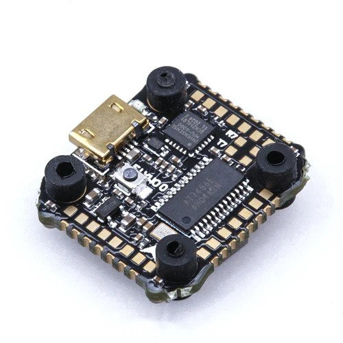
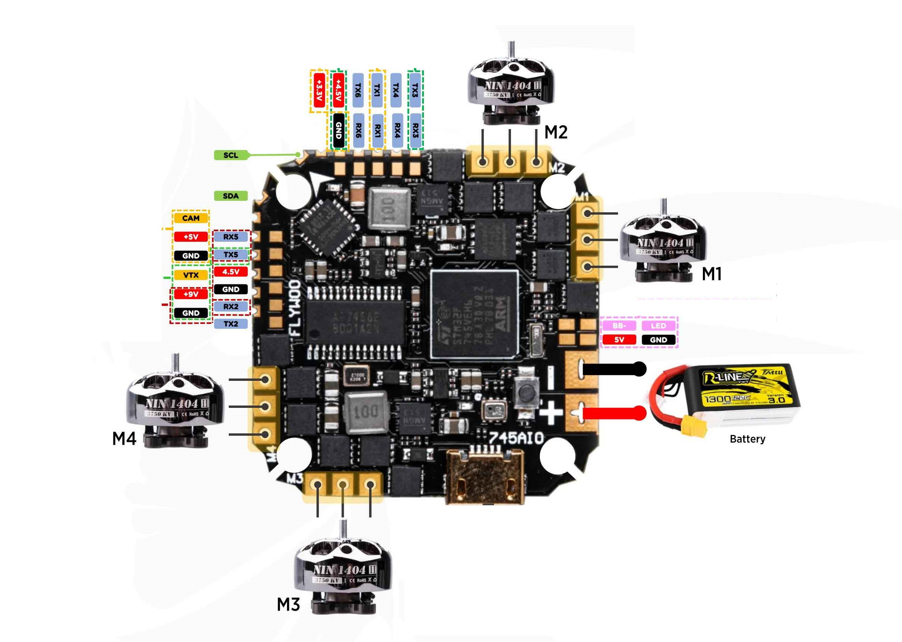
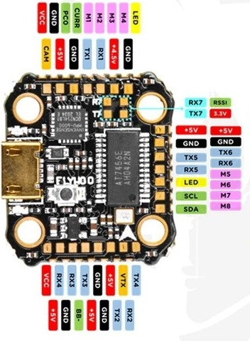

.. _common-flywoo-f745:

=========================================
Flywoo GOKU GN 745 AIO with 40A ESC/ Nano
=========================================

The Flywoo GOKU GN 745 AIO is an autopilot produced by [Flywoo](https://flywoo.net/).

The Nano version is a smaller reduced feature set version

Where To Buy
============

`Flywoo <https://flywoo.net>`__

Specifications
==============

-  **Processor**

   -  STM32F745VG  ARM (216MHz), 1MB Flash
   -  Integrated 4 output, BLHeli-32 40A ESC (AIO version only)

-  **Sensors**

   -  InvenSense MPU6000 IMU (accel, gyro) 
   -  BMP280 barometer
   -  Voltage & 100A Current sensor (AIO version only)

-  **Power**

   -  7.4V ~ 25V DC input power (4S MAX for Nano version)
   -  5V 2A BEC for peripherals
   -  9V 1.5A BEC for video

-  **Interfaces**

   -  7x UARTS
   -  10x PWM outputs, first 4 are internally connected to 4in1 40A BLHeli32 ESC.
   -  I2C port for external compass, airspeed sensor, etc.
   -  USB port
   -  Camera input/ VTX output
   -  Built-in OSD

   **Size and Dimensions AIO**

   - 33.5mm x 33.5mm (25.6 x 25.6mm mount pattern)
   - 8.5g

   **Size and Dimensions Nano**
   
   - 22mm x 23.5mm (16mm x16mm mount pattern)
   - 2.3g

Pinouts
=======
AIO

Nano

    
Default UART order
==================

- SERIAL0 = console = USB
- SERIAL1 = Telemetry1 = USART1 
- SERIAL2 = Telemetry2 = USART2
- SERIAL3 = RC Input = USART3 
- SERIAL4 = USER = USART4
- SERIAL5 = USER = UART5
- SERIAL6 = GPS = USART6
- SERIAL7 = ESC Telem = UART7 (RX tied to ESC telemetry) See :ref:`blheli32-esc-telemetry`

UART3 supports RX and TX DMA. UART1, UART2, UART4, and UART6 supports TX DMA. UART5 and UART7 do not support DMA. Serial port protocols (Telem, GPS, etc.) can be adjusted to personal preferences.

RC Input
========

RC input is configured on the RX3 (UART3_RX) pin. It supports all RC protocols except PPM. See :ref:`common-rc-systems` for details for a specific RC system. :ref:`SERIAL3_PROTOCOL<SERIAL3_PROTOCOL>` is set to "23", by default, to enable this.

- SBUS/DSM/SRXL connects to the RX3 pin but SBUS requires that the :ref:`SERIAL3_OPTIONS<SERIAL3_OPTIONS>` be set to "3".

- FPort requires connection to TX3 and :ref:`SERIAL3_OPTIONS<SERIAL3_OPTIONS>` be set to "7".

- CRSF also requires a TX3 connection, in addition to RX3, and automatically provides telemetry. Set :ref:`SERIAL3_OPTIONS<SERIAL3_OPTIONS>` to "0".

- SRXL2 requires a connection to TX6 and automatically provides telemetry.  Set :ref:`SERIAL3_OPTIONS<SERIAL3_OPTIONS>` to "4".

Any UART can be used for RC system connections in ArduPilot also, and is compatible with all protocols except PPM. See :ref:`common-rc-systems` for details.

PWM Output
==========

The GOKU GN 745 AIO supports up to 8 PWM outputs. The pads for motor output ESC1 to ESC4 on the above diagram are the first 4 outputs, there are four additional pads for PWM 5-8. All 8 outputs support DShot as well as all PWM types.

The Nano version has 4 esc signals, current and voltage sense inputs on an external connector. The remaining outputs are on solder pads.

The PWM are in 5 groups: 1/2/7/8, 3/4, 5, 6

Channels within the same group need to use the same output rate. If
any channel in a group uses DShot then all channels in the group need
to use DShot. PWM 1-4 support bidirectional DShot.

Neopixel Output
===============

The LED pin is PWM output 9 and is default setup for use with a NeoPixel 4 led string for notifications.

Battery Monitor
===============

The board has a built-in voltage and current sensors.

The correct battery monitor parameters are:

-    :ref:`BATT_MONITOR<BATT_MONITOR>` =  4
-    :ref:`BATT_VOLT_PIN<BATT_VOLT_PIN>` = 13
-    :ref:`BATT_VOLT_MULT<BATT_VOLT_MULT>` ~ 10.9
-    :ref:`BATT_CURR_PIN<BATT_CURR_PIN>` = 12
-    :ref:`BATT_AMP_PERVLT<BATT_AMP_PERVLT>` ~ 28.5 (when using AIO version)

These are set by default in the firmware and shouldn't need to be adjusted.

Compass
=======

The GOKU GN 745 AIO does not have a builtin compass but it does have an external I2C connector.

Loading ArduPilot onto the board
================================

Initial firmware load can be done with DFU by plugging in USB with the
bootloader button pressed. Then you should load the "with_bl.hex"
firmware, using your favourite DFU loading tool.

Once the initial firmware is loaded you can update the firmware using
any ArduPilot ground station software. Updates should be done with the xxxxxxxxxx.apj firmware files.

Firmware
========

Firmware for this board can be found `here <https://firmware.ardupilot.org>`_ in  sub-folders labeled
"FlywooF745" for the AIO or "FlywooF745Nano" for the Nano version.

[copywiki destination="plane,copter,rover,blimp"]
