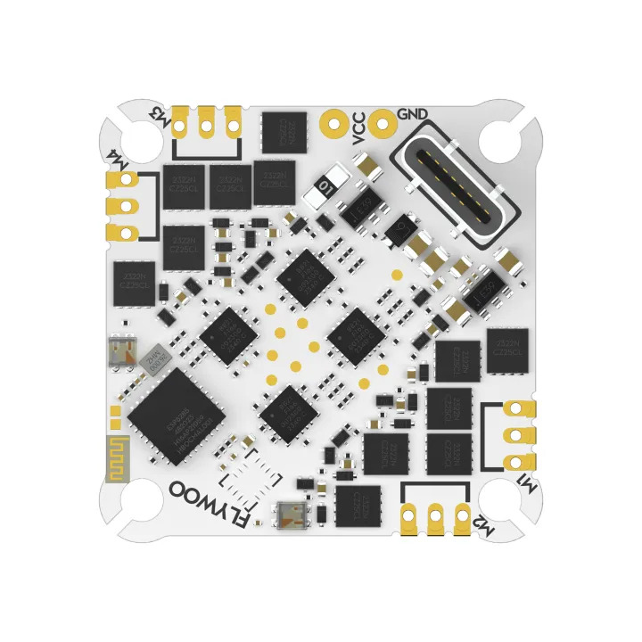

.. _common-flywoof405hd :

=================================
GOKU F405 HD 1-2S 12A ELRS AIO V2  
=================================

The Flywoo Goku F405HD is a small autopilot for 1-2S tiny whoop quadcopter applications with integrated 12A(25A peak) ESC and ELRS receiver.

.. note::

	Due to flash memory limitations, this board does not include all ArduPilot features.
        See :ref:`Firmware Limitations <common-limited_firmware>` for details.

Specifications
==============

-  **Processor**

   -  STM32F405 ARM (168MHz)
   -  8MByte flash for logging

-  **Sensors**

   -  ICM-42688P IMU or MPU6000(accel, gyro)
   -  DPS-310 or SPL06 barometer
   -  Voltage & 180A current sensor

-  **Power**

   -  1S - 2S Lipo input voltage with voltage monitoring
   -  5V, 2A BEC for internal and peripherals including air unit power
   -  9V, 2A on/off controlled BEC for video

-  **Interfaces**

   -  4 Motor outputs
   -  SBUS input with inversion for optional use instead of internal ELRS RX
   -  6x UARTs/serial for GPS and other peripherals, 1st UART internally tied to ELRS board
   -  USB-C port on remote dongle

-  **Size and Dimensions**

   - 20.5 x 20.5 mounting holes, 30 x 30mm overall
   - 4.9g

Where to Buy
============

`Flywoo <https://www.flywoo.net/products/goku-f405-hd-1-2s-elrs-aio-v2>`__

Pinout
======

Default UART order
==================

The UARTs are marked RXn and TXn in the above pinouts. The RXn pin is the
receive pin for UARTn. The TXn pin is the transmit pin for UARTn.

 - SERIAL0 -> USB
 - SERIAL1 -> USART1 (Internally connected to ELRS module) (DMA capable)
 - SERIAL2 -> USART2 (MAVlink Telem) (DMA on RX only)
 - SERIAL3 -> UART3  (USER) (DMA capable)
 - SERIAL4 -> UART4  (GPS)
 - SERAIL5 -> UART5  (not pinned out)
 - SERIAL6 -> UART6  (DisplayPort) 

Serial protocols shown are defaults, but can be adjusted to personal preferences.

Servo/Motor Outputs
===================

Internally connected to integrated 4in1 ESC with BLHELI_S firmware. Bi-Directional DShot capable and are configured as such by default.

.. note:: for users migrating from BetaflightX quads, the first four outputs M1-M4 have been configured for use with existing motor wiring using these default parameters:

- :ref:`FRAME_CLASS<FRAME_CLASS>` = 1 (Quad)
- :ref:`FRAME_TYPE<FRAME_TYPE>` = 12 (BetaFlightX) 

RC Input
========

UART1 is tied internally to a 2.4GHz ELRS receiver module and defaulted to that protocol.

There are two pins provided for SBUS input also, one being inverted and applied to UART3 RX, and another to UART5 RX on the DJI connector. To use either, the :ref:`SERIAL1_PROTOCOL<SERIAL1_PROTOCOL>` would have to be changed to something other than "23", and the :ref:`SERIAL3_PROTOCOL<SERIAL3_PROTOCOL>` set to "23", for use of its SBUS pin, or :ref:`SERIAL5_PROTOCOL<SERIAL5_PROTOCOL>` set to "23", in order tho use the SBUS input on the DJI Connector.

OSD Support
===========

The autopilot supports HD air units with telemetry using UART4 RX/TX on the DJI connector. See :ref:`common-msp-osd-overview-4.2` for more info.

Battery Monitor Configuration
=============================
These settings are set as defaults when the firmware is loaded . However, if they are ever lost, you can manually set the parameters:

Enable Battery monitor.

:ref:`BATT_MONITOR<BATT_MONITOR>` =4

Then reboot.

:ref:`BATT_VOLT_PIN<BATT_VOLT_PIN>` 13

:ref:`BATT_CURR_PIN<BATT_CURR_PIN>` 12

:ref:`BATT_VOLT_MULT<BATT_VOLT_MULT>` 11.0

:ref:`BATT_AMP_PERVLT<BATT_AMP_PERVLT>` 60.2

Compass
=======
The Flywoo Goku F405HD does not have a builtin compass but it does have an external I2C pads to allow its addition.

NeoPixel LED
============
The board includes a NeoPixel LED pad and is preconfigured for serial leds.

VTX Power Switch
================

The JST-GH-6P connector supports a standard DJI HD VTX connection. Pin 1 of the connector is 9v so be careful not to connect this to a peripheral requiring 5v. The 9v supply is controlled by a ``RELAY`` set to GPIO 81 and is on by default. It can be configured to be operated by an RC switch or via GCS command (Mission Planner AUX tab)

Firmware
========
This board does not come with ArduPilot firmware pre-installed. Use instructions here to load ArduPilot the first time :ref:`common-loading-firmware-onto-chibios-only-boards`.

Firmware (Copter/Heli only)for this board can be found `here <https://firmware.ardupilot.org>`_ in  sub-folders labeled "FlywooF405HD-AIOv2".

[copywiki destination="plane,copter,rover,blimp"]

