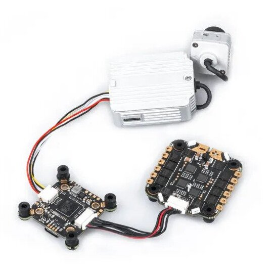
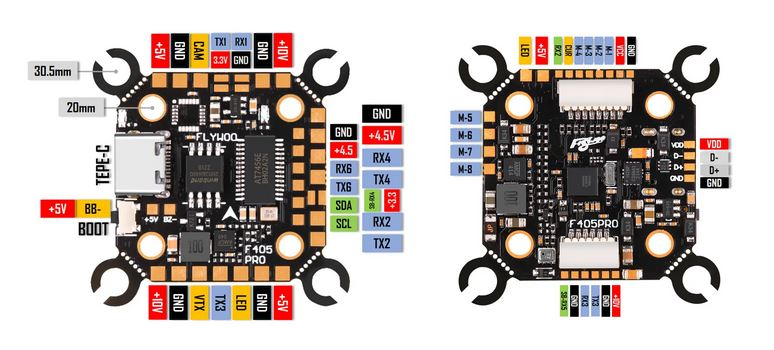

.. _common-flywoof405pro:

==============
FlywooF405 Pro
==============

Specifications
==============

-  **Processor and Sensors**

   -  STM32F405 ARM microcontroller
   -  ICM42688 IMU (Gyro and Accelerometers)
   -  BMP280 Barometer
   -  AT7456E OSD
   -  16Mbytes logging flash

-  **Interfaces**

   -  9x PWM outputs (PWM9 for Neopixel LED)
   -  1x RC input (PWM/PPM, SBUS)
   -  6x serial port inputs (including RC input listed above)
   -  1x I2C for external compass or airspeed sensor
   -  4 in 1 ESC connector
   -  DJI Air Unit connector
   -  USB-C connector

-  **Power**

   -  9V ~ 25V DC input power (3S-6S)
   -  5V 2A BEC for peripheral 
   -  10V 2A for Video

-  **Size and Dimensions**

   - 20mm x 20mm or 30.5mm x 30.5mm mount pattern
   - 5.5g

Where to Buy
============

- Available from various retailers and directly from the manufacturer `Flywoo <https://flywoo.net/products/goku-versatile-f405-pro-fc-20x20-30-5x30-5>`__

Pinouts
=======

UART Defaults
=============

The UARTs are marked Rn and Tn in the above pinouts. The Rn pin is the receive pin for UARTn. The Tn pin is the transmit pin for UARTn. 

-    SERIAL0 -> USB
-    SERIAL1 -> USART1 (GPS)
-    SERIAL2 -> USART2 (RX only,ESC Telemetry)
-    SERIAL3 -> USART3 (DJI, DMA Enabled)
-    SERIAL4 -> UART4 (SBUS pin is inverted and connects to RX pin)(TX DMA Enabled) For normal UART use, :ref:`BRD_ALT_CONFIG<BRD_ALT_CONFIG>` = 1.
-    SERIAL5 -> UART5 (RX5 is fed from an inverter connected to DJI connector's SBUS pin, no TX pin)
-    SERIAL6 -> UART6 (RC serial input, DMA-enabled)

RC Input
========

RC input is configured on the SBUS pin which is inverted and feeds the R4 (UART4_RX) pin for most RC unidirectional protocols, including PPM.

For CRSF/ELRS/SRXL2 connection of those to UART6 is pre-configured.

The DJI connector' SBUS input can be used for SBUS only, but :ref:`SERIAL5_PROTOCOL<SERIAL5_PROTOCOL>` must be set to "23" and :ref:`SERIAL6_PROTOCOL<SERIAL6_PROTOCOL>` must be changed to something other than "23".

Dshot capability
================

The FlywooF405 Pro supports up to 9 PWM outputs. The M1 to M4 outputs are on the esc connector and are bi-directional DShot capable, M5 to M8 on solder pads and DShot capable, plus LED pad(PWM output 9) for LED strip or another PWM output.

The PWM is in 3 groups:

-  PWM 1-2,5,7 in group1
-  PWM 3-4 in group2
-  PWM 6,8 in group2
-  PWM 9   in group3

Channels within the same group need to use the same output protocol. If any channel in a group uses DShot then all channels in the group need to use DShot. Channels 1-4 also support bi-directional DShot.

GPIOs
=====

The FlywooF405 Pro outputs can be used as GPIOs (relays, buttons, RPM etc). To use them you need to set the output's ``SERVOx_FUNCTION`` to -1. See :ref:`common-gpios` page for more information.

The numbering of the GPIOs for PIN variables in ArduPilot is:

 - PWM1 50
 - PWM2 51
 - PWM3 52
 - PWM4 53
 - PWM5 54
 - PWM6 55
 - PWM7 56
 - PWM8 57
 - PWM9 58

RSSI/Analog Airspeed Input
==========================

An analog input is provided and its reference pin number is "10"

OSD Support
===========

The FlywooF405 Pro has an on-board OSD using :ref:`OSD_TYPE<OSD_TYPE>` =  1 (MAX7456 driver). The CAM and VTX pins provide connections for using the internal OSD.

DJI Video and OSD
=================

A JST-GH-6P connector supports a standard DJI HD VTX connection and SERIAL3 is already setup for this by default.  Pin 1 of the connector is 10v so be careful not to connect this to any peripheral requiring 5v.

Battery Monitoring
==================

The board has a internal voltage sensor and connections on the ESC connector for an external current sensor input. The voltage sensor can handle up to 6S LiPo batteries.

The default battery parameters are:

-    :ref:`BATT_MONITOR<BATT_MONITOR>` = 4
-    :ref:`BATT_VOLT_PIN<BATT_VOLT_PIN>` = 13
-    :ref:`BATT_CURR_PIN<BATT_CURR_PIN>` = 12
-    :ref:`BATT_VOLT_MULT<BATT_VOLT_MULT>` = 11.0
-    :ref:`BATT_AMP_PERVLT<BATT_AMP_PERVLT>` = 58.8 (will need to be adjusted for whichever current sensor is attached)

Compass
=======

The FlywooF405 Pro does not have a builtin compass, but you can attach an external compass using I2C on the SDA and SCL pads.

Firmware
========
This board does not come with ArduPilot firmware pre-installed. Use instructions here to load ArduPilot the first time :ref:`common-loading-firmware-onto-chibios-only-boards`.

Firmware for this board can be found `here <https://firmware.ardupilot.org>`_ in  sub-folders labeled "FlywooF405Pro". Firmware is provided only for Copter/Heli but may be built for other vehicles using the `ArduPlot Custom Firmware Build Server <https://custom.ardupilot.org>`__

[copywiki destination="plane,copter,rover,blimp"]