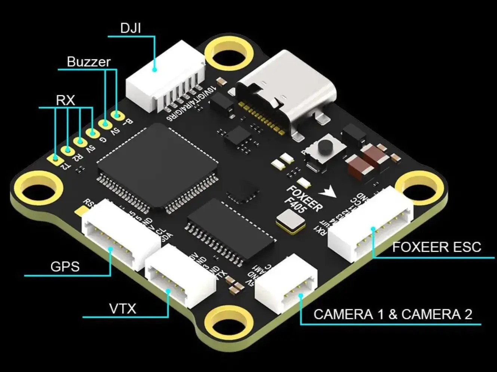

.. _common-foxeerf405v2:

============
FoxeerF405V2
============

*above image and some content courtesy of* `Foxeer <http://www.foxeer.com>`__

Where to Buy
============

- Available from many retailers including `Foxeer <https://www.foxeer.com/foxeer-f405-v2-fc-reaper-55a-esc-8s-stack-video-switcher-servo-barometer-g-578>`__

Specifications
==============

-  **Processor**

   -  STM32F405 32-bit processor 
   -  AT7456E OSD
   -  128 MBit flash for logging

-  **Sensors**

   -  ICM42688 IMU (accel and gyro only, no compass)
   -  DPS310 barometer

-  **Power**

   -  2S  - 8S Lipo input voltage with voltage monitoring
   -  5V, 2A BEC for perpherals
   -  10V, 2A BEC for powering Video Transmitter

-  **Interfaces**

   -  9x PWM outputs (9th pwm output is for NeoPixel LED string via the LED pad)
   -  1x RC input
   -  6x UARTs/serial for GPS and other peripherals
   -  1x I2C port for external compass
   -  USB-C port
   -  Switchable Camera Input
   -  Camera control GPIO
   -  External current monitor input

Pinout
======

Solder Pads (not on Connectors below)
-------------------------------------

=============     =================================================
Pin               Function
=============     =================================================
RSI               Analog RSSI (0-3.3v) input from receiver
R2, T2            UART2 RX and TX, RC Input(SBUS in on SBUS pin)
5v                5v output (1.5A max)
GND               Ground
5v                5v output (1.5A max)
B-                Piezo buzzer negative leg
LED               WS2182 addressable LED signal wire
SBUS              SBUS input (inverted and applied to R2)
CA2               Camera2 input
T1                UART1 TX
R3                UART3 RX
T6                UART6 TX
M5                Motor/Servo signal output 5
M6                Motor/Servo signal output 6
M7                Motor/Servo signal output 7
M8                Motor/Servo signal output 8
=============     =================================================

GPS Connector
-------------

=============     =================================================
Pin               Function
=============     =================================================
R5                UART5 RX, GPS
T5                UART5 TX, GPS
GND               Ground
5V                5V
SCL               I2C Clock
SDA               I2C Data
=============     =================================================

ESC Connector
-------------

=============     =================================================
Pin               Function
=============     =================================================
RX1               UART1 RX, ESC Telemetry
CUR               External Current Sensor Input
M4                Motor/Servo signal output 4
M3                Motor/Servo signal output 3
M2                Motor/Servo signal output 2
M1                Motor/Servo signal output 1
GND               Ground
=============     =================================================

Camera Connector
----------------

=============     =================================================
Pin               Function
=============     =================================================
5V                5V
GND               Ground
CAM1              Video input from FPV camera
CC                Camera Control GPIO
=============     =================================================

VTX Port
--------

=============     =================================================
Pin               Function
=============     =================================================
10V               10V for VTX
G                 Ground
T3                UART3 TX, VTX Control(Tramp default)
G                 Ground
VTX               Video output to video transmitter
=============     =================================================

HD VTX Connector (DJI)
----------------------

=============     =================================================
Pin               Function
=============     =================================================
10V               10V for VTX
G                 Ground
T4                UART4 TX, DisplayPort
R4                UART4 RX, DisplayPort
G                 Ground
R6                UART66 RX
=============     =================================================

UART Mapping
============

The UARTs are marked Rn and Tn in the above pinouts. The Rn pin is the
receive pin for UARTn. The Tn pin is the transmit pin for UARTn. Default protocols are shown below but may be changed by the user.

   -  SERIAL0 -> USB
   -  SERIAL1 -> UART1 (ESC telemetry)
   -  SERIAL2 -> UART2 (RC) DMA-enabled
   -  SERIAL3 -> UART3 (VTX Tramp)
   -  SERIAL4 -> UART4 (DisplayPort) DMA-enabled
   -  SERIAL5 -> UART5 (GPS) DMA-enabled
   -  SERIAL6 -> UART6 (User)

Any UART may be re-tasked by changing its protocol parameter.

RC Input
========

RC input is configured on the R2 (UART2_RX) pin. It supports all RC protocols except PPM and SBUS. See :ref:`common-rc-systems` for details for a specific RC system. :ref:`SERIAL2_PROTOCOL<SERIAL2_PROTOCOL>` is set to "23", by default, to enable this.

- SBUS connects to the SBUS pad which inverts the input and applies it to to R2 input.

- FPort requires connection to T2 and :ref:`SERIAL2_OPTIONS<SERIAL2_OPTIONS>` be set to "7".

- CRSF also requires a T2 connection, in addition to R2, and automatically provides telemetry. Set :ref:`SERIAL2_OPTIONS<SERIAL2_OPTIONS>` to "0".

- SRXL2 requires a connecton to T2 and automatically provides telemetry.  Set :ref:`SERIAL2_OPTIONS<SERIAL2_OPTIONS>` to "4".

Any UART can be used for RC system connections in ArduPilot also, and is compatible with all protocols except PPM. See :ref:`common-rc-systems` for details.

OSD Support
===========

The FoxeerF405v2  supports OSD using :ref:`OSD_TYPE<OSD_TYPE>` 1 (MAX7456 driver). The defaults are also setup to allow DJI Goggle OSD support on UART4. Both the internal analog OSD and the DisplayPort OSD can be used simultaneously by setting :ref:`OSD_TYPE2<OSD_TYPE2>` = 5

PWM Output
==========

The FoxeerF405v2 supports up to 9 PWM outputs (PWM 9  is defaulted to serial LED support). Outputs are available via two JST-SH connectors. All outputs support DShot,as well as all PWM types. 

The PWM is in 3 groups:

 - PWM 1, 2 in group1
 - PWM 3, 4 in group2
 - PWM 5, 6 in group3
 - PWM 7, 8 in group4
 - PWM 9 (LED) in group5

Channels within the same group need to use the same output rate, whether PWM or Dshot. If
any channel in a group uses DShot then all channels in the group need
to use DShot.

.. note:: for users migrating from BetaflightX quads, the first four outputs M1-M4 have been configured for use with existing motor wiring using these default parameters:

- :ref:`FRAME_CLASS<FRAME_CLASS>` = 1 (Quad)
- :ref:`FRAME_TYPE<FRAME_TYPE>` = 12 (BetaFlightX)

GPIO and Camera Switch
======================

GPIO pin 70 is the SER pad and is assigned by default to RELAY2 functionality. This pin can be controlled via GCS or by RC transmitter using the :ref:`common-auxiliary-functions` feature.

Camera input can be switched between CAM1 input and CA2 input using GPIO 71 which is assigned by default to the RELAY3 functionality. It can be controlled like the GPIO above.

LED Output
==========

The LED output is configured by default to support :ref:`NeoPixel LED strings<common-serial-led-neopixel>`.

Battery Monitoring
==================

The board has a built-in voltage sensor via the B+ pin, but no internal current sensor. An external current sensor can be connected to the CUR pin. Default parameters for both internal voltage and external current monitoring are set by default to the below for use with any Holybro Tekko32 F4 4in1 ESC.

The correct battery setting parameters are:

 - :ref:`BATT_MONITOR<BATT_MONITOR>` 4
 - :ref:`BATT_VOLT_PIN<BATT_VOLT_PIN>` 10
 - :ref:`BATT_CURR_PIN<BATT_CURR_PIN>` 11
 - :ref:`BATT_VOLT_MULT<BATT_VOLT_MULT>` 11
 - :ref:`BATT_AMP_PERVLT<BATT_AMP_PERVLT>` 142 but varies depending on external current sensor

Compass
=======

The FoxeerF405v2 does not have a built-in compass, however you can attach an external compass using I2C on the SDA and SCL pads.

Firmware
========

Firmware for this board can be found `here <https://firmware.ardupilot.org>`_ in  sub-folders labeled "FoxeerF405v2".

Loading Firmware
================

Initial firmware load can be done with DFU by plugging in USB with the
bootloader button pressed. Then you should load the "with_bl.hex"
firmware, using your favourite DFU loading tool.

Once the initial firmware is loaded you can update the firmware using
any ArduPilot ground station software. Later updates should be done with the
\*.apj firmware files.

[copywiki destination="plane,copter,rover,blimp"]
