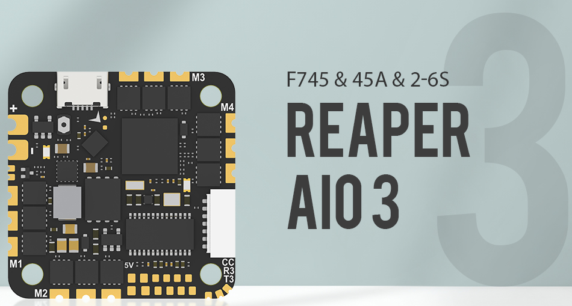
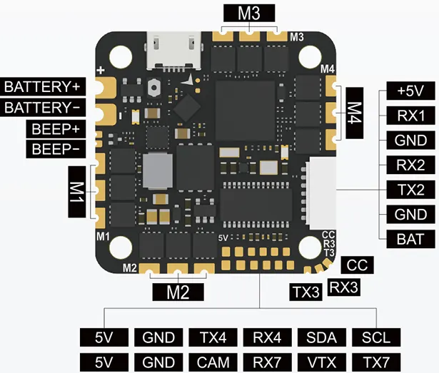

.. _common-foxeerf745aio:

=======================
Foxeer Reaper F745 AIO 
=======================

The Foxeer Reaper F745 AIO V2/V3 features an F7 autopilot and an integrated 45A 2-6S BLHeli_S 4-in-1 Bluejay ESC.

.. note:: ArduPilot does not currently support the V3 version.

Where To Buy
============

`Foxeer <https://www.foxeer.com>`__

Specifications
==============

-  **Processor**

   -  STM32F745VG  ARM (216MHz), 1MB Flash
   -  AT7456E OSD
   -  16Mbit Flash for datalogging

-  **Sensors**

   -  (Accelerometer/Gyro) BMI-270 IMU on V2, ICM-42688 on V3
   -  Voltage & 130A Current sensor

-  **Power**

   -  7.4V ~ 25V DC input power (2-6S)
   -  5V 2.5A BEC for peripheral

-  **Interfaces**

   -  5x UARTS
   -  5x PWM outputs, first 4 are internally connected to 4in1 40A BLHeli32 ESC. 5th used for LED PWM output
   -  I2C port for external compass, airspeed sensor, etc.
   -  Micro USB port
   -  Camera input/ VTX output
   -  DJI Goggle connector

-  **Integrated ESCs**

   -  4 integrated BLHeli_S ESCs
   -  Firmware - BlueJay
   -  2S-6S input voltage, 45A burst current
   -  DShot 300/600 capable

-  **Size and Dimensions**

   - 32.5mm x 32.5mm (25.5 x 25.5mm mount pattern)
   - 8.6g

Pinouts
=======

Default UART order
==================

default protocols shown

- SERIAL0 = console = USB
- SERIAL1 = Telemetry 1 = USART1 (RX1 used to for SBUS in DJI connector, protocol parameter must be changed)
- SERIAL2 = RC Input = USART2 (Defaults to RC input protocol) DMA-eanbled
- SERIAL3 = Telemetry 1/USER = UART3 
- SERIAL4 = Telemetry 2/USER = UART4
- SERIAL5 and SERIAL 6 are not available
- SERIAL7 = GPS = USART7 (DMA-enabled)

RC Input
========

RC input is configured on the RX2 (UART2_RX) pin. It supports all RC protocols except PPM. See :ref:`common-rc-systems` for details for a specific RC system. :ref:`SERIAL 2_PROTOCOL<SERIAL2_PROTOCOL>` is set to "23", by default, to enable this.

- SBUS/DSM/SRXL connects to the RX2 pin but SBUS requires that the :ref:`SERIAL2_OPTIONS<SERIAL2_OPTIONS>` be set to "3".

- FPort requires connection to TX2 and :ref:`SERIAL2_OPTIONS<SERIAL2_OPTIONS>` be set to "7".

- CRSF also requires a TX2 connection, in addition to RX2, and automatically provides telemetry. Set :ref:`SERIAL2_OPTIONS<SERIAL2_OPTIONS>` to "0".

- SRXL2 requires a connection to TX2 and automatically provides telemetry.  Set :ref:`SERIAL2_OPTIONS<SERIAL2_OPTIONS>` to "4".

Any UART can be used for RC system connections in ArduPilot also, and is compatible with all protocols except PPM. See :ref:`common-rc-systems` for details.

PWM Output
==========

The autopilot supports 5 PWM outputs. The first four outputs are directly connected to the integrated ESC. The 5th is defaulted for NeoPixel LED use.

The PWM are in 2 groups: 1-4, and 5

Channels within the same group need to use the same output rate and protocol. If
any channel in a group uses DShot then all channels in the group need
to use DShot. Outputs 1-4 support bidirectional DShot.

Integrated ESC Setup
====================

By default the following parameters are setup for a Copter vehicle to give Bi-Directional DShot600 protocol and BLHeli Passthrough capability to the first four outputs which drive the ESC:

- :ref:`SERVO_BLH_BDMASK<SERVO_BLH_BDMASK>` =  15 (outputs 1-4 are bi-directional BLHeli)
- :ref:`SERVO_BLH_AUTO<SERVO_BLH_AUTO>` =  1 (enable automatically enabling BLHeli passthrough on outputs 1 -4)
- :ref:`MOT_PWM_TYPE<MOT_PWM_TYPE>` = 6 (set DShot 600 protocol)

.. note:: for QuadPlane Copter Tailsitters, set :ref:`Q_M_PWM_TYPE<Q_M_PWM_TYPE>` = 6, since :ref:`MOT_PWM_TYPE<MOT_PWM_TYPE>` only applies to Copters.

Neopixel Output
===============

The LED pin is PWM output 5 on pad and is default setup for use with a NeoPixel 4 led string for notifications.

Battery Monitor
===============

The board has a built-in voltage and current sensors.

The correct battery monitor parameters are:

-    :ref:`BATT_MONITOR<BATT_MONITOR>` =  4
-    :ref:`BATT_VOLT_PIN<BATT_VOLT_PIN>` = 13
-    :ref:`BATT_VOLT_MULT<BATT_VOLT_MULT>` ~ 10.9
-    :ref:`BATT_CURR_PIN<BATT_CURR_PIN>` = 12
-    :ref:`BATT_AMP_PERVLT<BATT_AMP_PERVLT>` = 100

These are set by default in the firmware and shouldn't need to be adjusted.

Compass
=======

The ReaperF745v2 does not have a builtin compass, but you can attach an external compass using I2C on the SDA and SCL pads.

Barometer
=========

The ReaperF745v2 does not have a builtin barometer, but you can attach an external barometer using I2C on the SDA and SCL pads or use GPS as the EKF3 Z source. The board will boot without either, but only non altitude information requiring modes can be used.

Loading ArduPilot onto the board
================================

Initial firmware load can be done with DFU by plugging in USB with the
bootloader button pressed. Then you should load the "with_bl.hex"
firmware, using your favourite DFU loading tool.

Once the initial firmware is loaded you can update the firmware using
any ArduPilot ground station software. Updates should be done with the xxxxxxxxxx.apj firmware files.

Firmware
========

Firmware for this board can be found `here <https://firmware.ardupilot.org>`_ in  sub-folders labeled "ReaperF745".

[copywiki destination="plane,copter,rover,blimp"]
