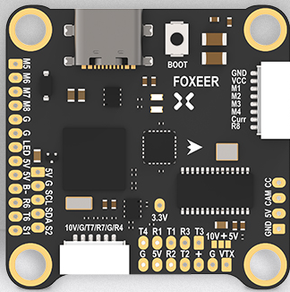
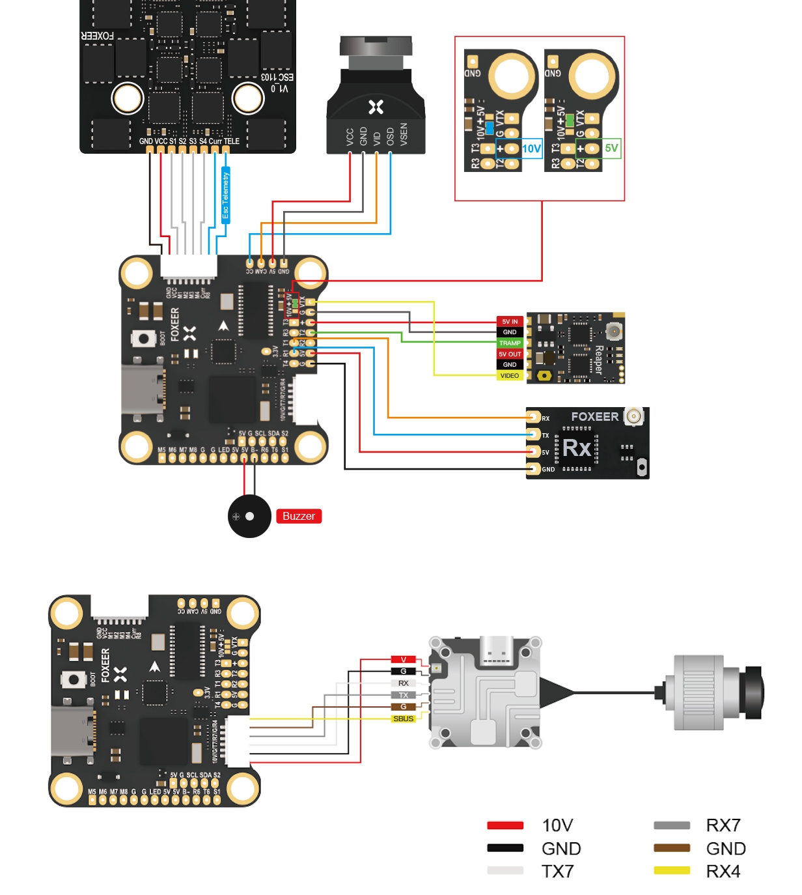

.. _common-foxeerH743v1:

=================
Foxeer H7 MPU6000
=================

Where to Buy
============

`Foxeer <https://www.foxeer.com/foxeer-h7-mpu6000-fc-8s-dual-bec-barometer-x8-g-503>`__

Specifications
==============

-  **Processor**

   -  STM32H743 ARM (480MHz)
   -  AT7456E OSD
   -  16MB data logging flash

-  **Sensors**

   -  MPU-6000 IMU (accel, gyro)
   -  DPS310 barometer

-  **Power**

   -  4S - 8S Lipo input voltage with voltage monitoring
   -  10V, 2A BEC for powering Video Transmitter
   -  5V, 2A BEC for internal and peripherals

-  **Interfaces**

   -  9x PWM outputs Bi-Directional DShot capable (Serial LED output is PWM9)
   -  1x RC input
   -  7x UARTs
   -  I2C port for external compass, airspeed, etc.
   -  USB-C port

-  **Size and Dimensions**

   - 37mm x 372mm x 19mm
   - 7.8g

Wiring Diagram
==============

Default UART Order
==================

The UARTs are marked Rn and Tn in the above pinouts. The Rn pin is the
receive pin for UARTn. The Tn pin is the transmit pin for UARTn.

 - SERIAL0 -> USB
 - SERIAL1 -> USART1 (Serial RC input) (DMA capable)
 - SERIAL2 -> USART2 (Tramp protocol by default) 
 - SERIAL3 -> UART3 (User, no protocol set by default) (DMA capable)
 - SERIAL4 -> UART4 ((RX on DJI connector for RC,no protocol by default)(DMA capable)
 - SERIAL6 -> UART6 (GPS) (DMA capable)
 - SERIAL7 -> UART7 (on DJI Goggle connector, set by default to DJI protocol) 
 - SERIAL8 -> UART8 (RX only on 4in1 ESC connector, ESC telemetry is the default protocol)

Serial protocols shown are defaults, but can be adjusted to personal preferences.

Servo/Motor Outputs
===================

All motor/servo outputs are  Dshot and PWM capable. However, mixing Dshot, serial LED, and normal PWM operation for outputs is restricted into groups, ie. enabling Dshot for an output in a group requires that ALL outputs in that group be configured and used as Dshot, rather than PWM outputs. Outputs 1-8 are also Bi-Directional DShot capable.

 - PWM 1-4 in group1
 - PWM 5,6 in group2
 - PWM 7,8 in group3
 - PWM 9   in group4 (marked LED)

RC Input
========

RC input is configured by default on the R1 (UART1_RX) pin. It supports all serial RC protocols. For protocols requiring separate half-duplex serial to transmit telemetry (such as FPort) you should setup SERIAL1 as an RC input serial port, with half-duplex, pin-swap and inversion enabled (:ref:`SERIAL1_OPTIONS<SERIAL1_OPTIONS>` = 15).

The DJI connector also has UART4 RX input for DJI RC input. To use this you would need to set :ref:`SERIAL1_PROTOCOL<SERIAL1_PROTOCOL>` to something other than "23" (RCinput) and set this protocol for :ref:`SERIAL4_PROTOCOL<SERIAL4_PROTOCOL>` instead. 

For PPM support on UART4_RX set :ref:`BRD_ALT_CONFIG<BRD_ALT_CONFIG>` to 1 and use the UART4 RX pin as PPM (and any other serial RC protocol) input.

OSD Support
===========

The FoxeerH7 MPU6000 supports using its internal OSD using OSD_TYPE 1 (MAX7456 driver). External OSD support such as DJI or DisplayPort is supported using UART7 or any other free UART. See :ref:`common-msp-osd-overview-4.2` for more info.

VTX Control
===========

UART2 TX is setup to provide IRC Tramp control of video transmitters by default. See :ref:`common-vtx` for more information.

Camera/GPIO Control
===================

ArduPilot does not support CameraControl but that pin is made available as a GPIO. As is the S1 and S2 pins. Relay operation is possible using any of those three pins. Their designated GPIO pin number for parameter setup is shown below:

- S1: GPIO 70
- S2: GPIO 71
- CC: GPIO 72

Compass
=======

The FoxeerH743 does not have a builtin compass, but you can attach an external compass using I2C on the SDA and SCL pads.

Battery Monitor Configuration
=============================
These settings are set as defaults when the firmware is loaded (except :ref:`BATT_AMP_PERVLT<BATT_AMP_PERVLT>` which needs to be changed from the default value). However, if they are ever lost, you can manually set the parameters:

Enable Battery monitor.

:ref:`BATT_MONITOR<BATT_MONITOR>` =4

Then reboot.

:ref:`BATT_VOLT_PIN<BATT_VOLT_PIN>` 13

:ref:`BATT_CURR_PIN<BATT_CURR_PIN>` 12

:ref:`BATT_VOLT_MULT<BATT_VOLT_MULT>` 11.0

:ref:`BATT_AMP_PERVLT<BATT_AMP_PERVLT>` 35.4

Connecting a GPS/Compass module
===============================

This board does not include a GPS or compass so an :ref:`external GPS/compass <common-positioning-landing-page>` should be connected in order for autonomous modes to function.

Firmware
========
This board does not come with ArduPilot firmware pre-installed. Use instructions here to load ArduPilot the first time :ref:`common-loading-firmware-onto-chibios-only-boards`.

Firmware for this board can be found `here <https://firmware.ardupilot.org>`_ in  sub-folders labeled
"FoxeerH743v1".

[copywiki destination="plane,copter,rover,blimp"]

