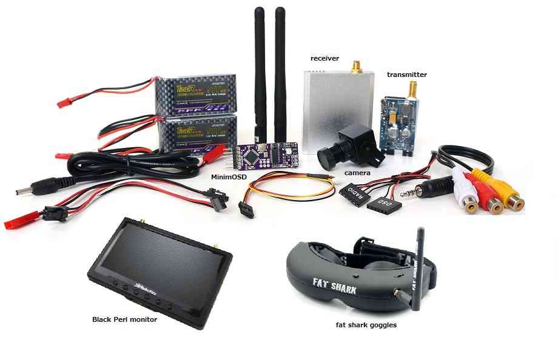

.. _common-fpv-first-person-view:

=======================
First Person View (FPV)
=======================

*First Person View* provides you with a true pilot's eye view while
flying by placing a video camera and transmitter on your vehicle paired
with a receiver and either an LCD or goggles on the ground.  An optional
OSD (On Screen Display) helps maintain orientation by providing aircraft
instrument overlay on your FPV monitor.

Recommended parts
=================

To set up an FPV system on your Copter/Plane equipped vehicle you will
need:

-  Miniature video camera. The variety of cameras increases daily. Most now support resolutions of 600-1200 TVL (TV Lines) and have wide supply range tolerance (5-24V typically). Lens are available from wide-angle (<2.8mm) to ultra-narrow (>5mm). For mini-quads, usually wide angle are used, while for planes, normal field of view/focal lengths (2.8mm-3.6mm) are usually used. A wide selection are easily found by searching the internet for ``FPV Camera``.
-  5.8Ghz 25mw to 200mw video transmitter/receiver pair. Again, supply voltage tolerances now easily accommodate 2s-4s Lipo batteries normally used as vehicle power.
-  OSD (On-Screen-Display). Many autopilots now integrate this function directly. If not, external OSDs like `MinimOSD <http://store.jdrones.com/jD_MiniOSD_V12_p/jdminiosd12.htm>`__ can be used. Or, not used at all. However, being able to see the battery status, flight data, etc. makes a much more enjoyable flight!
-  Separate batteries for powering the above are rarely needed now, since most now accommodate the flight pack's voltage range from full to empty,

In addition you will need a monitor like the `Black Pearl <http://www.amazon.com/FlySight-Black-Pearl-Diversity-Integrated/dp/B00KR69WHY>`__
or goggles.

**Goggle options:**

-  `Fat Shark <http://www.fatshark.com/default.html>`__ has a wide range
   of goggles including the "Attitude" and "Dominator" that have been
   proven to work.  Note that some models come with a built in
   transmitter & receiver that would replace the 3DR video kits 5.8 Ghz
   transmitter/receiver pair mentioned above. SkyZone, Eachine, and others also make many models for FPV use.
-  Low cost 320x240 resolution goggles (`example video <https://www.youtube.com/watch?v=tG-4JNpE2fc>`__) are not
   recommended because the higher resolution 640x480 (`example video <https://www.youtube.com/watch?v=ywqacXyjcNw>`__) or SVGA
   goggles provide a much better flying experience.

In addition you may wish to set-up a separate :ref:`camera gimbal <common-cameras-and-gimbals>`\ (perhaps with Go-Pro
attached) to record the flight in HD.

Connection diagram
==================

Here is a wiring diagram `created by IVC <http://beta.ivc.no/wiki/index.php/TBS_Discovery_graphic>`__ for a
TBS Discovery Quadcopter that includes an APM2 and MinimOSD:

.. image:: ../../../images/tbs_discovery_install_APM2.6withminimosdtbscore.jpg
    :target: ../_images/tbs_discovery_install_APM2.6withminimosdtbscore.jpg

FPV equipment on the vehicle should be placed as far away as possible
from GPS and RC receiver to reduce the chance of interference.

Minim OSD setup through mission planner
=======================================

The MinimOSD set-up guide :ref:`can be found here <common-minim-osd-quick-installation-guide>`.

Integrated OSD
==============

Many autopilots now integrate the :ref:`OSD function<common-osd-overview>` on board, eliminating the need for an external device and reducing wiring.

User Videos / Blogs
===================

Richard Evan's FPV flight footage (recorded from the ground station) of
his Copter based quadcopter including MinimOSD

..  youtube:: KQOQYcf4Dbc
    :width: 100%

Stefan Cenkov's FPV flight footage (recoded from the ground station) of
his Plane running on VrBrain including MinimOSD.

..  youtube:: LxjtUl8Fw6o
    :width: 100%

Robert Mcintosh's in `Lone Pine California <https://diydrones.com/profiles/blogs/the-best-place-to-fly>`__
FPV Flight with HD video footage from GoPro camera

.. vimeo:: 70365435
   :width: 400
   :height: 400

Euan Ramsey's APM2 powered `TBS Discovery <https://diydrones.com/profiles/blogs/tbs-disco-apm-mounting-suggestion>`__. 
Note the TBS frame spreads the 2 front arms apart so the blades don't
interfere with the FPV and allow the camera to easily be mounted in
front

Safety Warnings Relating Specifically to FPV Flight
===================================================

-  Because of the limited field-of-view of the FPV camera you may not be
   able to easily see obstacles near the vehicle which may be why the
   `Academy of Model Aeronautics <https://www.modelaircraft.org/>`__
   requires that there be a second person acting as spotter for all FPV
   flights.
-  Be ready for loss of FPV video caused by flying beyond your FPV
   systems limits or interference from structures between you and the
   vehicle. Being able to invoke the vehicle's RTL mode is a worthwhile safety feature even though most countries require FPV operation within line of sight of the operator.
-  Know and recognize the FPV signal loss warning signs and be ready to
   shed the FPV equipment and retake line-of-sight control at all times.
-  FPV equipment can interfere with the vehicle's radio or GPS if placed
   too close.

Government/Local Regulations
============================

FPV flight regulations imposed by countries and localities vary greatly and are constantly evolving. Be sure you know the applicable restrictions.
Also, be aware that FPV transmitters may have restrictions on frequency bands and power that vary from country to country, as well as requirements for licensing.
