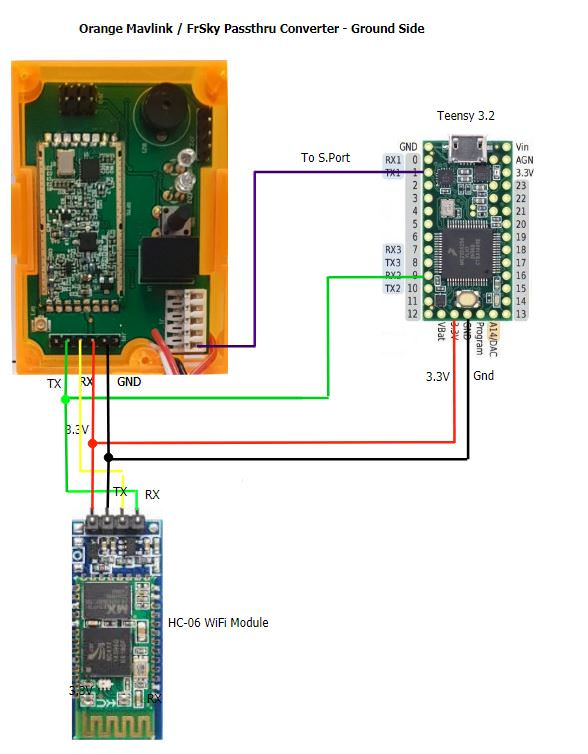

.. _common-frsky-mavlink:

===========================
MavLink to FrSky Converters
===========================

This section contains hardware MAVLink to FrSky converter solutions.

Please feel free to add your own solutions (`or ask us to <https://github.com/ArduPilot/ardupilot/issues/new>`__).

.. _common-frsky-telemetry_apm_mavlink_to_frsky_smartport_converter_airborne_projects:

APM MavLink to FrSky SmartPort Converter (MavLink_FrSkySPort)
-------------------------------------------------------------

There are several open source projects such that use small cpu boards, such as the Teensy USB Development board, to convert MAVLink
messages to FrSkySmartPort format so that ArduPilot telemetry can be displayed on an `OpenTX <https://www.open-tx.org/>`__ transmitter.

Mav2PT Converter Project
------------------------

This project provides airborne (autopilot-> RX SPort), ground (TX module telem output -> TX SPort input), and relay station applications using inexpensive Teensy, ESP, ESP8266, and HelTec WIFI cpu boards. It also provides Bluetooth and WIFI output options to allow parallel connections to Ground Control stations in the ground and relay modes. It is currently well supported.

- `Project discussion page <https://www.rcgroups.com/forums/showthread.php?3089648-Mavlink-To-FrSky-Passthrough-Converter>`_
- `Github code <https://github.com/zs6buj/MavlinkToPassthru>`_
- `Wiki documents <https://github.com/zs6buj/MavlinkToPassthru/wiki>`_

Other Projects
--------------

`MavLink_FrSkySPort <https://github.com/Clooney82/MavLink_FrSkySPort/wiki>`__

.. image:: https://raw.githubusercontent.com/Clooney82/MavLink_FrSkySPort/s-c-l-v-rc-opentx2.1/images/Basic%20Wiring%20-%20Teensy3.jpg
    :target:  https://raw.githubusercontent.com/Clooney82/MavLink_FrSkySPort/s-c-l-v-rc-opentx2.1/images/Basic%20Wiring%20-%20Teensy3.jpg

`Scottflys <http://openbrainiacs.com/tiki-index.php?page=Teensy+Telemetry+Project>`__ 

`Athertop <https://github.com/athertop/MavLink_FrSkySPort>`__ 

`APM MavLink to FrSky X8R S.Port converter <https://diydrones.com/forum/topics/amp-to-frsky-x8r-sport-converter>`_

Information about the circuits and software can be found on the each project link above.
