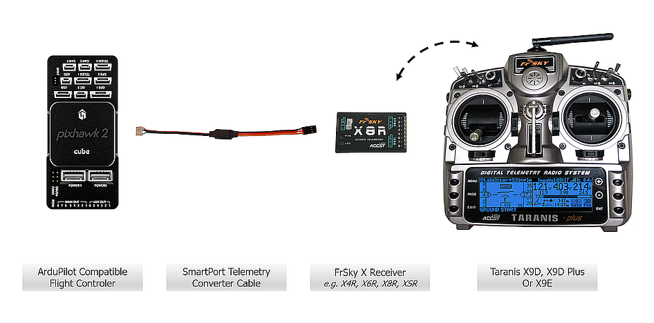
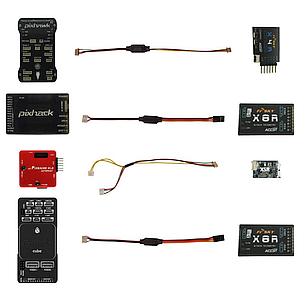

.. _common-frsky-passthrough:

====================================
Passthrough FrSky Telemetry Protocol
====================================

Overview
========

Passthrough FrSky Telemetry is the latest protcol available in ArduPilot and it allows the transmission of raw data directly to OpenTX without any preprocessing by OpenTX and without the need for discovery. The passthrough telemetry protocol is optimized specifically for the FrSky datalink bandwidth and enhancements include having multiple data elements in a single telemetry packet and using floating point representation (e.g. we don't really need centimeter precision altitude to be displayed on screen when flying at 100m). This results in an improved data refresh rate such that information such as attitude (roll, pitch, yaw) is displayed without any perceptible lag.

Compared to regular FrSky telemetry, passthrough telemetry contains ArduPilot specific information such as flight modes, error messages, warnings, and failsafes.

ArduPilot's Passthrough FrSky telemetry protocol is an open protocol that is free to use. `FlightDeck <http://www.craftandtheoryllc.com/product/flightdeck-taranis-app-for-ArduPilot-apmcopter/>`__ is an OpenTX app that uses passthrough telemetry.

The ArduPilot passthrough telemetry specification including data packets and message rates is available as a spreadsheet on `Google Sheets <https://docs.google.com/spreadsheets/d/1HIfioe-EGTOtH5rOdexGlAz2E5HnCvZLm0EG6rfjNSI/edit?usp=sharing>`__.

.. raw:: html

  <iframe src="https://docs.google.com/spreadsheets/d/e/2PACX-1vQzfjhsUvByPERTC9vqK9v8WouYvKwZh1cQNF_KjAQLfZZiQ03nryHOn5NBwbxT3WvFw--eKEn71mz3/pubhtml?gid=1792154932&amp;single=true&amp;widget=true&amp;headers=false" width="600" height="800"></iframe>

Required/Compatible Hardware
============================

	
	Common FrSky Telemetry Setup with Taranis RC transmitter running :ref:`FlightDeck <common-frsky-flightdeck>`.

* An ArduPilot compatible flight controler from this list:
	
	- Pixhawk
	- Pixhawk derivatives (clones)
	- Pixhawk 2.1
	- PixRacer
	- Pixhack
	- (Linux Boards have not been tested and APM2.6 is not supported)

* A Taranis X9D, X9D Plus or X9E

* An X series FrSky SmartPort receiver from this list:
	
	- X4R
	- X4R-SB
	- X6R
	- **X8R** (recommended for medium to large airframes)
	- **XSR** (recommended for mini to medium airframes)

* A SmartPort telemetry cable to connect the ArduPilot compatible autopilot on the FrSky SmartPort bus (Pixhawk, Pixhawk 2.1, PixRacer and Pixhack cables available from `Craft and Theory <http://www.craftandtheoryllc.com/product-category/telemetry-cables/>`__)

For information on how to connect the FrSky equipment together, please go :ref:`here <common-frsky-equipment>`.

Firmware Configuration
======================

Passthrough FrSky Telemetry is enable by setting ``SERIAL#_PROTOCOL`` to ``10`` using your favorite GCS application.

For information on how to configure ArduPilot for FrSky telemetry, please go :ref:`here <common-frsky-configMP>`.
