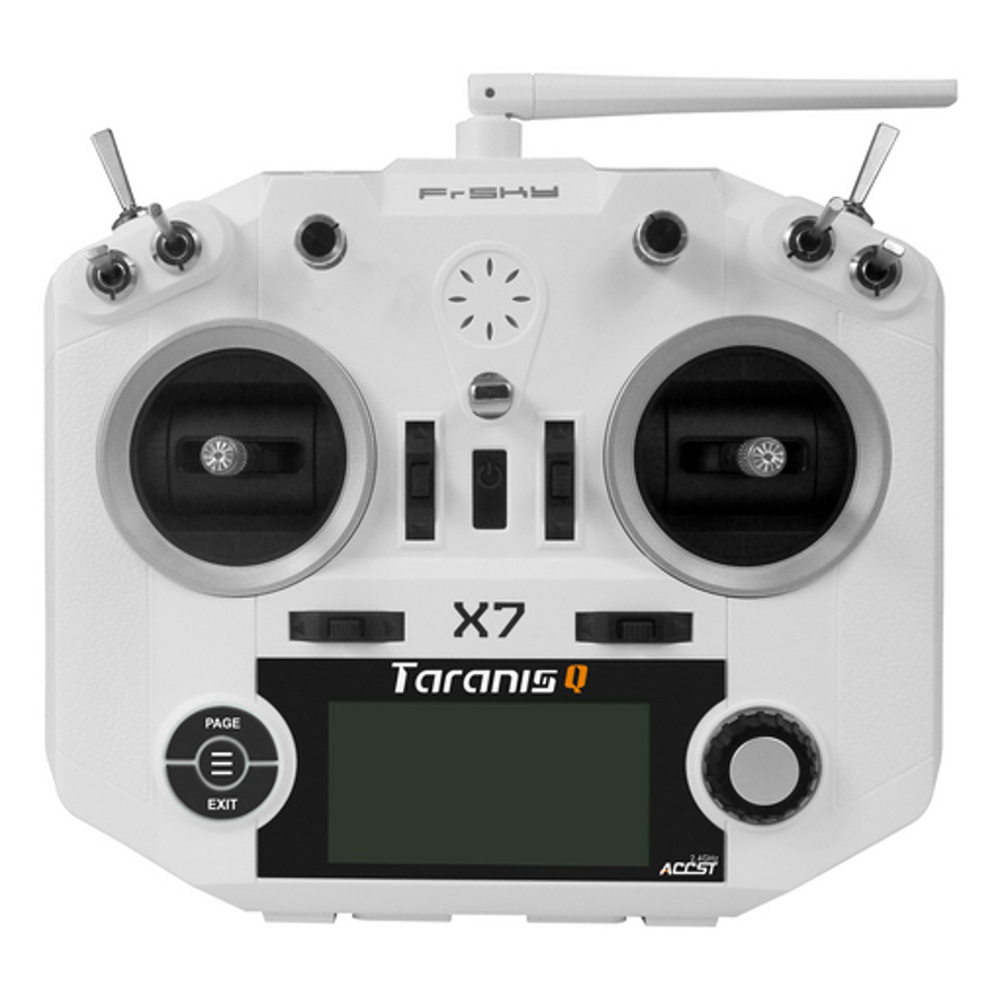
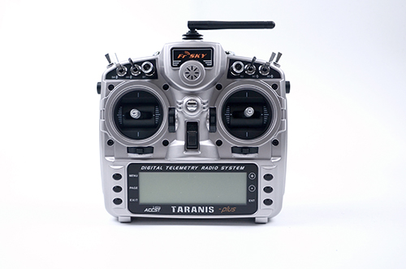
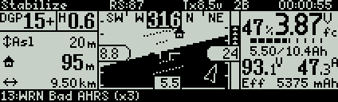
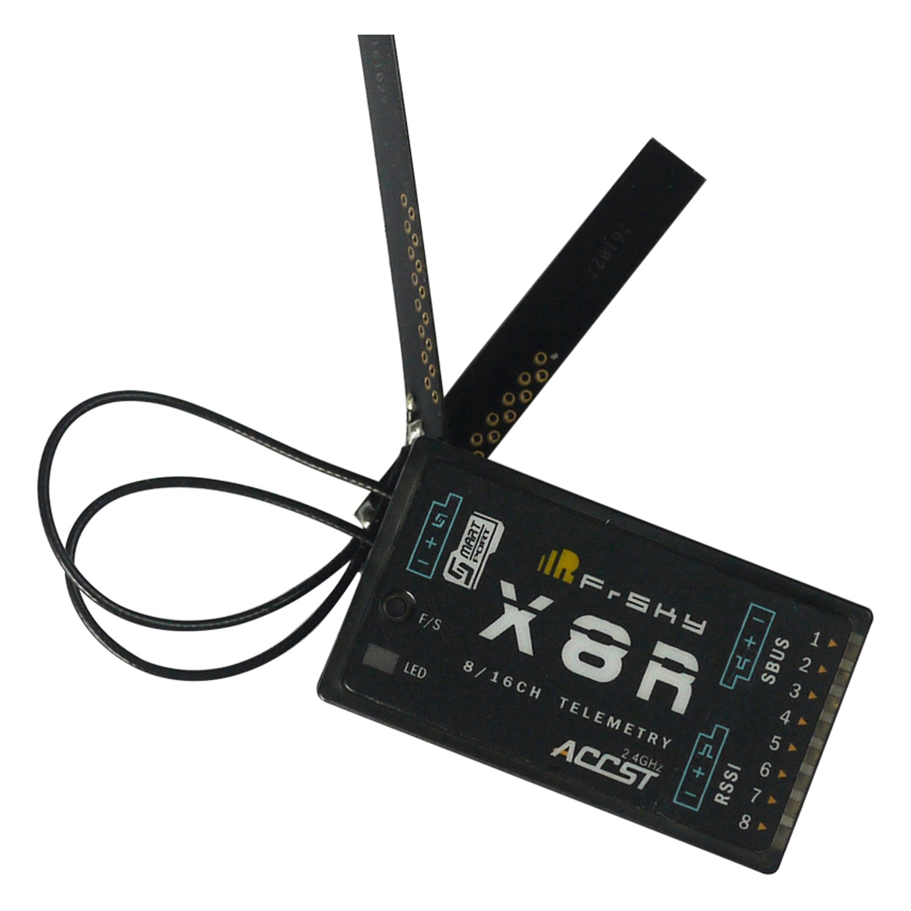
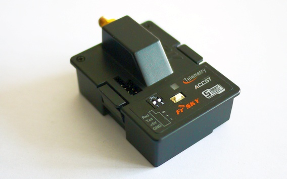

.. _common-frsky-rc:

================
FRSky RC Systems
================

FrSky Taranis X9D Plus, QX7, and X-Lite RC Transmitters
-------------------------------------------------------

.. tip::

   These transmitters are **highly recommended** for all RC uses.

.. figure:: ../../../images/FrSky_Taranis_Xlite.jpg
    :target: ../_images/FrSky_Taranis_Xlite.jpg
    :width: 60 %
    :align: center

    Taranis X-Lite

    Taranis QX7

    Taranis X9D Plus

.. note::

   Theses transmitters are feature packed for their price. You can buy them from different locations e.g. `Craft and Theory <http://www.craftandtheoryllc.com/packageq>`__, `Aloft Hobbies <https://alofthobbies.com/catalogsearch/result/?cat=0&q=X9D>`__ .

The `FrSky Taranis RC Transmitter <https://www.frsky-rc.com/product/taranis-q-x7-2/>`__ is a
high quality `OpenTX <http://www.open-tx.org/downloads.html>`__ (open source firmware) enabled RC Transmitter that is compatible with a wide variety of high quality FrSky PPM-Sum and S.Bus compatible receivers. 

One of the major advantages of the Taranis is that it can receive and display telemetry data **directly from ArduPilot** and on-board FrSky telemetry sensors, such as flight mode, GPS status, current drawn and cell voltages, and even ArduPilot messages, that can be added to your vehicle. For more information, see :ref:`FrSky telemetry <common-frsky-telemetry>`.

The Taranis transmitters have integrated ACCST 2.4GHz transmitters that are compatible with X series FrSky receivers such as the very popular X8R or the newer and lighter XSR receivers. *This means that an additional JR type transmitter module is not required.* If needed, both the Taranis X9D Plus and the Taranis QX7 have JR module bays for external radio transmitters.

Advantages of the FrSky systems:

* 2.4GHz ACCST frequency hopping radio transmitter with range that is sufficient for most VLOS applications
* Quad Ball Bearing Gimbals
* Audio Speech Outputs (values, alarms, settings, etc.)
* Vibration Alerts
* Receiver Signal Strength Indicator (RSSI) Alerts
* Open source firmware OpenTx, and a significant user base
* Flash via USB
* High visibility LCD screen
* Reliable and low latency telemetry with matched FrSky receiver
* Removable MicroSD card to store sounds, voices, models and custom scripts

The Taranis transmitters can run the :ref:`Yappu Telemetry <common-frsky-yaapu>` 

or :ref:`FlightDeck <common-frsky-flightdeck>` telemetry user interface.

.. image:: ../../../images/FD-X9-1.jpg
    :target: http://www.craftandtheoryllc.com/feature
    :width: 450px

FrSky D/X/R Receivers
---------------------

FrSky has many compatible receivers. Some ouput PPM, some SBus. Almost all offer telemetry in some form. Any receiver with S.Port offers bi-directional telemetry. For more information about FrSky receiver telemetry, refer to the :ref:` FrSky telemetry page <common-frsky-telemetry>`.

    FrSky X8R receiver

FrSky Transmitter Module
------------------------

FrSky makes modules for transmitters with JR style auxiliary RF module bays. This allows you to use FrSky receivers and telemetry with Turnigy 9 series, JR, and other transmitters.

