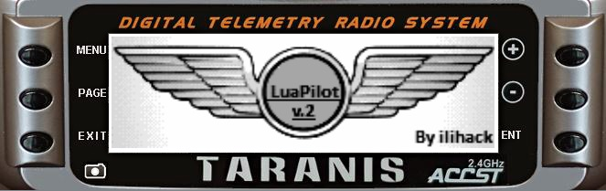
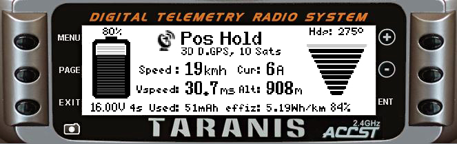
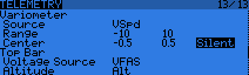
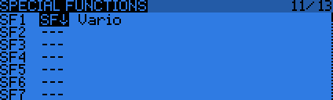
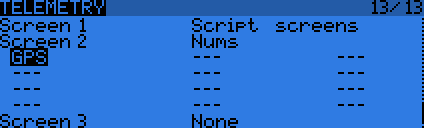
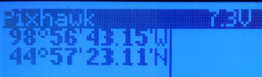

.. _common-frsky-repurposed:

=========================================
FrSky Telemetry Using Repurposed Messages
=========================================

.. note:: this is superceded by :ref:`common-frsky-passthrough`

The original solution for transmitting ArduPilot telemetry data over the FrSky telemetry link was to reuse FrSky data messages meant for another purpose and/or reserved by FrSky for their sensors. For example in this protocol the Flight mode is sent using the tmp1 message instead of the temperature. If you are not using an FrSky temperature sensor on your vehicle, this will not cause any problem. But if you intend to use temperature, other FrSky sensors, this telemetry protocol will cause conflicts with them. 

Once your equipment is connected and ArduPilot is configured, follow the instructions below to get standard FrSky telemetry displayed on your RC transmitter.

Protocol information
====================

Values that are sent over the FrSky telemetry link by ArduPilot:

+-------------------------------------+---------------------------------------------------------------+
| Taranis telemetry screen identifier |                          Description                          |
+=====================================+===============================================================+
| Fuel                                | Remaining battery capacity %                                  |
+-------------------------------------+---------------------------------------------------------------+
| VFAS                                | Battery voltage                                               |
+-------------------------------------+---------------------------------------------------------------+
| Curr                                | Current consumption                                           |
+-------------------------------------+---------------------------------------------------------------+
| GPS                                 | Latitude/longitude                                            |
+-------------------------------------+---------------------------------------------------------------+
| GSpd                                | GPS groundspeed                                               |
+-------------------------------------+---------------------------------------------------------------+
| GAlt                                | GPS altitude                                                  |
+-------------------------------------+---------------------------------------------------------------+
| Hdg                                 | Yaw angle                                                     |
+-------------------------------------+---------------------------------------------------------------+
| Alt                                 | Navigation altitude (relative to home)                        |
+-------------------------------------+---------------------------------------------------------------+
| Tmp1                                | Control/flight mode                                           |
+-------------------------------------+---------------------------------------------------------------+
| Tmp2                                | GPS status and number of satellites (as num_sats*10 + status) |
+-------------------------------------+---------------------------------------------------------------+

If you installed FrSky sensors on your vehicle, other messages from these may also appear during discovery.

Repurposed Messages Scripts for ArduPilot
=========================================
The following script was made specifically for ArduPilot with telemetry protocol 4, repurposed messages.

* `LuaPilot <http://ilihack.github.io/LuaPilot_Taranis_Telemetry>`__

for additional information, see:

* `LuaPilot use for plane discussion <https://discuss.ardupilot.org/t/lua-script-for-apm-plane-quadplane/16202>`__

Configuration with OpenTX
=========================

Transmitter set-up
------------------

Please refer to the `OpenTX manual <https://www.gitbook.com/book/opentx/opentx-taranis-manual/details>`__
for how to display values from the FrSky telemetry feed on the RC transmitter's screen.

.. note::

   If upgrading to OpenTX 2.1+ you will need to replace your OpenTX
   2.0 configuration and "discover" your sensors. There are other minor
   "oddities" - for example T1 (flight mode) and Tt2 (number of sats) are
   both called TEMP (switching mode helps you identify which is
   which).

.. image:: ../../../images/Telemetry_FrSky_TXSetup.png
    :target: ../_images/Telemetry_FrSky_TXSetup.png

FrSky telemetry data consists of 16 or 32bit unsigned integers recognized by OpenTX. Standard FrSky telemetry does not include autopilot messages natively. Therefore, less important telemetry data messages (temperature, variometer…) have been repurposed to carry more useful information such as flight mode.

Using telemetry values in OpenTX
~~~~~~~~~~~~~~~~~~~~~~~~~~~~~~~~

Examples
~~~~~~~~

Variometer
~~~~~~~~~~

In the example below, the variometer function of OpenTX is configured to use the discovered VSpd sensor value. The value is only considered if it is between -10m/s and 10m/s. In the center band -0.5 to 0.5 m/s the variometer will be silent.

This example shows how to assign a switch on the Taranis to enable/disable variometer sounds:

For a more detailed video of how to setup the variometer, you may check out this `video <https://youtu.be/oe_LIWRJ37w>`__
ArduPilot already provides variometer values through the FrSky telemetry link, so the FrSky variometer sensor is not necessary.

GPS
~~~

You can setup the display of the latest transmitted latitude and longitude information; for instance, in case of a crash or fly away, to locate your copter.

When configured to display “GPS,” the custom telemetry screen will show longitude/latitude value pairs as such:

Configuration with ErSky9x
==========================

For information on how to configure your ErSky9x transmitter (such as a Turnigy 9XR Pro) for FrSky telemetry, please go :ref:`here <common-frsky-telemetry>`.
