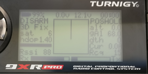

.. _common-frsky-telemetry:

===============
FrSky Telemetry
===============

FrSky telemetry allows you to display ArduPilot information such as flight modes, battery level, and error messages, as well as information from additional FrSky sensors on `OpenTx <https://www.open-tx.org/>`__ compatible RC transmitters and even older X9R transmitters (although with more limited capability).

It is particularly useful:
 * for flying without a ground control station (no need for MAVLink telemetry radio),
 * as a backup in case the ground station fails (e.g., loss of MAVLink radio link),
 * when a separate person operates the ground control station,
 * for quick situational awareness by the pilot.

Moreover, some RC transmitters such as the Taranis series, Horus, and T16, can be configured to play sounds, vibrate or perform automatic RC actions based on telemetry information through the highly configurable OpenTX firmware.

.. figure:: ../../../images/frsky_requiredhardware_flightdeck.jpg
    :target: ../_images/frsky_requiredhardware_flightdeck.jpg
    :align: center

    Common FrSky Telemetry Setup with OpenTX transmitter running :ref:`FlightDeck <common-frsky-flightdeck>` or :ref:`Yaapu Telemetry Script <common-frsky-yaapu>`.

.. note:: before the addition of FrSky telemetry protocols to ArduPilot, it was necessary to use an external converter to convert normal MAVLink telemetry from the Autopilot into FrSky Sport compatible telemetry (See :ref:`common-frsky-mavlink`), but this is no longer required. However, the `MAV2PT converter <https://www.rcgroups.com/forums/showthread.php?3089648-Mavlink-To-FrSky-Passthrough-Converter>`__ is especially useful for converting MAVLink telemetry output from many long-range RC systems for display on an OpenTX transmitter or forwarding via Bluetooth or WiFi to a smarphone or PC running a Ground Control Station.

Setup
=====

In order to use FrSky telemetry, the following steps are required:

- Connect an autopilot telemetry port to an FrSky reciever which has an SPort or Fport interface. This may require a bi-directional inverter depending on which autopilot it being used. See :ref:`common-connecting-sport-fport`. 
- Configure the autopilot.
- Install a LUA script to display the full telemetry. (Although is it possible to display a subset of telemetry values using OpenTX's built in telemetry screens, it is very limited.)

Connection Diagrams
-------------------

See
 .. toctree::
    :maxdepth: 1

    Connecting to SPort and FPort <common-connecting-sport-fport>

for connection diagrams.

Configuration
-------------

Two protocols are available, Repurposed and PassThrough. Repurposed has been superseded by PassThrough since much more telemetry information can be transferred and displayed.

First set the SERIALxPROTOCOL to "10" for the telemetry port used.

.. note:: SERIAL port numbers do not necessarily directly correspond to UART or TELEM port labels. See the hardware documentation for your :ref:`autopilot <common-autopilots>`.

If you have an F7 or H7 autopilot, and therefore do not need to use an external inverter, you must turn on the inverters for the SERIAL port and also set it to half duplex.

.. note:: Any configuration change to a UART requires a re-boot to take effect.

In general, F4 based autopilots using an external bi-directional inverter can use any UART with the following configuration:

-   ``SERIALx_PROTOCOL`` =10
-   ``SERIALx_OPTIONS`` =160 (enable pull-up/pull-downs on TX and RX pins for those external inverter circuits that may require it)

F4 based autopilots using an "inverted SPort" output from the receiver can connect it to any  UART's TX pin with the configuration:

-   ``SERIALx_PROTOCOL`` =10
-   ``SERIALx_OPTIONS`` = 4 (Half Duplex) 

.. note:: F4 based autopilots cannot use the RX pin with an "inverted SPort" output since the SWAP capability is only available in F7/H7 based autopilots.

F7/H7 based autopilots can directly connect to the TX pin of any UART and use this configuration:

-   ``SERIALx_PROTOCOL`` =10
-   ``SERIALx_OPTIONS`` =  7 (invert TX/RX,Half Duplex)

    OR to the RX pin:

-   ``SERIALx_PROTOCOL`` =10
-   ``SERIALx_OPTIONS`` =  15 (invert TX/RX,Half Duplex, SWAP TX/RX pins)

.. note:: Some F7/H7 autopilots have level/shifters on their UARTs that cause a delay in Half Duplex operation, like CubeOrange. If the above configuration does not, try setting :ref:`RC_OPTIONS<RC_OPTIONS>` = 8 which will add padding in the protocol to accommodate this. However, using this option when not required will break operation.

Display Scripts
---------------

Several options are available:

.. toctree::
    :maxdepth: 1

    FlightDeck <common-frsky-flightdeck>
    Yaapu FrSky Telemetry Script for OpenTX <common-frsky-yaapu>

Turnigy 9XR Pro
===============

This section describes how to enable FrSky telemetry on the Turnigy
9XR Pro transmitter.

Requirements
------------

- You will need a transmitter module with support for FrSky telemetry,
  such as the ``FrSky XJT``.  The DJT_ also supports telemetry, but you
  will need to use an external cable to connect the telemetry data
  from the module to your transmitter.

  The instructions in this section are specifically for the XJT
  module.

- You will need to be running a recent version (211 or later) of the
  ErSky9x firmware.  You can find more information about upgrading
  the firmware and about ErSky9x in general from `the
  documentation`_.

.. _frsky xjt: https://www.frsky-rc.com/product/xjt-2/
.. _djt:  https://www.frsky-rc.com/product/djt-2/
.. _the documentation: http://openrcforums.com/forum/viewtopic.php?f=122&t=5575#p79483

Configuring ArduPilot
---------------------

Ensure that you have the appropriate ``SERIAL#_PROTOCOL`` parameter
set to ``10`` ("passthrough FrSky telemetry") to select the ArduPilot
SPORT protocol.  For example, if you have plugged your SmartPort cable
into the serial 4/5 port on your Pixhawk, set ``SERIAL4_PROTOCOL`` to
``10``.

Reboot your controller after making this change.

ErSky9x will also work with protocol ``4`` ("repurposed FrSky
telemetry"), but you will not have access to ArduPilot-specific
information such as the name of the current flight mode or arming
status.

Configuring the 9XR Pro
-----------------------

#. Verify that you are running version 211 or later.  Navigate to the ``Radio
   Setup`` menu and then select ``Version``.  Look at the ``SVN``
   field.

    .. figure:: ../../../images/9xrpro-firmware-version.png
        :target: ../_images/9xrpro-firmware-version.png
        :align: center

   Telemetry support is substantially improved in revision 218 and
   later.

#. Navigate to ``Model Setup`` menu, then select ``Protocol``.  Ensure
   that you have ``Proto`` set to ``XJT``, and ``Type`` set to ``D16``.

    .. figure:: ../../../images/9xrpro-settings-protocol.png
        :target: ../_images/9xrpro-settings-protocol.png
        :align: center

   In older versions of the firmware, you may see `PXX` instead of
   `XJT`.

#. Navigate to the ``Model Setup`` menu, then select ``Telemetry``, and
   then again select ``Telemetry`` from the popup menu.  Ensure that
   ``UsrProto`` is set to ``ArduP`` (for ArduPlane) or ``ArduC`` (for
   ArduCopter), ``Telemetry Com Port`` (previously ``FrSky Com Port``)
   is ``1``, and ``Com Port Invert`` (previously ``Invert Com 1``) is
   off (unchecked).

    .. figure:: ../../../images/9xrpro-settings-telem-protocol.png
        :target: ../_images/9xrpro-settings-telem-protocol.png
        :align: center

    .. figure:: ../../../images/9xrpro-settings-telem-port.png
        :target: ../_images/9xrpro-settings-telem-port.png
        :align: center

   If you are using something other than ArduPlane or ArduCopter, you
   can set ``UsrProto`` to ``FrSky``.  You will get a more basic
   telemetry display that will be missing things like the graphic
   heading indicator, the name of the current flight mode, and so
   forth.

At this point, you should be receiving extended telemetry on your 9XR
Pro.  If you navigate to the telemetry home screen (use the up/down
arrows to switch between screens) you should see standard FrSky
telemetry values (such as RSSI, receiver voltage, etc) as well as
extended telemetry, such as flight mode, current measurements, GPS
information, etc.

Use the left/right arrows to switch between available telemetry views:

.. figure:: ../../../images/9xrpro-telem-gps.png
    :target: ../_images/9xrpro-telem-gps.png
    :align: center

Configuring custom telemetry screens
------------------------------------

ErSky9x allows you to customize two telemetry display screens with
your choice of information.  To configure the custom screens, navigate
to ``Model Setup``, then select ``Telemetry``, and then select
``Custom``:

.. figure:: ../../../images/9xrpro-settings-telem-custom.png
    :target: ../_images/9xrpro-settings-telem-custom.png
    :align: center
    
**Other Pages Related to FrSky Telemetry**

.. toctree::
    :maxdepth: 1

    MavLink to FrSky Telemetry Converters <common-frsky-mavlink>
    FrSky Protocol Information <common-frsky-protocol-info>

