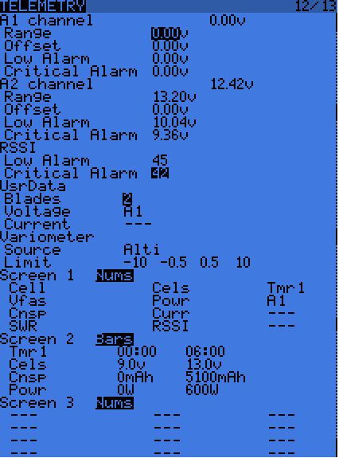

.. _common-frsky-telemetry:

===============
FrSky Telemetry
===============

This article describes how to transmit vehicle information from the
autopilot and display it on an FrSky transmitter ("FrSky Telemetry").

Overview
========

This article explains a number of approaches for getting information
from the autopilot to an FrSky transmitter (including the Taranis).

.. image:: ../../../images/FRSkyTaranis.jpg
    :target: ../_images/FRSkyTaranis.jpg

Native FrSky Telemetry Support
==============================

ArduPilot provides a driver that can directly output the FrSky protocol.
This section explains how you can connect and configure a Pixhawk to
communicate with a D-Receiver or X-Receiver.

.. note::

   -  This feature is only officially supported on the Pixhawk (running
      AC3.2 or higher) but there is a `DIY solution for the APM2.x here <http://diydrones.com/forum/topics/amp-to-frsky-x8r-sport-converter>`__.
   -  These instructions are largely based upon information from the
      `Pixhawk website <http://pixhawk.org/peripherals/telemetry/frsky>`__.
   -  These instructions were written and tested for OpenTX 2.0.x. They
      have been re-validated against OpenTx 2.1.3 and AC 3.3.2.

D-Receiver setup
----------------

.. image:: http://www.craftandtheoryllc.com/wp-content/uploads/2015/12/D4R-cable-connected.jpg
    :target: ../_images/D4R-cable-connected.jpg

For the D-Receiver setup you will need:

-  **A FrSky D telemetry capable transmitter**, such as such as the
   `Taranis <http://www.frsky-rc.com/product/pro.php?pro_id=113>`__
   which runs the `OpenTX open source transmitter software <https://github.com/opentx/opentx>`__.
-  **A FrSky D telemetry capable receiver**, such as such as the `FrSky D4R-II <http://www.hobbyking.com/hobbyking/store/__24788__FrSky_D4R_II_4ch_2_4Ghz_ACCST_Receiver_w_telemetry_.html>`__
   (HobbyKing)
-  **A cable** to connect the Pixhawk to the D telemetry capable
   receiver (:ref:`cable options are listed below <common-frsky-telemetry_d-receiver_cables>`).

   
.. _common-frsky-telemetry_d-receiver_cables:

D-Receiver cables
~~~~~~~~~~~~~~~~~

Craft and Theory Pixhawk to FrSky Telemetry Cable (D4R-II receiver)
^^^^^^^^^^^^^^^^^^^^^^^^^^^^^^^^^^^^^^^^^^^^^^^^^^^^^^^^^^^^^^^^^^^

The `Pixhawk to FrSky Telemetry Cable (D4R-II receiver) <http://www.craftandtheoryllc.com/product/pixhawk-to-frsky-telemetry-cable-d4r-ii-receiver/>`__
from *Craft and Theory* is a cost effective "turnkey" cable solution.

.. figure:: http://www.craftandtheoryllc.com/wp-content/uploads/2015/12/D4RPixhawkcable.jpg
   :target:  http://www.craftandtheoryllc.com/product/pixhawk-to-frsky-telemetry-cable-d4r-ii-receiver/

   Craft andTheory: Pixhawk to FrSky D4R-II receiver cable

DIY Cable for D receivers
^^^^^^^^^^^^^^^^^^^^^^^^^

You can make your own cable using the following components:

-  TTL-to-RS232 converter such as the `FrSky FUL-1 <http://www.frsky-rc.com/product/pro.php?pro_id=34>`__ which is
   sold by many retailers `including these on ebay <http://www.ebay.com/sch/i.html?_trksid=p2050601.m570.l1313.TR11.TRC1.A0.H0.Xfrsky+ful-1.TRS0&_nkw=frsky+ful-1&_sacat=0&_from=R40>`__.
-  `DF13 6 position connector <http://www.unmannedtechshop.co.uk/df13-6-position-connector-30cm/>`__
   which will be cut and soldered to the TTL-to-RS232 converter
-  `Molex Picoblade <http://www.molex.com/molex/products/family?key=picoblade&channel=products&chanName=family&pageTitle=Introduction&parentKey=wire_to_board_connectors>`__
   4 position telemetry wire which will be cut and soldered to the
   TTL-to-RS232 converter (should be included with the receiver)

X-Receiver setup
----------------

.. image:: http://www.craftandtheoryllc.com/wp-content/uploads/2015/12/X4R-cable-connected.jpg
    :target: ../_images/X4R-cable-connected.jpg

For the X-Receiver setup you will need:

-  **A FrSky X telemetry capable transmitter**, such as the
   `Taranis <http://www.frsky-rc.com/product/pro.php?pro_id=113>`__
   which runs the `OpenTX open source transmitter software <https://github.com/opentx/opentx>`__.
-  **A FrSky X telemetry capable receiver**, such as the FrSky X4R,
   X4RSB, X6R or
   `X8R <http://www.hobbyking.com/hobbyking/store/__41608__FrSky_X8R_8_16Ch_S_BUS_ACCST_Telemetry_Receiver_W_Smart_Port.html>`__
   (HobbyKing)
-  **An X-receiver telemetry cable** (:ref:`cable options are listed below <common-frsky-telemetry_x-receiver_cables>`).

.. _common-frsky-telemetry_x-receiver_cables:

X-Receiver cables
~~~~~~~~~~~~~~~~~

Craft and Theory Pixhawk to FrSky Telemetry Cables
^^^^^^^^^^^^^^^^^^^^^^^^^^^^^^^^^^^^^^^^^^^^^^^^^^

Craft and Theory supply cost-effective all-in-one X-receiver cables with
different connectors for the various X-receivers:

-  `Pixhawk to FrSky Telemetry Cable (X4R, X4RSB) <http://www.craftandtheoryllc.com/product/frsky-x4r-x4rsb-telemetry-cable-for-pixhawk/>`__

   .. figure:: http://www.craftandtheoryllc.com/wp-content/uploads/2015/12/X4R-Pixhawk-cable1.jpg
      :target:  http://www.craftandtheoryllc.com/product/frsky-x4r-x4rsb-telemetry-cable-for-pixhawk/

      Craft and Theory: Pixhawk to FrSky X4R/X4RSB receiver cable

-  `Pixhawk to FrSky Telemetry Cable (X6R, X8R, FLVSS) <http://www.craftandtheoryllc.com/product/frsky-x6r-x8r-flvss-telemetry-cable-for-pixhawk/>`__:

   .. figure:: http://www.craftandtheoryllc.com/wp-content/uploads/2015/12/X8R-Pixhawk-cable.jpg
      :target:  http://www.craftandtheoryllc.com/product/frsky-x6r-x8r-flvss-telemetry-cable-for-pixhawk/

      Craft and Theory: Pixhawk to FrSky X6R and X8R receiver cable

DIY Cable for X receivers
^^^^^^^^^^^^^^^^^^^^^^^^^

You can make your own cable using the following components:

.. image:: ../../../images/Telemetry_FrSky_Pixhawk-SPORT.jpg
    :target: ../_images/Telemetry_FrSky_Pixhawk-SPORT.jpg

-  TTL-to-RS232 converter such as the `FrSky FUL-1 <http://www.frsky-rc.com/product/pro.php?pro_id=34>`__ which is
   sold by many retailers `including these on ebay <http://www.ebay.com/sch/i.html?_trksid=p2050601.m570.l1313.TR11.TRC1.A0.H0.Xfrsky+ful-1.TRS0&_nkw=frsky+ful-1&_sacat=0&_from=R40>`__.
-  SPC cable such as `SPC Cable <http://www.frsky-rc.com/product/pro.php?pro_id=132>`__
-  `DF13 6 position connector <http://www.unmannedtechshop.co.uk/df13-6-position-connector-30cm/>`__
   which will be cut and soldered to the TTL-to-RS232 converter
-  `Molex Picoblade <http://www.molex.com/molex/products/family?key=picoblade&channel=products&chanName=family&pageTitle=Introduction&parentKey=wire_to_board_connectors>`__
   4 position telemetry wire which will be cut and soldered to the
   TTL-to-RS232 converter (should be included with the receiver)

FrSky Telemetry setup in Mission Planner
----------------------------------------

You can connect the telemetry cable to the TELEM1, TELEM2, GPS or SERIAL 4/5 ports.

To enable the FrSky Telemetry output on one of the serial ports,
please connect with the **Mission Planner** and then open the
**Config/Tuning \| Full Parameter List** page and set the corresponding
``SERIALX_PROTOCOL`` parameter to the desired value depending on the port that the cable is plugged in:

- Standard D telemetry: **3** (2 for AC3.2 or prior versions)
- Standard SPort telemetry: **4** (3 for AC3.2 or prior versions)
- Ardupilot SPort telemetry: **10** (AC 3.4 Latest only)

+--------------------------+-------------------+
| Port used                | Parameter         |
+==========================+===================+
| TELEM1                   | SERIAL1_PROTOCOL  |
+--------------------------+-------------------+
| TELEM2                   | SERIAL2_PROTOCOL  |
+--------------------------+-------------------+
| GPS                      | SERIAL3_PROTOCOL  |
+--------------------------+-------------------+
| SERIAL 4/5 (recommended) | SERIAL4_PROTOCOL  |
+--------------------------+-------------------+

.. note::
   ``SERIALX_BAUD`` is not necessary for FrSky
   telemetry - it is a static value for D telemetry (9600) and SPort
   (57600).

.. warning::
   Make sure to set only one SERIAL#_PROTOCOL parameter to 10 and the other SERIAL#_PROTOCOL parameters to their default values or at least to something other than 3, 4, or 10, as only one port can be used for FrSky telemetry at a time!

Connect the telemetry cable to either the TELEM1, TELEM2, GPS, or SERIAL 4/5 port of your Pixhawk and the other end to the Smart Port of your X-series receiver (X4R, X4RSB, X6R, X8R, or XSR) or FLVSS/MLVSS sensor.

.. warning::
   DO NOT PLUG THE TELEMETRY CABLE TO THE PIXHAWK WHILE THE PIXHAWK IS ON! IT MAY CAUSE THE CABLE TO OVERHEAT WHICH COULD RESULT IN SERIOUS BURNS AND DAMAGE TO THE CABLE!

Transmitter set-up
------------------

Please refer to the `OpenTX manual <https://docs.google.com/document/d/1qlh09LzxtpPt7j_aqG8yiOu2yoYMzP9XA-PJA81rDJQ/edit#heading=h.36trni4byo5x>`__
for how to control which values from the telemetry feed will be
displayed on the transmitter's screen.

.. note::

   If upgrading to OpenTx 2.1 you will need to replace your OpenTx
   2.0 configuration and "discover" your sensors. There are other minor
   "oddities" - for example T1 (flight mode) and Tt2 (number of sats) are
   both called TEMP (switching mode helps you identify which is
   which).

Protocol information
--------------------

This section outlines what values are being sent over the telemetry
link, and how they are encoded.

.. note::

   The list below is produced by code observation, and is not fully
   complete.

.. raw:: html

   <table>
   <tbody>
   <tr>
   <th>Taranis telemetry screen identifier</th>
   <th>FRSKY_ID\_</th>
   <th>Description</th>
   </tr>
   <tr>
   <td>T1</td>
   <td>TEMP1</td>
   <td>send control_mode as Temperature 1 (TEMP1)</td>
   </tr>
   <tr>
   <td>T2</td>
   <td>TEMP2</td>
   <td>send number of GPS satellites and GPS status. For example: 73 means 7 satellite and 3D lock</td>
   </tr>
   <tr>
   <td>FUEL</td>
   <td>FUEL</td>
   <td>Send battery remaining</td>
   </tr>
   <tr>
   <td>Vfas</td>
   <td>VFAS</td>
   <td>Send battery voltage</td>
   </tr>
   <tr>
   <td>CURR</td>
   <td>CURRENT</td>
   <td>Send current consumption</td>
   </tr>
   <tr>
   <td>Hdg</td>
   <td>GPS_COURS_BP</td>
   <td>Send heading in degrees based on AHRS and not GPS</td>
   </tr>
   <tr>
   <td>GPS lat/long</td>
   <td>?</td>
   <td>Is transmitted normally</td>
   </tr>
   <tr>
   <td>Spd</td>
   <td>GPS_SPEED_BP/AP</td>
   <td>GPS speed</td>
   </tr>
   <tr>
   <td>Alt</td>
   <td>FRSKY_ID_BARO_ALT_BP/AP</td>
   <td>Barometer altitude</td>
   </tr>
   <tr>
   <td>GAlt</td>
   <td>FRSKY_ID_GPS_ALT_BP/AP</td>
   <td>GPS altitude</td>
   </tr>
   </tbody>
   </table>

Other available values:

.. raw:: html

   <table>
   <tbody>
   <tr>
   <th>Taranis telemetry screen identifier</th>
   <th>FRSKY_ID\_</th>
   <th>Description</th>
   </tr>
   <tr>
   <td>RSSI</td>
   <td>
   </td>
   <td>Transmitter data</td>
   </tr>
   <tr>
   <td>Batt, time</td>
   <td>
   </td>
   <td>Consumption (maybe mAh used?)</td>
   </tr>
   <tr>
   <td>CONS</td>
   <td>
   </td>
   <td>
   </td>
   </tr>
   <tr>
   <td>SWR</td>
   <td>
   </td>
   <td>
   </td>
   </tr>
   <tr>
   <td>A1</td>
   <td>
   </td>
   <td>Receiver voltage (not very useful since is always around 4-5V).</td>
   </tr>
   </tbody>
   </table>
   
Missing:

.. raw:: html

   <table>
   <tbody>
   <tr>
   <th>Taranis telemetry screen identifier</th>
   <th>FRSKY_ID\_</th>
   <th>Description</th>
   </tr>
   <tr>
   <td>GPS date&time</td>
   <td>
   </td>
   <td>Note: These were logged as some fixed date&time in the year 2000 on my
    Taranis SD card. Reviewing if this is a logging issue or a telemetry
    issue.</td>
   </tr>
   <tr>
   <td>AccelX,Y,Z</td>
   <td>
   </td>
   <td>
   </td>
   </tr>
   <tr>
   <td>CELLS</td>
   <td>
   </td>
   <td>
   </td>
   </tr>
   <tr>
   <td>RPM</td>
   <td>
   </td>
   <td>
   </td>
   </tr>
   <tr>
   <td>Air speed</td>
   <td>
   </td>
   <td>
   </td>
   </tr>
   <tr>
   <td>Vertical speed</td>
   <td>
   </td>
   <td>
   </td>
   </tr>
   </tbody>
   </table>

Hardware solutions
==================

This section contains hardware-only MAVLink to FrSky converter
solutions.

Please feel free to add your own solutions (`or ask us to <https://github.com/ArduPilot/ardupilot/issues/new>`__).

.. _common-frsky-telemetry_apm_mavlink_to_frsky_smartport_converter_airborne_projects:

APM MavLink to FrSky SmartPort Converter (Airborne Projects)
------------------------------------------------------------

Airborne Project's `APM MavLink to FrSky SmartPort Converter <https://www.airborneprojects.com/product/apm-mavlink-to-frsky-smartport-converter/>`__
converts MAVLink messages to FrSkySmartPort format. It can directly be
connected to the Taranis Radio. You only have to load the Taranis
telemetry modules and configure in Mission Planner. No soldering
required!

.. figure:: https://www.airborneprojects.com/wp-content/uploads/2015/08/converter_1-500x500.jpg
   :target:  https://www.airborneprojects.com/product/apm-mavlink-to-frsky-smartport-converter/

   AirborneProjects: APM MavLink to FrSky SmartPort Converter

The converter includes all needed cables. It features a hardware
modified version of the Arduino Nano and be powered directly from the
Taranis receiver.

For more information see the `QuickStart Guide <https://www.airborneprojects.com/wp-content/uploads/2016/02/Quick-Start-Guide.pdf>`__
(www.airborneprojects.com).

APM MavLink to FrSky SmartPort Converter (MavLink_FrSkySPort)
--------------------------------------------------------------

The open source
`MavLink_FrSkySPort <https://github.com/Clooney82/MavLink_FrSkySPort/wiki>`__
project uses the Teensy USB Development board to convert MAVLink
messages to FrSkySmartPort format so that ArduPilot telemetry can be
displayed on an FrSky transmitter.

.. image:: https://raw.githubusercontent.com/Clooney82/MavLink_FrSkySPort/s-c-l-v-rc-opentx2.1/images/Basic%20Wiring%20-%20Teensy3.jpg
    :target:  https://raw.githubusercontent.com/Clooney82/MavLink_FrSkySPort/s-c-l-v-rc-opentx2.1/images/Basic%20Wiring%20-%20Teensy3.jpg

.. note::

   This solution is one of the most versatile solutions available,
   and is the inspiration of many similar solutions 
   (including :ref:`Airborne's above <common-frsky-telemetry_apm_mavlink_to_frsky_smartport_converter_airborne_projects>`).
   It is however not a "commercial" solution and does require some soldering.

Information about the circuit and software can be found on the `project wiki <https://github.com/Clooney82/MavLink_FrSkySPort/wiki>`__.
