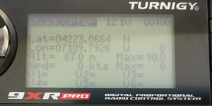

.. _common-frsky-telemetry:

===============
FrSky Telemetry
===============

FrSky telemetry allows you to display ArduPilot information such as flight modes, battery level, and error messages, as well as information from additional FrSky sensors on the FrSky Taranis, Turnigy 9XR Pro, and other FrSky compatible RC transmitters.

It is particularly useful:
 * for flying without a ground control station (no need for MAVLink telemetry radio),
 * as a backup in case the ground station fails (e.g., loss of MAVLink radio link),
 * when a separate person operates the ground control station,
 * for instantaneous situational awareness by the pilot.

Compared to a MAVLink radio link, the FrSky telemetry link has practically no delay.

Moreover, some RC transmitters such as the Taranis can be configured to play sounds, vibrate or perform automatic RC actions based on telemetry information through the highly configurable OpenTX firmware.

    Common FrSky Telemetry Setup with Taranis RC transmitter running :ref:`FlightDeck <common-frsky-flightdeck>`.

.. note::

    FrSky telemetry packages including Taranis, X-receiver, LiPo cell voltage sensor and autopilot specific telemetry cable for the Pixhawk, Cube, PixRacer and Pixhack are available from `Craft and Theory <http://www.craftandtheoryllc.com/store/>`__.

**Pages Related to FrSky Telemetry**

.. toctree::
    :maxdepth: 1

    Passthrough FrSky Telemetry <common-frsky-passthrough>
    FlightDeck <common-frsky-flightdeck>
    Yaapu FrSky Telemetry Script for OpenTX <common-frsky-yaapu>
    Repurposed FrSky Telemetry <common-frsky-repurposed>
    MavLink to FrSky Telemetry Converters <common-frsky-mavlink>

Protocol Information
====================

ArduPilot has FrSky telemetry drivers to natively output autopilot information through the serial ports. It comes in two flavors:

a) :ref:`Repurposed FrSky telemetry <common-frsky-repurposed>` (D and SmartPort) (available since AC3.2), which reuses FrSky data IDs to transmit basic flight control information to the RC transmitter (e.g. T2 temperature message reused to transmit the number of GPS satellites and GPS status); and

b) :ref:`Passthrough telemetry <common-frsky-passthrough>` (SmartPort) (available since AC3.4), which leverages the new passthrough FrSky data IDs to send an extensive amount of autopilot specific information to the RC transmitter.

FrSky telemetry is also possible through the use of a :ref:`MAVLink to FrSky converter <common-frsky-mavlink>`.

The following table summarizes the information available using each protocol:

+------------------------------------------------------------+---------------------------------+------------------------------------+-------------------------------------------------+-----------------------------------+---------------------------------------------+
| Feature                                                    | Native standard FrSky telemetry | Native passthrough FrSky telemetry | Converted MAVLink telemetry (Airborne Projects) | Converted MAVLink telemetry (DIY) | Converted MAVLink telemetry (TBS Crossfire) |
+============================================================+=================================+====================================+=================================================+===================================+=============================================+
| Vehicle/frame type                                         |                                 | ●                                  |                                                 |                                   |                                             |
+------------------------------------------------------------+---------------------------------+------------------------------------+-------------------------------------------------+-----------------------------------+---------------------------------------------+
| Flight/control mode                                        | ●                               | ●                                  | ●                                               | ●                                 |                                             |
+------------------------------------------------------------+---------------------------------+------------------------------------+-------------------------------------------------+-----------------------------------+---------------------------------------------+
| Simple/super simple mode                                   |                                 | ●                                  |                                                 |                                   |                                             |
+------------------------------------------------------------+---------------------------------+------------------------------------+-------------------------------------------------+-----------------------------------+---------------------------------------------+
| Throttle %                                                 |                                 |                                    |                                                 | ●                                 |                                             |
+------------------------------------------------------------+---------------------------------+------------------------------------+-------------------------------------------------+-----------------------------------+---------------------------------------------+
| Flight timer (automatically counting while in flight)      |                                 | ●                                  |                                                 |                                   |                                             |
+------------------------------------------------------------+---------------------------------+------------------------------------+-------------------------------------------------+-----------------------------------+---------------------------------------------+
| Battery pack voltage                                       | ●                               | ●                                  | ●                                               | ●                                 | ●                                           |
+------------------------------------------------------------+---------------------------------+------------------------------------+-------------------------------------------------+-----------------------------------+---------------------------------------------+
| Battery failsafe voltage                                   |                                 | ●                                  |                                                 |                                   |                                             |
+------------------------------------------------------------+---------------------------------+------------------------------------+-------------------------------------------------+-----------------------------------+---------------------------------------------+
| Battery failsafe capacity                                  |                                 | ●                                  |                                                 |                                   |                                             |
+------------------------------------------------------------+---------------------------------+------------------------------------+-------------------------------------------------+-----------------------------------+---------------------------------------------+
| Battery failsafe trigger                                   |                                 | ●                                  |                                                 |                                   |                                             |
+------------------------------------------------------------+---------------------------------+------------------------------------+-------------------------------------------------+-----------------------------------+---------------------------------------------+
| EKF failsafe trigger                                       |                                 | ●                                  |                                                 |                                   |                                             |
+------------------------------------------------------------+---------------------------------+------------------------------------+-------------------------------------------------+-----------------------------------+---------------------------------------------+
| Instantaneous current consumption                          | ●                               | ●                                  | ●                                               |                                   | ●                                           |
+------------------------------------------------------------+---------------------------------+------------------------------------+-------------------------------------------------+-----------------------------------+---------------------------------------------+
| Total current consumption                                  |                                 | ●                                  |                                                 |                                   | ●                                           |
+------------------------------------------------------------+---------------------------------+------------------------------------+-------------------------------------------------+-----------------------------------+---------------------------------------------+
| Battery pack capacity (mAh)                                |                                 | ●                                  |                                                 |                                   |                                             |
+------------------------------------------------------------+---------------------------------+------------------------------------+-------------------------------------------------+-----------------------------------+---------------------------------------------+
| Battery pack capacity remaining (%)                        | ●                               | ●                                  |                                                 | ●                                 |                                             |
+------------------------------------------------------------+---------------------------------+------------------------------------+-------------------------------------------------+-----------------------------------+---------------------------------------------+
| GPS number of satellites visible                           | ●                               | ●                                  | ●                                               | ●                                 | ●                                           |
+------------------------------------------------------------+---------------------------------+------------------------------------+-------------------------------------------------+-----------------------------------+---------------------------------------------+
| GPS fix status (e.g., 2D, 3D, DGPS, RTK)                   | ●                               | ●                                  | ●                                               | ●                                 |                                             |
+------------------------------------------------------------+---------------------------------+------------------------------------+-------------------------------------------------+-----------------------------------+---------------------------------------------+
| GPS HDOP                                                   |                                 | ●                                  | ●                                               | ●                                 |                                             |
+------------------------------------------------------------+---------------------------------+------------------------------------+-------------------------------------------------+-----------------------------------+---------------------------------------------+
| GPS latitude and longitude                                 | ●                               | ●                                  | ●                                               | ●                                 | ●                                           |
+------------------------------------------------------------+---------------------------------+------------------------------------+-------------------------------------------------+-----------------------------------+---------------------------------------------+
| GPS altitude                                               | ●                               | ●                                  |                                                 | ●                                 | ●                                           |
+------------------------------------------------------------+---------------------------------+------------------------------------+-------------------------------------------------+-----------------------------------+---------------------------------------------+
| GPS speed                                                  | ●                               |                                    | ●                                               | ●                                 | ●                                           |
+------------------------------------------------------------+---------------------------------+------------------------------------+-------------------------------------------------+-----------------------------------+---------------------------------------------+
| Ground speed (using GPS/INS filter)                        |                                 | ●                                  |                                                 |                                   |                                             |
+------------------------------------------------------------+---------------------------------+------------------------------------+-------------------------------------------------+-----------------------------------+---------------------------------------------+
| Air speed (from airspeed sensor)                           |                                 | ●                                  |                                                 | ●                                 |                                             |
+------------------------------------------------------------+---------------------------------+------------------------------------+-------------------------------------------------+-----------------------------------+---------------------------------------------+
| GPS heading                                                | ●                               |                                    | ●                                               |                                   | ●                                           |
+------------------------------------------------------------+---------------------------------+------------------------------------+-------------------------------------------------+-----------------------------------+---------------------------------------------+
| X, Y, Z accelerations                                      |                                 |                                    |                                                 | ●                                 |                                             |
+------------------------------------------------------------+---------------------------------+------------------------------------+-------------------------------------------------+-----------------------------------+---------------------------------------------+
| Roll/pitch/yaw                                             |                                 | ●                                  |                                                 | ●                                 | ●                                           |
+------------------------------------------------------------+---------------------------------+------------------------------------+-------------------------------------------------+-----------------------------------+---------------------------------------------+
| Barometric altitude                                        |                                 |                                    | ●                                               | ●                                 |                                             |
+------------------------------------------------------------+---------------------------------+------------------------------------+-------------------------------------------------+-----------------------------------+---------------------------------------------+
| Altitude from home (using GPS/INS filter, incl. barometer) | ●                               | ●                                  |                                                 |                                   |                                             |
+------------------------------------------------------------+---------------------------------+------------------------------------+-------------------------------------------------+-----------------------------------+---------------------------------------------+
| Rangefinder distance                                       |                                 | ●                                  |                                                 |                                   |                                             |
+------------------------------------------------------------+---------------------------------+------------------------------------+-------------------------------------------------+-----------------------------------+---------------------------------------------+
| Direction to home                                          |                                 | ●                                  |                                                 |                                   |                                             |
+------------------------------------------------------------+---------------------------------+------------------------------------+-------------------------------------------------+-----------------------------------+---------------------------------------------+
| Distance from home                                         |                                 | ●                                  | ●                                               | ●                                 |                                             |
+------------------------------------------------------------+---------------------------------+------------------------------------+-------------------------------------------------+-----------------------------------+---------------------------------------------+
| Vertical velocity                                          |                                 | ●                                  |                                                 | ●                                 |                                             |
+------------------------------------------------------------+---------------------------------+------------------------------------+-------------------------------------------------+-----------------------------------+---------------------------------------------+
| Arming status                                              |                                 | ●                                  | ●                                               | ●                                 |                                             |
+------------------------------------------------------------+---------------------------------+------------------------------------+-------------------------------------------------+-----------------------------------+---------------------------------------------+
| Sensor health messages (e.g., Bad Compass Health)          |                                 | ●                                  |                                                 |                                   |                                             |
+------------------------------------------------------------+---------------------------------+------------------------------------+-------------------------------------------------+-----------------------------------+---------------------------------------------+
| EKF error messages (e.g., Error compass variance)          |                                 | ●                                  |                                                 |                                   |                                             |
+------------------------------------------------------------+---------------------------------+------------------------------------+-------------------------------------------------+-----------------------------------+---------------------------------------------+
| MAVLink status messages                                    |                                 | ●                                  | ●                                               | ●                                 |                                             |
+------------------------------------------------------------+---------------------------------+------------------------------------+-------------------------------------------------+-----------------------------------+---------------------------------------------+

Hardware Selection Guide
========================

The following equipment is required to enable FrSky telemetry on an ArduPilot-compatible autopilot:

.. _ersky9x: http://www.er9x.com/

* A FrSky telemetry capable RC transmitter.
  Possible options include:

  - FrSky Taranis Q X7
  - FrSky Taranis X9D
  - FrSky Taranis X9D Plus
  - FrSky Taranis X9E
  - FrSky Horus X12S
  - Jumper T16 with multi protocol module
  - Turnigy 9XR Pro (running ErSky9x_ version 211 or later)
  - A number of DIY solutions are also available

* :ref:`A FrSky telemetry capable receiver <frsky_receivers>`.
  There are receivers available for two types of FrSky telemetry systems, which are not compatible with each other:

  - D telemetry

      D telemetry is a deprecated protocol for D receivers. It uses 16 bit data frames, only supports one way communication and requires a hub to connect other D telemetry sensors. Only repurposed FrSky telemetry is available over the D telemetry system.

  - SmartPort telemetry (recommended)

      SmartPort telemetry is available on X-series receivers. It uses 32 bit data frames, supports two-way communication; and enables other SmartPort sensors to be connected without a hub.

* :ref:`A telemetry cable <frsky_cables>` to connect your autopilot to your FrSky receiver.

In addition to the required hardware, a selection of :ref:`FrSky sensors <frsky_sensors>` can be added. (see below)

.. tip::

    The use of an FLVSS or MLVSS LiPo cell voltage (see below) sensor is recommended to measure and report the voltage of individual cells in a battery pack.

.. _frsky_receivers:

Telemetry capable FrSky receivers
---------------------------------

+------------------------+------------+-------------------+--------------------------------------------------------------------------------+-----------------------------------------------------------------------------------------------------------+
|        Receiver        |   Range    | Target frame type |                                    Outputs                                     |                                                   Notes                                                   |
+========================+============+===================+================================================================================+===========================================================================================================+
| X4R/X4R-SB             | Good       | Small to mid size | X4R: CPPM and 3 extra PWM channels X4R-SB: SBUS, CPPM and 2 extra PWM channels |                                                                                                           |
+------------------------+------------+-------------------+--------------------------------------------------------------------------------+-----------------------------------------------------------------------------------------------------------+
| XSR (recommended)      | Better     | Mini and racing   | SBUS and CPPM                                                                  | Smallest telemetry capable FrSky receiver.                                                                |
+------------------------+------------+-------------------+--------------------------------------------------------------------------------+-----------------------------------------------------------------------------------------------------------+
| X6R, X8R (recommended) | Best       | Mid to large size | SBUS or PWM                                                                    | The X8R is the **most common** and versatile FrSky receiver as it is often sold bundled with the Taranis. |
+------------------------+------------+-------------------+--------------------------------------------------------------------------------+-----------------------------------------------------------------------------------------------------------+
| D4R-II                 | Not tested | All               | PWM                                                                            | Deprecated receiver. It is recommended to upgrade to an X-series (SmartPort) receiver.                    |
+------------------------+------------+-------------------+--------------------------------------------------------------------------------+-----------------------------------------------------------------------------------------------------------+

.. tip::

  SBUS signal output is highly recommended as it features 16 RC channels and can be directly plugged into the autopilot (e.g., RCIN on Pixhawk/Cube)

.. _frsky_cables:

X-Receiver cables
-----------------

Craft and Theory Pixhawk to FrSky Telemetry Cables
^^^^^^^^^^^^^^^^^^^^^^^^^^^^^^^^^^^^^^^^^^^^^^^^^^

`Craft and Theory <http://www.craftandtheoryllc.com/product-category/frsky-smartport-telemetry-cables/>`__ supplies cost-effective all-in-one X-receiver cables with connectors for the various FrSky receivers.

.. figure:: ../../../images/FrSky_Hardware3.jpg
    :target: http://www.craftandtheoryllc.com/product/telemetry-cable-flightdeck-taranis-opentx-ardupilot-arducopter-pixhawk-2-cube-servo-frsky-smartport-smart-port-df13-jst-gh-serial/
    :width: 50%
    :align: center

-  `Servo telemetry Cable (X6R/X8R, SmartPort sensors) for The Cube <http://www.craftandtheoryllc.com/product/telemetry-cable-flightdeck-taranis-opentx-ardupilot-arducopter-pixhawk-2-cube-servo-frsky-smartport-smart-port-df13-jst-gh-serial/>`__:

   .. figure:: ../../../images/FrSky_Ph2-X8R.jpg
      :target:  http://www.craftandtheoryllc.com/telemetry-cable
      :width: 50%
      :align: center

      Craft and Theory Cube to FrSky X6R and X8R receiver cable

-  `Pixhawk to FrSky Telemetry Cable (X6R, X8R, FLVSS) <http://www.craftandtheoryllc.com/product/telemetry-cable-flightdeck-taranis-opentx-ardupilot-arducopter-pixhawk-2-cube-servo-frsky-smartport-smart-port-df13-jst-gh-serial/>`__:

   .. figure:: ../../../images/FrSky_Phawk-X8R.jpg
      :target:  http://www.craftandtheoryllc.com/product/telemetry-cable-flightdeck-taranis-opentx-ardupilot-arducopter-pixhawk-2-cube-servo-frsky-smartport-smart-port-df13-jst-gh-serial/
      :width: 50%
      :align: center

      Craft and Theory Pixhawk to FrSky X6R and X8R receiver cable

-  `Cube to FrSky XSR Telemetry Cable <http://www.craftandtheoryllc.com/product/telemetry-cable-flightdeck-taranis-opentx-ardupilot-arducopter-pixhawk-2-cube-servo-frsky-smartport-smart-port-df13-jst-gh-serial/>`__:

   .. figure:: ../../../images/FrSky_Ph2-XSR.jpg
      :target:  http://www.craftandtheoryllc.com/product/telemetry-cable-flightdeck-taranis-opentx-ardupilot-arducopter-pixhawk-2-cube-servo-frsky-smartport-smart-port-df13-jst-gh-serial/
      :width: 50%
      :align: center

      Craft and Theory Cube to FrSky XSR receiver cable

DIY cable for SmartPort
^^^^^^^^^^^^^^^^^^^^^^^
You can make your own cable using the following components:

.. image:: ../../../images/Telemetry_FrSky_Pixhawk-SPORT.jpg
    :target: ../_images/Telemetry_FrSky_Pixhawk-SPORT.jpg

-  TTL-to-RS232 converter such as the `FrSky FUL-1  <http://www.ebay.com/sch/i.html?_trksid=p2050601.m570.l1313.TR11.TRC1.A0.H0.Xfrsky+ful-1.TRS0&_nkw=frsky+ful-1&_sacat=0&_from=R40>`__
-  `SPC cable <https://www.ebay.com/sch/i.html?_from=R40&_trksid=m570.l1313&_nkw=frsky+spc+cable&_sacat=0&LH_TitleDesc=0&_osacat=0&_odkw=spc+cable>`_
-  `DF13 6 position connector <https://www.unmannedtechshop.co.uk/df13-6-position-connector-30cm-pack-of-5/>`__
   which will be cut and soldered to the TTL-to-RS232 converter
-  `Molex Picoblade <http://www.molex.com/molex/products/family?key=picoblade&channel=products&chanName=family&pageTitle=Introduction&parentKey=wire_to_board_connectors>`__
   4 position telemetry wire which will be cut and soldered to the
   TTL-to-RS232 converter (should be included with the receiver)

Or a more compact version using the following components:

-`MAX3232 RS-232 to TTL converter breakout board <https://www.ebay.com/sch/i.html?_from=R40&_trksid=m570.l1313&_nkw=max3232+rs-232+to+TTL&_sacat=0&LH_TitleDesc=0&_osacat=0&_odkw=max3232+breakout&LH_TitleDesc=0>`__

-Any silicon `diode <https://www.ebay.com/sch/i.html?_from=R40&_trksid=p2334524.m570.l1313.TR4.TRC1.A0.H0.X1n4148.TRS0&_nkw=1n4148&_sacat=0&LH_TitleDesc=0&_osacat=0&_odkw=1n4118&LH_TitleDesc=0>`__

 .. figure:: ../../../images/DIY_SPort_Cable.jpg
      :width: 50%
      :align: center

      DIY FRSky Smartport adapter cable

.. warning ::

  DO NOT PLUG THE TELEMETRY CABLE TO THE AUTOPILOT OR RECIEVER WHILE POWER IS ON!

.. _frsky_sensors:

FrSky Sensors
-------------

The following SmartPort sensors are available from FrSky:

.. |flvss| image:: ../../../images/frsky_flvss.png
    :width: 200pt
    :height: 200pt

+-----------------+----------------+-----------------------------------------------------+-----------------------------------------------------------------------------------------------------+
| Image           |  Sensor Name   |                     Description                     |                                        Useful with ArduPilot?                                       |
+=================+================+=====================================================+=====================================================================================================+
| |flvss|         | FLVSS          | LiPo cell voltage sensor with OLED screen           | Yes, as individual cell voltages are not available in ArduPilot.                                    |
+-----------------+----------------+-----------------------------------------------------+-----------------------------------------------------------------------------------------------------+
| |mlvss|         | MLVSS          | Provides cell voltage (smaller than FLVSS)          | Yes, as individual cell voltages are not available in ArduPilot.                                    |
+-----------------+----------------+-----------------------------------------------------+-----------------------------------------------------------------------------------------------------+
| |rpm|           | RPM            | RPM and temperature sensors                         | Yes, for traditional heli rpm and monitoring motors/battery temperature                             |
+-----------------+----------------+-----------------------------------------------------+-----------------------------------------------------------------------------------------------------+
| |fas40s|        | FAS40S/FAS150s | 40A/150A current sensor                             | Mostly no. Information already provided by ArduPilot if equipped with a power monitor               |
+-----------------+----------------+-----------------------------------------------------+-----------------------------------------------------------------------------------------------------+
| |gps|           | GPS            | GPS receiver                                        | No. Information already provided by ArduPilot.                                                      |
+-----------------+----------------+-----------------------------------------------------+-----------------------------------------------------------------------------------------------------+
| |vari|          | Vari-H/Vari-N  | Variometer (high or normal precision)               | No. Information already provided by ArduPilot.                                                      |
+-----------------+----------------+-----------------------------------------------------+-----------------------------------------------------------------------------------------------------+
| |ass-100|       | ASS-70/100     | Normal/High precision Air Speed Sensor (pitot tube) | Mostly no. Information already provided by ArduPilot on Planes if equipped with an airspeed sensor. |
+-----------------+----------------+-----------------------------------------------------+-----------------------------------------------------------------------------------------------------+

.. _common-frsky-equipment:

Connecting Equipment to the SmartPort Bus
=========================================

All FrSky sensors have two SmartPort connections that are hardwired in parallel such that all sensors and the receiver communicate on the same bus wire. In practice, the devices are **daisychained** as illustrated below.

   .. image:: ../../../images/FrSky_cablesbus.png
    :target: ../_images/FrSky_cablesbus.png

Connect the telemetry cable to one of the serial ports available on your autopilot and the other end to the Smart Port of your X-series receiver (X4R, X4RSB, X6R, X8R, or XSR) or a Smart Port sensor (e.g., FLVSS/MLVSS).

Adding a FrSky FLVSS or MLVSS LiPo sensor to measure individual cell voltages
-----------------------------------------------------------------------------

While battery pack voltage is usually a good indicator of remaining flight time, **flight time is actually limited by the lowest cell voltage**. Once the voltage of a cell drops below a certain level, that cell's voltage will continue to drop dramatically. This in turn causes the battery pack voltage to drop and may irreparably damage the battery pack.

By using a FrSky FLVSS or MLVSS LiPo voltage sensor, the lowest cell voltage (which is not available on a ground station using radio telemetry) can be displayed on your transmitter.

To install, connect the telemetry cable between the autopilot and the FLVSS/MLVSS sensor, then use the cable supplied with your receiver or supplied with the FLVSS/MLVSS sensor to connect the FLVSS/MLVSS sensor to the Smart Port connector of your X-series receiver:

   Setup with The Cube and X8R

   Setup with Pixhawk and X8R

   Setup with Pixhawk and X4R

.. note::

   For both the X4R and the X8R configuration, the same servo telemetry cable is used. This is because in both cases the autopilot is directly connected to the LiPo sensor instead of the receiver.

.. _common-frsky-configMP:

FrSky Telemetry Configuration in Mission Planner
================================================

To enable FrSky Telemetry on one of the serial ports, connect with **Mission Planner** and set the corresponding ``SERIAL#_PROTOCOL`` parameter to the desired value depending on the autopilot and the port that the cable is plugged in:

- Standard D telemetry: **3**
- Standard SmartPort telemetry: **4**
- Passthrough SmartPort telemetry: **10**

+-------------------------------------------------------------+--------------------------------+-------------------------------------------------+
|                      Autopilot                              |           Port used            |     Parameter name                              |
+=============================================================+================================+=================================================+
| The Cube                                                    | TELEM1                         | :ref:`SERIAL1_PROTOCOL<SERIAL1_PROTOCOL>`       |
|                                                             +--------------------------------+-------------------------------------------------+
|                                                             | TELEM2                         | :ref:`SERIAL2_PROTOCOL<SERIAL2_PROTOCOL>`       |
|                                                             +--------------------------------+-------------------------------------------------+
|                                                             | GPS 1                          | :ref:`SERIAL3_PROTOCOL<SERIAL3_PROTOCOL>`       |
|                                                             +--------------------------------+-------------------------------------------------+
|                                                             | GPS 2                          | :ref:`SERIAL4_PROTOCOL<SERIAL4_PROTOCOL>`       |
+-------------------------------------------------------------+--------------------------------+-------------------------------------------------+
| Pixhawk and Pixhawk clones                                  | TELEM1                         | :ref:`SERIAL1_PROTOCOL<SERIAL1_PROTOCOL>`       |
|                                                             +--------------------------------+-------------------------------------------------+
|                                                             | TELEM2                         | :ref:`SERIAL2_PROTOCOL<SERIAL2_PROTOCOL>`       |
|                                                             +--------------------------------+-------------------------------------------------+
|                                                             | GPS                            | :ref:`SERIAL3_PROTOCOL<SERIAL3_PROTOCOL>`       |
|                                                             +--------------------------------+-------------------------------------------------+
|                                                             | SERIAL 4/5 (recommended)       | :ref:`SERIAL4_PROTOCOL<SERIAL4_PROTOCOL>`       |
+-------------------------------------------------------------+--------------------------------+-------------------------------------------------+
|  Pixhawk Mini                                               | TELEM                          | :ref:`SERIAL1_PROTOCOL<SERIAL1_PROTOCOL>`       |
+-------------------------------------------------------------+--------------------------------+-------------------------------------------------+
|  PixRacer                                                   | FRS                            | :ref:`SERIAL4_PROTOCOL<SERIAL4_PROTOCOL>`       |
+-------------------------------------------------------------+--------------------------------+-------------------------------------------------+
|  Pixhack                                                    | SERIAL 4/5                     | :ref:`SERIAL4_PROTOCOL<SERIAL4_PROTOCOL>`       |
+-------------------------------------------------------------+--------------------------------+-------------------------------------------------+

.. note::
   Configuring ``SERIAL#_BAUD`` for FrSky telemetry has no effect - it is always a hardcoded value in ArduPilot: 9,600bps for D telemetry and 57,600bps for SmartPort telemetry.

.. image:: ../../../images/MP_SERIAL2_FrSky10.png
    :target: ../_images/MP_SERIAL2_FrSky10.png

.. warning::
   Only one ``SERIAL#_PROTOCOL`` parameter should be set for FrSky telemetry. Keep the other ``SERIAL#_PROTOCOL`` parameters to their default values or at least to something other than 3, 4, or 10, as only one serial port can be used for FrSky telemetry at a time!

Additional configuration in Mission Planner
-------------------------------------------

For FrSky telemetry to transmit the correct battery information to the RC transmitter, ArduPilot must be configured for the power monitor and battery pack used.

Configuring the Power Module via Mission Planner
^^^^^^^^^^^^^^^^^^^^^^^^^^^^^^^^^^^^^^^^^^^^^^^^

Perform the steps in the following tutorial if you've never configured or must reconfigure your power monitor: :ref:`power monitor configuration in mission planner <common-power-module-configuration-in-mission-planner>`

.. warning::

  It is highly recommended to configure the power monitor (both voltage and current), otherwise the voltage, current, battery consumption (Ah) and battery percentage reported in Mission Planner and via FrSky telemetry will not be accurate!!!

Battery Capacity Configuration
^^^^^^^^^^^^^^^^^^^^^^^^^^^^^^

Set your battery pack capacity.

.. image:: ../../../images/MP_FrSky_BattCapacity.png
   :target: ../_images/MP_FrSky_BattCapacity.png

Battery Failsafe Configuration
^^^^^^^^^^^^^^^^^^^^^^^^^^^^^^

**This feature is only available with passthrough telemetry.**

Battery failsafes are transmitted when using Passthrough FrSky telemetry. The battery failsafes are configured in the “Mandatory Hardware” tab. Click on “Failsafe” and set the “Low Battery” voltage and the “Reserved mAh” capacity.

OpenTX Scripts
==============

This section covers how to enable and runs scripts on the Taranis with OpenTX:

Enabling Scripts on OpenTX
--------------------------

   The version installed on your Taranis may not have the option to run scripts. If this is the case, you will need to install a new version via OpenTX Companion. This can be done in a few easy steps.

   1. Download and install the latest version of OpenTX Companion from `OpenTX <http://www.open-tx.org/downloads.html>`__. Open the OpenTX Companion program, then go to Settings >> Settings

   .. image:: ../../../images/opentx_settingstab.png
       :target: ../_images/opentx_settingstab.png

   2. Select your “Radio Type” (Taranis, Taranis Plus, or Taranis X9E), make sure the “lua” build option is checked, then press OK.

   .. image:: ../../../images/opentx_luacheck.png
       :target: ../_images/opentx_luacheck.png

   3. Click on File >> Download...

   .. image:: ../../../images/opentx_filetab.png
       :target: ../_images/opentx_filetab.png

   4. Click on the “Download FW” button and save the resulting .bin file. Once the firmware is downloaded, press OK.

   .. image:: ../../../images/opentx_dlwindow.png
       :target: ../_images/opentx_dlwindow.png

   5. Enter bootloader mode on the Taranis by sliding both horizontal trims, each under the main sticks, towards the center and then turning the Taranis on. The top of the Taranis LCD screen should now display “Taranis Bootloader.”

   .. image:: ../../../images/frsky_taranis_bootloadermode.png
       :target: ../_images/frsky_taranis_bootloadermode.png

   6. Connect a USB cable between the Taranis and the computer. “USB Connected” should appear in the center of the Taranis LCD screen. Click on Read/Write >> Write Firmware to Radio.

   .. image:: ../../../images/opentx_RWtab.png
       :target: ../_images/opentx_RWtab.png

   7. Locate/load the firmware (.bin) which was downloaded earlier, then click on the “Write to TX” button. A popup window should display a progress bar which will eventually reach 100%. Once flashing is done, click on the “Close” button to close the popup window.

   .. image:: ../../../images/opentx_flashwindow.png
       :target: ../_images/opentx_flashwindow.png

Copying Scripts and Sounds to the Taranis
-----------------------------------------

Scripts and sounds are stored on the Taranis SD Card. To copy a script or sounds to the Taranis, copy them to the SCRIPTS or SOUNDS folder on the Taranis SD. This can be done with an SD card reader or directly with the Taranis.

With the Taranis still in bootloader mode and connected to the computer via USB, the SD card should appear as a computer drive that contains multiple folders, including SCRIPTS and SOUNDS. Scripts and sounds should be copied to these folders.

Running Telemetry Scripts
-------------------------

This section describes how to the discover the telemetry sensors (similar to using telemetry without scripts), how to assign a display script to a screen and how to access the screen showing the script display or activate a non-display script (e.g. sound script).

Discovering Sensors
^^^^^^^^^^^^^^^^^^^

OpenTX 2.2.0 requires “discovering” the telemetry messages from the Pixhawk that are not passthrough messages. To discover them, unplug the USB cable, turn off the Taranis, then turn it back on (not in bootloader mode). Repeat the following steps for each model for which you want to use FrSky telemetry:

1. Press the MENU button, then long press the PAGE button to get to the TELEMETRY page. Press the - button until “Discover new sensors” is highlighted and press ENTER. The Taranis LCD screen should display “Stop discovery.”

 .. image:: ../../../images/OpenTX_Discover.png
    :target: ../_images/OpenTX_Discover.png

2. Power on the Pixhawk and FrSky receiver. Wait for 15 seconds. The Taranis should discover the emulated sensors based on the data from the Pixhawk. The sensors must all be properly discovered for the scripts to run. For example:

 .. image:: ../../../images/OpenTX_sensors.png
    :target: ../_images/OpenTX_sensors.png

Assigning a Display Script to a Screen
^^^^^^^^^^^^^^^^^^^^^^^^^^^^^^^^^^^^^^

If a scripts has a display, it needs to be assigned to telemetry screens. Once the script has been assigned to a screen, the script is accessed by doing a long press on the main OpenTX screen. Each long press will switch screens. Multiple scripts can be assigned to multiple screens.

On the TELEMETRY page, scroll down using the - button, and highlight the “None” entry next to “Screen 1.” Once “None” is highlighted, press ENT, then navigate the choices with the +/- buttons until “Script” appears. Press ENT to validate, then press - to move to the right (highlighting “- - -“). Press ENT and select your script (e.g. “screens”) using the +/- buttons, then press ENT to validate. The “screens” script handles the display capabilities. The Taranis LCD display should then look like this:

Activating a Custom Script (no display function)
^^^^^^^^^^^^^^^^^^^^^^^^^^^^^^^^^^^^^^^^^^^^^^^^

Scripts that do not display anything (e.g. data parsing, sounds) are activated on the CUSTOM script page.
Press EXIT once, long press PAGE to get to the CUSTOM SCRIPT page, then press ENT to edit LUA1. On the LUA1 page, press ENT and select the script using the +/- buttons, then press ENT to validate.

Turnigy 9XR Pro
===============

This section describes how to enable FrSky telemetry on the Turnigy
9XR Pro transmitter.

Requirements
------------

- You will need a transmitter module with support for FrSky telemetry,
  such as the `FrSky XJT`_.  The DJT_ also supports telemetry, but you
  will need to use an external cable to connect the telemetry data
  from the module to your transmitter.

  The instructions in this section are specifically for the XJT
  module.

- You will need to be running a recent version (211 or later) of the
  ErSky9x_ firmware.  You can find more information about upgrading
  the firmware and about ErSky9x in general from `the
  documentation`_.

.. _frsky xjt: https://www.frsky-rc.com/product/xjt-2/
.. _djt:  https://www.frsky-rc.com/product/djt-2/
.. _the documentation: http://openrcforums.com/forum/viewtopic.php?f=122&t=5575#p79483

Configuring ArduPilot
---------------------

Ensure that you have the appropriate ``SERIAL#_PROTOCOL`` parameter
set to ``10`` ("passthrough FrSky telemetry") to select the ArduPilot
SPORT protocol.  For example, if you have plugged your SmartPort cable
into the serial 4/5 port on your Pixhawk, set ``SERIAL4_PROTOCOL`` to
``10``.

Reboot your controller after making this change.

ErSky9x will also work with protocol ``4`` ("repurposed FrSky
telemetry"), but you will not have access to ArduPilot-specific
information such as the name of the current flight mode or arming
status.

Configuring the 9XR Pro
-----------------------

#. Verify that you are running version 211 or later.  Navigate to the ``Radio
   Setup`` menu and then select ``Version``.  Look at the ``SVN``
   field.

    .. figure:: ../../../images/9xrpro-firmware-version.png
        :target: ../_images/9xrpro-firmware-version.png
        :align: center

   Telemetry support is substantially improved in revision 218 and
   later.

#. Navigate to ``Model Setup`` menu, then select ``Protocol``.  Ensure
   that you have ``Proto`` set to ``XJT``, and ``Type`` set to ``D16``.

    .. figure:: ../../../images/9xrpro-settings-protocol.png
        :target: ../_images/9xrpro-settings-protocol.png
        :align: center

   In older versions of the firmware, you may see `PXX` instead of
   `XJT`.

#. Navigate to the ``Model Setup`` menu, then select ``Telemetry``, and
   then again select ``Telemetry`` from the popup menu.  Ensure that
   ``UsrProto`` is set to ``ArduP`` (for ArduPlane) or ``ArduC`` (for
   ArduCopter), ``Telemetry Com Port`` (previously ``FrSky Com Port``)
   is ``1``, and ``Com Port Invert`` (previously ``Invert Com 1``) is
   off (unchecked).

    .. figure:: ../../../images/9xrpro-settings-telem-protocol.png
        :target: ../_images/9xrpro-settings-telem-protocol.png
        :align: center

    .. figure:: ../../../images/9xrpro-settings-telem-port.png
        :target: ../_images/9xrpro-settings-telem-port.png
        :align: center

   If you are using something other than ArduPlane or ArduCopter, you
   can set ``UsrProto`` to ``FrSky``.  You will get a more basic
   telemetry display that will be missing things like the graphic
   heading indicator, the name of the current flight mode, and so
   forth.

At this point, you should be receiving extended telemetry on your 9XR
Pro.  If you navigate to the telemetry home screen (use the up/down
arrows to switch between screens) you should see standard FrSky
telemetry values (such as RSSI, receiver voltage, etc) as well as
extended telemetry, such as flight mode, current measurements, GPS
information, etc.

.. figure:: ../../../images/9xrpro-telem-arducopter.png
    :target: ../_images/9xrpro-telem-arducopter.png
    :align: center

Use the left/right arrows to switch between available telemetry views:

Configuring custom telemetry screens
------------------------------------

ErSky9x allows you to customize two telemetry display screens with
your choice of information.  To configure the custom screens, navigate
to ``Model Setup``, then select ``Telemetry``, and then select
``Custom``:

**Pages Related to FrSky Telemetry**

.. toctree::
    :maxdepth: 1

    Passthrough FrSky Telemetry <common-frsky-passthrough>
    FlightDeck <common-frsky-flightdeck>
    Repurposed FrSky Telemetry <common-frsky-repurposed>
    MavLink to FrSky Telemetry Converters <common-frsky-mavlink>
