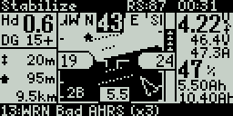

.. _common-frsky-yaapu:

=======================================
Yaapu FrSky Telemetry Script for OpenTX
=======================================

This is an open source LUA script to display :ref:`FrSky passthrough telemetry <common-frsky-passthrough>` on Horus X10,X12, Jumper T16,T18, Radiomaster TX16S, Taranis X9D,X9E,QX7 and Jumper T12 radios using OpenTX 2.2.3.

Support for dual flight batteries is also provided.

Hardware details are shown in  :ref:`FrSky passthrough telemetry <common-frsky-passthrough>` also.

Display on Horus, Jumper T16/T18 and Radiomaster TX16S

.. image:: ../../../images/x10-horus.png
    :target: ../_images/x10-horus.png

Display on Taranis

.. image:: ../../../images/x9d-taranis.png
    :target: ../_images/x9d-taranis.png

Display on QX7 and Jumper T12

Details can be found `here <https://discuss.ardupilot.org/t/an-open-source-frsky-telemetry-script-for-the-horus-x10-x12-and-taranis-x9d-x9e-and-qx7-radios/26443>`__.

Latest script releases are `here <https://github.com/yaapu/FrskyTelemetryScript/releases>`__.

The script is also compatible with the excellent `MavlinkToPassthru converter firmware <https://github.com/zs6buj/MavlinkToPassthru>`__ by Eric Stockenstrom which allows alternative telemetry transport methods, such as the data modem in DragonlinkRC RC systems, to feed MAVLink data into these transmitters for display by this LUA script.

Requires `OpenTX 2.2.x <http://www.open-tx.org/>`__ (2.2.3 recommended) and a recent release of ArduPilot with support for :ref:`common-frsky-passthrough`.

Installation and Operation
==========================

Complete instructions are provided in the wiki pages `here <https://github.com/yaapu/FrskyTelemetryScript/wiki>`_ , but the steps are:

- Copy the SD card directory contents provided in the code section of that github site to your TX's SD card: Horus SD for Horus, T16, and T16s style TXs; Taranis SD for all others.
- On the telemetry display setup page of the TX (or telemetry widget for Horus class TXs) choose the appropriate script as the source for the display page. In the case of Taranis class, the ``yaapu7`` script is for the smaller QX7 size displays, and the ``yaapu9`` is for the Taranix 9x size displays.
- Setup the ArduPilot side (see :ref:`common-frsky-telemetry`)
- On the TX telemetry page, "discover sensors".
- The script will run on startup. On Horus the widget will display, on others, you will need to page to the telemetry display page to see the data.
- There is a configuration screen for the script that allows customization of warnings, units, etc.

