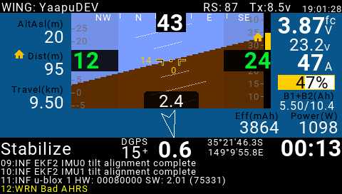

.. _common-frsky-yaapu:

=======================================
Yaapu FrSky Telemetry Script for OpenTX
=======================================

This is an open source LUA script to display :ref:`FrSky passthrough telemetry <common-frsky-passthrough>` on Horus X10,X12, Jumper T16,T18, Radiomaster TX16S, Taranis X9D,X9E,QX7 and Jumper T12 radios.

Support for dual flight batteries is also provided.

Hardware details are shown in  :ref:`FrSky passthrough telemetry <common-frsky-passthrough>` also.

Display on Horus, Jumper T16/T18 and Radiomaster TX16S

Display on Taranis

Display on QX7 and Jumper T12

.. image:: ../../../images/x7-taranis.png
    :target: ../_images/x7-taranis.png

Details can be found `here <https://discuss.ardupilot.org/t/an-open-source-frsky-telemetry-script-for-the-horus-x10-x12-and-taranis-x9d-x9e-and-qx7-radios/26443>`__.

Latest script releases are `here <https://github.com/yaapu/FrskyTelemetryScript/releases>`__.

The script is also compatible with the excellent `MavlinkToPassthru converter firmware <https://github.com/zs6buj/MavlinkToPassthru>`__ by Eric Stockenstrom which allows alternative telemetry transport methods, such as the data modem in DragonlinkRC RC systems, to feed MAVLink data into these transmitters for display by this LUA script.

Requires `OpenTX 2.2.x <http://www.open-tx.org/>`__ (2.2.3 recommended) and a recent release of ArduPilot with support for :ref:`common-frsky-passthrough` .

