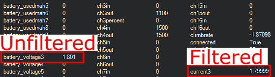

.. _common-fuel-sensors:

===========================
Fuel Flow and Level Sensors
===========================

In firmware versions 4.0 and later, ArduPilot provides the ability to use fuel flow and level sensors, in addition to battery monitors. Pulse output fuel flow sensors, PWM output fuel level sensors, and analog output fuel level sensors are supported. Just as an analog battery monitor provides current flow measurements with the capacity status being computed by the autopilot, these sensors provide fuel use or level status measurements to enable the same reporting and monitoring for liquid fuel systems.

Fuel Flow Sensors
=================

Fuel flow sensors that provide a pulse for each unit of consumed fuel, such as `this <https://www.btflowmeter.com/en/flow-meter-products/flow-meters-lowflow-flowmeters-low-flow-turbine-flow-meter-fuel-flow-meters-diesel-fuel-flow-meter-watermeters-paddlewheel-flow-meter-oil-flow-meter-oilflowmeter-waterflowmeter-water-meters-turbineflowmeter-oilflowmeter/mini-flowmeter-fch-mini-pp-series-chemical/fch-m-pp-30-lpm-97478169-lc.html>`__, shown below, can be used just like a battery would be in ArduPilot, with monitoring, display, failsafes, etc.

.. image:: ../../../images/fuelflow-sensor.jpg
    :target: ../_images/fuelflow-sensor.jpg

image courtesy `BIO-TECH <https://www.btflowmeter.com/home.html>`__

The displays/logs/limits for amps and mAh consumed are now actually the liters/hour and milliliters consumed. The voltage will always report as 1.0V.

Connecting to the Autopilot
---------------------------

Any GPIO capable pin on the :ref:`autopilot<common-autopilots>` can be used to connect to the sensor's output. If it is an open-collector output, a 10kOhm external resistor pull-up to 3.3V will be required. For Pixhawk-style autopilots, any AUX pin can be used. For most other autopilots, an upper PWM output can be used.
In either case, it must be freed up from use as a PWM output by setting the ``BRD_PWM_COUNT`` lower than the total number of outputs available for PWM use. 

.. note:: in firmware versions 4.2 and later, the method for setting a PWM/SERVO/MOTOR output to be a GPIO function is changed. Instead of ``BRD_PWM_COUNT`` being used, the individual ``SERVOx_FUNCTION`` parameter is merely set to "-1". If set to "0", it remains a PWM output, unassigned to a function, and outputs that output's trim value when board safety is not active. If the servo function is being "mirrored" to a remote device, as in the case of a DroneCAN or KDECAN ESC, then in order to change the autopilot board's corresponding output pin to be a GPIO, but allow the ``SERVOx_FUNCTION`` to still be assigned to the remote device, the :ref:`SERVO_GPIO_MASK<SERVO_GPIO_MASK>` parameter can be used to assign the board pin to be a GPIO without affecting the ``SERVOx_FUNCTION`` assignment for the remote device.

For example, if the board provides 6 outputs normally, setting ``BRD_PWM_COUNT`` to 5 would make PWM output 6 available for use as a GPIO.
The pin number assigned to that output when used as a GPIO needs to be determined from its hwdef.dat file, located `here <https://github.com/ArduPilot/ardupilot/tree/master/libraries/AP_HAL_ChibiOS/hwdef>`__ as shown below, where PWM6 is assigned as GPIO pin 55 when used as such:

.. image:: ../../../images/gpio.png
   :target: ../_images/gpio.png

.. note:: These sensors can sometimes provide erroneous data due to vibrations. This will cause the autopilot to assume that a higher amount of fuel has passed through the sensor than has been consumed from the tank.

Fuel Level Sensors
==================

PWM Fuel Level Sensors
----------------------

Fuel level sensors that output a PWM signal proportional to the level of fuel remaining in the tank such as the one supplied by `Foxtech <https://www.foxtechfpv.com/pwm-output-liquid-level-senser.html>`__ shown below are supported.

.. image:: ../../../images/fuel-level-sensor.jpg
   :target: ../_images/fuel-level-sensor.jpg

The displays/logs/limits for mAh consumed are now actually the milliliters consumed with 1100 us PWM input indicating empty, and 1900 us PWM indicating full. The voltage will always report as 1.0V. The current is undefined.

Any GPIO-capable pin can be used as the PWM input from the sensor.

Parameter Setup
+++++++++++++++

Like analog battery current and capacity monitoring, the key parameters are:

-  :ref:`BATT_MONITOR<BATT_MONITOR>` This sets the type of sensor. In this case, type 11 for pulse fuel flow sensors, and 12 for PWM fuel level sensors.
-  :ref:`BATT_CURR_PIN<BATT_CURR_PIN>` This is the GPIO pin where the sensor is attached.
-  :ref:`BATT_AMP_PERVLT<BATT_AMP_PERVLT>` This is set in milliliters per pulse for fuel flow sensors.
-  :ref:`BATT_CAPACITY<BATT_CAPACITY>` This is the capacity in milliliters.
-  :ref:`BATT_LOW_MAH<BATT_LOW_MAH>` This is set in milliliters instead of mAh.
-  :ref:`BATT_CRT_MAH<BATT_CRT_MAH>` This is set in milliliters instead of mAh.

Analog Fuel Level Sensors
-------------------------

Fuel level sensors that output voltage are supported in ArduPilot version 4.3 and later. These types of sensors are also sometimes called fuel senders and are widely available from many manufacturers. Just as with the PWM type sensors, the estimated volume of fluid in the tank is shown as mAh when it is now actually milliliters.

Any analog-capable pin can be used as the input from the sensor. Carefully consider the maximum voltage that the chosen ADC pin can measure and tolerate. Adding an external voltage divider might be necessary. To assist with calibrating these types of sensors, the voltage ArduPilot sees on the analog pin is shown in the battery voltage field.

A low-pass filter feature is available to reduce the impact of tank slosh on the measured fuel level. The battery current field shows the voltage through the low-pass filter. The suggested range for the low-pass filter is between 0.2 Hz and 0.5 Hz. Setting the filter to a value of -1 will disable it and unfiltered voltage from the analog pin will be used. The filtered voltage value will be logged with a cutoff frequency of 0.3 Hz even when the filter is disabled.

.. note:: This feature assumes linear fuel tank shapes and even distribution of fuel in the tank. It will not take into account non-uniform-shaped tanks or sloped fuel levels. This should be taken into consideration when setting failsafe values.

Parameter Setup
+++++++++++++++

-  :ref:`BATT_MONITOR<BATT_MONITOR>` The sets the type of sensor. In this case, use type 24 for analog fuel level sensors.
-  :ref:`BATT_CAPACITY<BATT_CAPACITY>` This is the capacity in milliliters.
-  :ref:`BATT_FL_VLT_MIN<BATT_FL_VLT_MIN>` This is the minimum voltage seen on the analog pin when the fuel tank is empty.
-  :ref:`BATT_FL_V_MULT<BATT_FL_V_MULT>` The is a multiplier calculated using the minimum and maximum voltage measured on the analog pin. This is calculated as 1 / (Voltage_Full - Voltage_Empty).
-  :ref:`BATT_FL_FLTR<BATT_FL_FLTR>` This is the frequency of the low pass filter in Hertz. A value of -1 disables the filter and unfiltered voltage is used to determine the fuel level.
-  :ref:`BATT_FL_PIN<BATT_FL_PIN>` This is the analog pin where the sensor is attached.

Advanced Parameter Setup
++++++++++++++++++++++++

Fuel level is normally calculated using a linear relationship between fuel level and reported analog voltage from the sensor. However, some sensors have a non-linear output versus fuel level. ArduPilot provides up to a third order polynomial curve fit by changing the following parameters from their default values (which is a linear fit):

example shown for first battery monitor
- :ref:`BATT_FL_FF<BATT_FL_FF>` First order polynomial fit term
- :ref:`BATT_FL_FS<BATT_FL_FS>` Second order polynomial fit term
- :ref:`BATT_FL_FT<BATT_FL_FT>` Third order polynomial fit term
- :ref:`BATT_FL_OFF<BATT_FL_OFF>` Offset term

every voltage sample from the sensor is modified as:

measured sensor voltage = vm

modified voltage = (BATT_FL_FT * vm^3 + BATT_FL_FS * vm^2 + BATT_FL_FF * vm) + BATT_FL_OFF

This allows the non-linearity to be compensated. The values for these parameters should be obtained from the sensor manufacturer, if applicable.
