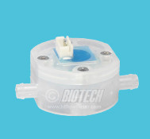
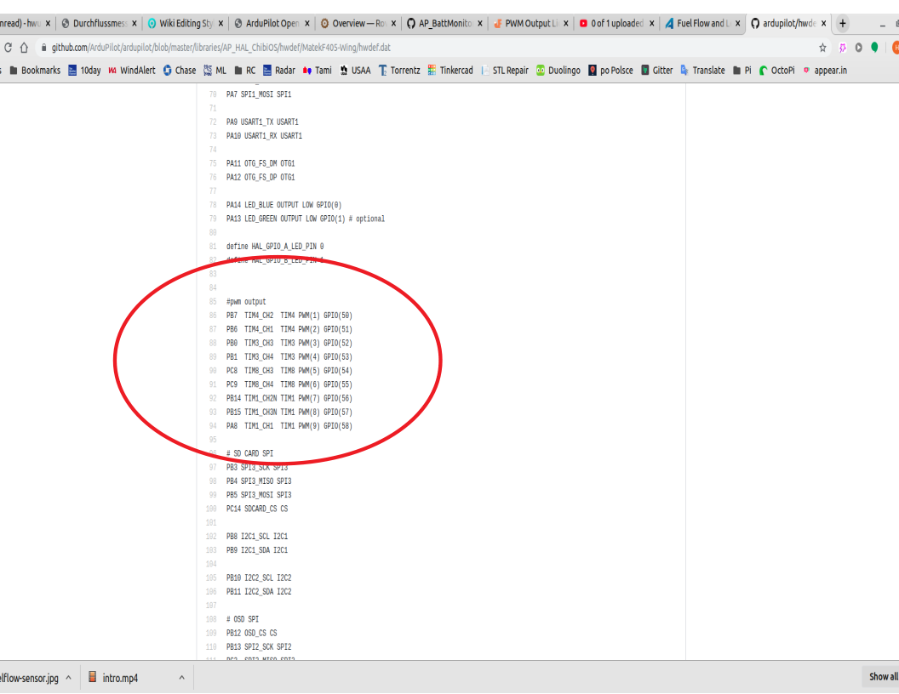
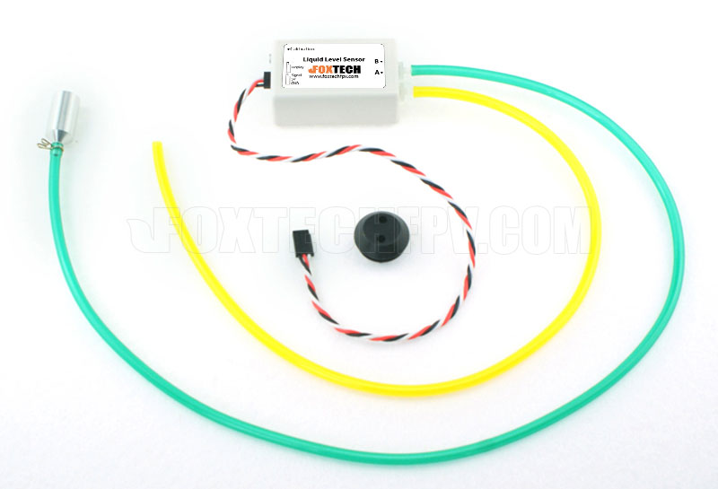

.. _common-fuel-sensors:

===========================
Fuel Flow and Level Sensors
===========================

In firmware versions 4.0 and later, ArduPilot provides the ability to use fuel flow and level sensors, in addition to battery monitors. Both pulse output fuel flow sensors and PWM output fuel level sensors are supported. Like an analog battery monitor provides current flow measurements with capacity status being computed by the autopilot, these sensors provide fuel use or level status measurements to enable the same reporting and monitoring for liquid fuel systems.

Fuel Flow Sensors
=================

Fuel flow sensors which provide a pulse for each unit of consumed fuel, such as `this <https://www.btflowmeter.com/en/flow-meter-products/flow-meters-lowflow-flowmeters-low-flow-turbine-flow-meter-fuel-flow-meters-diesel-fuel-flow-meter-watermeters-paddlewheel-flow-meter-oil-flow-meter-oilflowmeter-waterflowmeter-water-meters-turbineflowmeter-oilflowmeter/mini-flowmeter-fch-mini-pp-series-chemical/fch-m-pp-30-lpm-97478169-lc.html>`__ , shown below, can be used just like a battery would be in ArduPilot, with monitoring, display, failsafes, etc.

image courtesy `BIO-TECH <https://www.btflowmeter.com/home.html>`__

The displays/logs/limits for amps and maH consumed are now actually the liters/hour and milliliters consumed.  Voltage will always report as 1.0V

Connecting to the Autopilot
---------------------------

Any GPIO capable pin on the :ref:`autopilot<common-autopilots>` can be used to connect to the sensor's output. If it is an open-collector output, a 10Kohm external resistor pull-up to 3.3V will be required. For Pixhawk style controllers, any AUX pin can be used, and for most of the other autopilots, an upper PWM output can be used.
In either case, it must be freed up from use as a PWM output by setting the :ref:`BRD_PWM_COUNT<BRD_PWM_COUNT>` lower than the total number of outputs available for PWM use. 

For example, if the board provides 6 outputs normally, setting :ref:`BRD_PWM_COUNT<BRD_PWM_COUNT>` to 5 would make PWM output 6 available for use as a GPIO.
The pin number assigned to that output when used as a GPIO needs to be determined from its hwdef.dat file, located `here <https://github.com/ArduPilot/ardupilot/tree/master/libraries/AP_HAL_ChibiOS/hwdef>`__ as shown below, where PWM6 is assigned as GPIO pin 55 when used as such:

Fuel Level Sensors
==================

Fuel level sensors which output a PWM values proportional to the level of fuel remaining in the tank  such as the one supplied by `Foxtech <https://www.foxtechfpv.com/pwm-output-liquid-level-senser.html>`__ shown below are supported.

The displays/logs/limits for maH consumed is now actually the milliliters consumed with 1100 us PWM input indicating empty, and 1900us PWM indicating full.  Voltage will always report as 1.0V. Current is undefined.

Connecting to the Autopilot
---------------------------

Again, as above, any GPIO capable pin can be used as the PWM input from the sensor.

Parameter Setup
===============

Like analog battery current and capacity monitoring, the key parameters are:

-  :ref:`BATT_MONITOR<BATT_MONITOR>` This sets the type of sensor. In this case, type 11 for pulse fuel flow sensors, and 12 for PWM fuel level sensors
-  :ref:`BATT_CURR_PIN<BATT_CURR_PIN>` This is the GPIO pin where the sensor is attached
-  :ref:`BATT_AMP_PERVLT<BATT_AMP_PERVLT>` This is set in milliliters per pulse for fuel flow sensors
-  :ref:`BATT_CAPACITY<BATT_CAPACITY>` This is the capacity in milliliters
-  :ref:`BATT_LOW_MAH<BATT_LOW_MAH>` This is set in milliliters instead of mah
-  :ref:`BATT_CRT_MAH<BATT_CRT_MAH>` This is set in milliliters instead of mah
