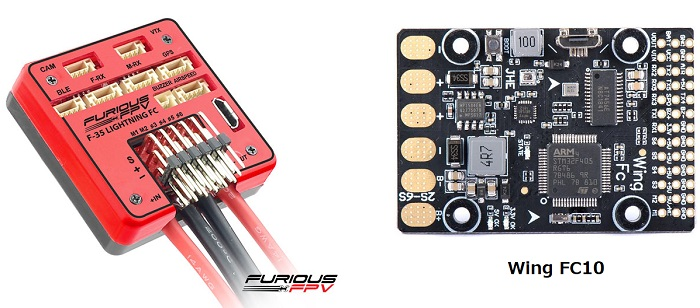

.. _common-furiousfpv-f35:

========================================
Furious FPV F-35 Lightning and Wing FC10
========================================

*above image and some content courtesy of the* `Furious FPV website <https://furiousfpv.com/product_info.php?cPath=25&products_id=641>`__ and `banggood.com <https://www.banggood.com/Wing-FC-10-DOF-Flight-Controller-INAV-OSD-Accelerometer-Barometer-Gyro-Compass-For-RC-Airplane-Drone-p-1318626.html>`__

.. note::

   Support for the FuriousFPV and WingFC10 were released with Copter-3.6.1.  These boards use the same firmware.

Specifications
==============

-  **Processor and Sensors**

   -  STM32F4 ARM microcontroller
   -  InvenSense IMU (accel, gyro, compass)

-  **Interfaces**

   -  6x PWM outputs
   -  1x RC input (PWM/PPM, SBUS)
   -  6x serial port inputs
   -  battery voltage and current monitor
   -  Onboard OSD
   -  USB port
   -  2S to 6S input power

Where to Buy
============

- Furious FPV F-35 Lightening is available from `FuriousFPV <https://furiousfpv.com/product_info.php?cPath=25&products_id=641>`__ (`Full options model here <https://furiousfpv.com/product_info.php?cPath=25&products_id=657>`__)
- Wing FC-10 is available from multiple retailers including `banggood.com <https://www.banggood.com/Wing-FC-10-DOF-Flight-Controller-INAV-OSD-Accelerometer-Barometer-Gyro-Compass-For-RC-Airplane-Drone-p-1318626.html>`__

Peripheral Connections
======================

.. image:: ../../../images/furiousfpv-f35-wiring.jpg
    :target: ../_images/furiousfpv-f35-wiring.jpg
    
Default UART order
==================

- SERIAL0 = console = USB
- SERIAL1 = Telemetry1 = USART1 (= BLE port on orig. F-35)
- SERIAL2 = Telemetry2 = UART5 (= M-RX port on orig. F-35)
- SERIAL3 = GPS1 = USART2 (= GPS port)
- SERIAL4 = not used
- SERIAL5 = USER = UART4 (only TX4 pinned out, TX-pin on orig. F-35's VTx port)
- SERIAL6 = USER = USART6 (only TX6 pinned out as "SPO" with hardware inverter, TX-pin on orig. F-35's F-RX port)

USART3 RX used as RC input (F-RX port's Rx pin on orig. F-35)

Serial protocols can be adjusted to personal preferences.

Dshot capability
================

All motor/servo outputs are Dshot and PWM capable. However, mixing Dshot and normal PWM operation for outputs is restricted into groups, ie. enabling Dshot for an output in a group requires that ALL outputs in that group be configured and used as Dshot, rather than PWM outputs. The output groups that must be the same (PWM rate or Dshot, when configured as a normal servo/motor output) are: 1/2, 3/4, 5/6.

Notes
=====
The F-35 has ability to have the middle rail for M1/M2 to be independent of that of the S1-S6 slots, which are supplied by the internal 5V regulator, or to have it tied to them, via board jumper pads. The WingFC10 is isolated with no pad option. The internal regulators can only supply two or three standard servos (3A).
It is generally recommended that servos be powered independent of on-board regulators to avoid noise injection issues. For both boards this means either cutting traces or externally powering the servos.

Both boards have an onboard compass, however, since there is an on-board current sensor, if used, the compass cannot be accurately used and should be disabled in ArduPilot. For plane use, not having a compass is a non-issue, but compass is required for Copter/Quadplane. 

However, an external compass can be connected to the board's I2C1 after a small modification. To enable I2C on the Wing FC10 clone, you need to move from 'PRS' to 'I2C' position (on the bottom side of the board) and use the test pad as shown below. The test pad is I2C1/SDA and the AIR pin is I2C1/SCL after the jumper modification.

For the F-35, there are solder pads for the internal I2C bus as shown below. An external compass can be attached to these pads.

.. note:: Be sure to disable the internal compass in all cases. Also be careful when connecting to board solder pads since they can be easily torn from the board. Using small wire and securing with some kind of glue after soldering is recommended.

Either rssi or analog airspeed can be input on the AIR pin if not used for external I2C connections. Either must be first enabled in the params, params refreshed, and then pin "13" set for the input, and type set.

Videos
======

arduplane auto mission using the Wing FC10:

.. vimeo:: 301399536
   :width: 400
   :height: 400
