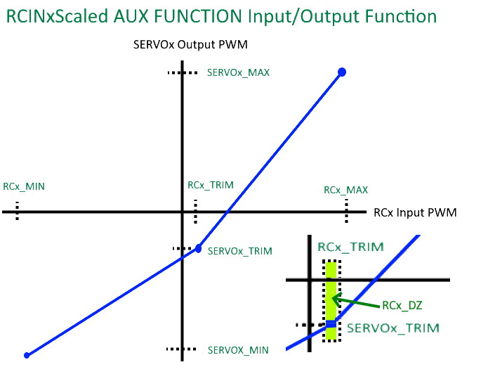

.. _common-future-wiki-changes:

==========================================
Future Wiki Changes (in Master branch now)
==========================================

[copywiki destination="plane,copter,rover,blimp"]

Add to :ref:`common-rcoutput-mapping`
=====================================

add to Generic Functions Table:

+--------------------------------+----+---------------------------------------+
|       Function                 | ID |        Available in:                  |
+--------------------------------+----+---------------------------------------+
|      RCIN1Scaled               |140 |        Plane, Copter, Rover           |
+--------------------------------+----+---------------------------------------+
|      RCIN2Scaled               |141 |        Plane, Copter, Rover           |
+--------------------------------+----+---------------------------------------+
|      RCIN3Scaled               |142 |        Plane, Copter, Rover           |
+--------------------------------+----+---------------------------------------+
|      RCIN4Scaled               |143 |        Plane, Copter, Rover           |
+--------------------------------+----+---------------------------------------+
|      RCIN5Scaled               |144 |        Plane, Copter, Rover           |
+--------------------------------+----+---------------------------------------+
|      RCIN6Scaled               |145 |        Plane, Copter, Rover           |
+--------------------------------+----+---------------------------------------+
|      RCIN7Scaled               |146 |        Plane, Copter, Rover           |
+--------------------------------+----+---------------------------------------+
|      RCIN8Scaled               |147 |        Plane, Copter, Rover           |
+--------------------------------+----+---------------------------------------+
|      RCIN9Scaled               |148 |        Plane, Copter, Rover           |
+--------------------------------+----+---------------------------------------+
|      RCIN10Scaled              |149 |        Plane, Copter, Rover           |
+--------------------------------+----+---------------------------------------+
|      RCIN11Scaled              |150 |        Plane, Copter, Rover           |
+--------------------------------+----+---------------------------------------+
|      RCIN12Scaled              |151 |        Plane, Copter, Rover           |
+--------------------------------+----+---------------------------------------+
|      RCIN13Scaled              |152 |        Plane, Copter, Rover           |
+--------------------------------+----+---------------------------------------+
|      RCIN14Scaled              |153 |        Plane, Copter, Rover           |
+--------------------------------+----+---------------------------------------+
|      RCIN15Scaled              |154 |        Plane, Copter, Rover           |
+--------------------------------+----+---------------------------------------+
|      RCIN16Scaled              |155 |        Plane, Copter, Rover           |
+--------------------------------+----+---------------------------------------+

RCIN1Scaled to RCIN16Scaled
+++++++++++++++++++++++++++

This operates similar to RCPassThru1 to RCPassThru16 above. However, instead of exactly passing the received PWM to the output, its is scaled.The RC input's dead-zone(DZ) is also obeyed.

The upper PWM range from the input trim value to its maximum input is translated to its corresponding output's trim to maximum parameter values range, and similarly for the ranges below the input's trim value as shown below:

Also note expansion to 32 outputs instead of 16 : See https://github.com/ArduPilot/ardupilot_wiki/pull/4595
 
Add IRC Tramp VTX Support
=========================

See https://github.com/ArduPilot/ardupilot_wiki/pull/4596

Add In-Flight FFT averaging
===========================

See https://github.com/ArduPilot/ardupilot_wiki/pull/4614

Add Analog Fuel Level Sensors
=============================

See https://github.com/ArduPilot/ardupilot_wiki/pull/4413

On :ref:`common-rangefinder-landingpage`
========================================

Add link to :ref:`common-teraranger-neo`

On :ref:`common-auxiliary-functions` page
=========================================

Add

+----------------------+----------------------------+----------+---------+---------+
| **RCx_OPTION value** | **Feature Description**    |**Copter**|**Plane**|**Rover**|
+----------------------+----------------------------+----------+---------+---------+
|        162           | In-Flight FFT AutoSetup    |    X     |    X    |         |
+----------------------+----------------------------+----------+---------+---------+
|        163           | Mount Lock                 |    X     |    X    |    X    |
+----------------------+----------------------------+----------+---------+---------+
|        164           | Pause Streaming Logging    |    X     |    X    |    X    |
+----------------------+----------------------------+----------+---------+---------+
|        165           | ARM/Motor Emergency Stop   |    X     |    X    |    X    |
+----------------------+----------------------------+----------+---------+---------+

.. raw:: html

   <table border="1" class="docutils">
   <tbody>
   <tr>
   <th>Option</th>
   <th>Description</th>
   </tr>
   <tr>
   <td><strong>In-Flight FFT AutoSetup</strong></td>
   <td>

Allows automatic setup of in-flight FFT notch parameters. Set :ref:`FFT_ENABLE<FFT_ENABLE>` =1, takeoff with switch low, hover 30 seconds with switch high,switch low, and land and notch parameters will have been configured.

.. raw:: html

   </td>
   </tr>
   <tr>
   <td><strong>Mount Lock</strong></td>
   <td>

If high, locks the heading of all mounts to earth-frame, otherwise, yaw is heading locked to vehicle heading. If pilot controlled positioning is active, the pilot's inputs changes the heading target appropriately in whatever frame is selected. Without this switch, its vehicle heading.

.. raw:: html

   </td>
   </tr>
   <tr>
   <td><strong>Pause Streaming Logging</strong></td>
   <td>

If high, will not log streaming type log messages (sensors,attitudes,ekf,etc.) to allow logging only when desired for autopilots with limited logging capabilites (ie no SD card). Events, mode changes, etc. are still logged. Logging is unaffected if switch is low.

.. raw:: html

   </td>
   </tr>
   <tr>
   <td><strong>ARM/Motor Emergency Stop</strong></td>
   <td>

Three position switch. If high, will request arming. If switched to low position, will emergency stop any rotating motor output like the Motor Emergency Stop switch. If switched to middle position, will de-activate the Motor Emergency Stop, but not request an arm condition. This is a safer alternative to ARM/DISARM in that accidental switching to low position will not disarm, and will allow recovery in the air if switched back to middle or high quickly.

.. raw:: html

   </td>
   </tr>
   </table>

In :ref:`common-imu-fft`
========================

add:

.. note:: Setting up the FFT parameters can be done automatically using the ``RCx_OPTION`` auxiliary function "162" on a transmitter switch. Set the function to a switch on the transmitter. Hover the vehicel, switch it on (high) for 30 seconds, switch back low and land. The parameters will have been setup and switch function removed.

In :ref:`common-downloading-and-analyzing-data-logs-in-mission-planner`
=======================================================================

add:

.. note:: Logging of the continuously streaming log messages, such as attitude, sensors, etc. can be paused by using the ``RCx_OPTION`` auxiliary function "164" on a transmitter channel. Switching this channel high will pause these messages, but not events, mode changes, warnings, etc. This allows autopilots with limited logging capabilites (ie using Block logging to chip memory and no SD card) to log only when desired during the flight, as during tuning phases or determination of TECs parameters, etc.

[site wiki="rover"]

Add info about steering speed scaling option
============================================

see https://github.com/ArduPilot/ardupilot_wiki/pull/4423

[/site]
[site wiki="plane"]

Add info on altitude control in LOITER mode
===========================================

see https://github.com/ArduPilot/ardupilot_wiki/pull/4457

Add new tuning options for :ref:`common-transmitter-tuning`
===========================================================

see https://github.com/ArduPilot/ardupilot_wiki/pull/4458

Add new mission command, NAV_DELAY
==================================

see https://github.com/ArduPilot/ardupilot_wiki/pull/4465

- On :ref:`quadplane-auto-mode` page under "AUTO VTOL Takeoff" add to end of section:

In order to prevent the landing gear from dragging due to GPS noise at the beginning of the takeoff, you can set :ref:`Q_NAVALT_MIN<Q_NAVALT_MIN>` to a non zero value which will force the roll and pitch to be zero until that altitude is reached. At which point, navigation (ie loiter in position during the takeoff climb) will become active.

[/site]
[site wiki="copter"]

Add "dead-reckoning" failsafe page
==================================

see https://github.com/ArduPilot/ardupilot_wiki/pull/4517
[/site]
