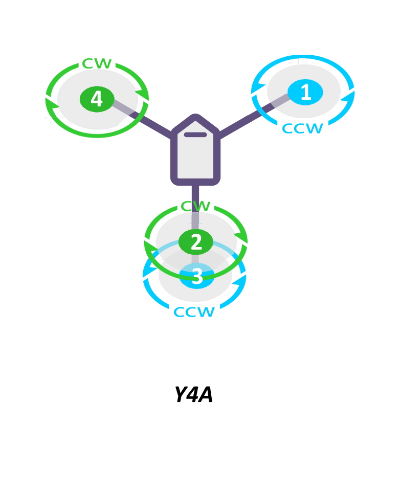

.. _common-future-wiki-changes:

==========================================
Future Wiki Changes (in Master branch now)
==========================================

Common
======

:ref:`common-rpm` page
----------------------

- under types list at top: add ESC Telemetry

- add section:

ESC Telemetry - Average Motor RPM
~~~~~~~~~~~~~~~~~~~~~~~~~~~~~~~~~

The RPM library can also be used to setup an 'RPM sensor' that computes and logs the average RPM for selected motors on the vehicle that are controlled by BLHeli_32 or BLHeli_S capable ESCs.  First the ESC telemetry will need to be setup.  See :ref:`BLHeli Telemetry<common-dshot-blheli32-telemetry>` for details on how to do this.  Once complete set ``RPMx_TYPE`` to 5 and write the parameters to ArduPilot.  Then refresh/fetch the parameters.  You will find a number of additional parameters are now available for that instance.  Find and set ``RPMx_ESC_MASK`` to add which ESC channels you want to be included in the average. For example for the second RPM instance:

:ref:`RPM2_ESC_MASK<RPM2_ESC_MASK>` is a bitmask, with each bit corresponding to a channel. If you wanted the average RPM for motors 1 to 4 you would set :ref:`RPM2_ESC_MASK<RPM2_ESC_MASK>` = 1 + 2 + 4 + 8 = 15.

:ref:`common-compass-calibration-in-mission-planner` page
---------------------------------------------------------
- add note at beginning of Onboard Calibration using Stick Gestures (no GCS) section:

.. note:: This feature ahs been removed in firmware versions after 4.1.

:ref:`common-gpios` page
------------------------

- add the following note at the top:

.. note:: in firmware versions later than 4.1, the method for setting a PWM/SERVO/MOTOR outputs to be a GPIO function is changed. Instead of ``BRD_PWM_COUNT`` being used, the individual ``SERVOx_FUNCTION`` parameter is merely set to "-1". If set to "0", it remains a PWM output, unassigned to a function, and outputs that output's trim value when board safety is not active.

:ref:`common-imutempcal` page
-----------------------------

change all ``BRD_IMU_TEMPTARG`` param names to :ref:`BRD_HEAT_TARG<BRD_HEAT_TARG>`

:ref:`common-gps-for-yaw` page
------------------------------

under Hardware Setup change last bullet to read:

- Serial GPS modules must be connected to ArduPilot via their UART1 connectors, DroneCAN modules via CAN, or interconnected per their manufacturer instructions.

under Configuration change GPS type param bullets to read:

- :ref:`GPS_TYPE <GPS_TYPE>` = 17 ("UBlox moving baseline base") or 22 (DroneCAN-MovingBaseline-Base), as appropriate.
- :ref:`GPS_TYPE2 <GPS_TYPE2>` = 18 ("UBlox moving baseline rover") or 23 (DroneCAN-MovingBaseline-Rover), as appropriate.

:ref:`common-power-module-configuration-in-mission-planner` page
----------------------------------------------------------------

Add to power monitors table:

=================================     =============================
:Ref:`BATT_MONITOR<BATT_MONITOR>`       TYPE
=================================     =============================
20 	                                    MPPT
21 	                                    INA2XX
22 	                                    LTC2946
23 	                                    Torqeedo
=================================     =============================

Plane
=====

:ref:`quadplane-parameters` page
--------------------------------

- add:

bit 18, if set,will allow arming only if in a VTOL mode. Primarily used for tailsitters to prevent accidental immediate tip-over if armed in a fixed wing mode with assistance active.

- change bit 15 to:

bit 15, if set, will allow pilot to control descent during VTOL AUTO-LAND phases, similar to throttle stick action during QHOVER or QLOITER. However, this will not become active until the throttle stick is raised above 70% during the descent at least once.

:ref:`guide-tailsitter` page:
-----------------------------

- at top of  page:

Tailsitters and their parameters are enabled by setting :ref:`Q_TAILSIT_ENABLE<Q_TAILSIT_ENABLE>` to either "1" ,for most tailsitters, or "2" for the special case of Copter Motor Only Tailsitters (those without control surfaces like elevons or ailerons/elevators).

- in Vectored and non-Vectored change:

 " CopterMotor tailsitters without them (ie. only have a lifting wing with no control surfaces) must use QASSIST (discussed below) to provide control while in fixed wing flight modes." to:**"                CopterMotor tailsitters without them (ie. only have a lifting wing with no control surfaces) must use always use their motors to provide control while in fixed wing flight modes. Setting** :ref:`Q_TAILSIT_ENABLE<Q_TAILSIT_ENABLE>` = 2 **automatically does this."**

- under Tailsitter Configuration change:

 "The key to make a QuadPlane a tailsitter is to either set Q_FRAME_CLASS =10 or Q_TAILSIT_MOTMX non-zero. That tells the QuadPlane code to use the tailsitter VTOL backend." to:**"The key to make a QuadPlane a tailsitter is to either set** :ref:`Q_TAILSIT_ENABLE<Q_TAILSIT_ENABLE>` **to "1" or "2" to tell the QuadPlane code to use the tailsitter VTOL backend."**

:ref:`Q_FRAME_CLASS<Q_FRAME_CLASS>` **determines the number and layout of VTOL motors and** :ref:`Q_TAILSIT_MOTMX<Q_TAILSIT_MOTMX>` **determines which motors are active when in fixed wing modes, except in the special case of the Copter Motor Only Tailsitter which keeps running the motors like a Copter mode even when flying in a fixed wing mode for control surface-less Copter tailsitters (ie always running the motors to provide attitude control, even at low throttle).**

- Add table at end of the Tailsitter Configuration section:

+-------------------+------+----------------+-------------+--------------+-----------------------+
|Tailsitter Style   |ENABLE| CLASS          |  TYPE       |  MOTORMASK   | Motor Output Functions+
+===================+======+================+=============+==============+=======================+
|3D Single Motor    |  1   | 10(Single/Dual)|  NA         | 0            | Throttle              |
+-------------------+------+----------------+-------------+--------------+-----------------------+
|Twin Motor and Twin|  1   | 10(Single/Dual)|  NA         | 0            | Left Throttle,        |
|Motor Vectored     |      |                |             |              | Right Throttle        |
+-------------------+------+----------------+-------------+--------------+-----------------------+
|Copter Tailsitters |  1   |to match number | to match    |active motors |   Motor 1- Motor x    |
|with fixed wing    |      |of VTOL motors  | motor mixing|in fixed wing |                       |
|control surfaces   |      |                |             |modes         |                       |
+-------------------+------+----------------+-------------+--------------+-----------------------+
|Copter Tailsitters |  2   |to match number | to match    |active motors |   Motor 1- Motor x    |
|with no fixed wing |      |of VTOL motors  | motor mixing|in fixed wing |                       |
|control surfaces   |      |                |             |modes         |                       |
+-------------------+------+----------------+-------------+--------------+-----------------------+

The ENABLE column refers to the :ref:`Q_TAILSIT_ENABLE<Q_TAILSIT_ENABLE>` parameter, while CLASS,TYPE, and MOTORMASK refer to :ref:`Q_FRAME_CLASS<Q_FRAME_CLASS>`, :ref:`Q_FRAME_TYPE<Q_FRAME_TYPE>`, and :ref:`Q_TAILSIT_MOTMX<Q_TAILSIT_MOTMX>`, respectively.

- under Copter Tailsitters change the note to read:

.. note:: It is possible to have a CopterMotor Tailsitter using no fixed wing control surfaces, ie basically a quadcopter with a wing. For that configuration, use :ref:`Q_TAILSIT_ENABLE<Q_TAILSIT_ENABLE>` = 2. :ref:`Q_TAILSIT_MOTMX<Q_TAILSIT_MOTMX>` is ignored in that case.

- Remove Tailsitter Input Mask section entirely

:ref:`flight-options` page:
---------------------------

- add to table

=====================================   ======================
:ref:`FLIGHT_OPTIONS<FLIGHT_OPTIONS>`   Function
=====================================   ======================
7                                       Enable default airspeed EKF fusion for takeoff (Advanced users only)
8                                       Remove :ref:`TRIM_PITCH_CD<TRIM_PITCH_CD>` offset on the GCS horizon to show pitch relative to AHRS trim (ie the attitude at which the flight controller was calibrated,unless manually changed)
9                                       Remove :ref:`TRIM_PITCH_CD<TRIM_PITCH_CD>` on the OSD horizon to show pitch relative to AHRS trim (ie the attitude at which the flight controller was calibrated,unless manually changed)
10                                      Adjust mid-throttle to be :ref:`TRIM_THROTTLE<TRIM_THROTTLE>` in non-auto throttle modes except MANUAL,instead of midway between MAX and MIN stick values (note that the RCx_TRIM value for the throttle channel (x) MUST BE set to center stick value)
=====================================   ======================

.. note:: Normally, TRIM_PITCH_CD is subtracted from the AHRS pitch so that the artificial horizon shows pitch as if the flight controller was calibrated with aircraft level position set at TRIM_PITCH_CD instead of flat.  This normally results in the artificial horizon indicating 0 pitch when in cruise at desired cruise speed. TRIM_PITCH_CD is the pitch trim that would be required in stabilized modes to maintain altitude at nominal cruise airspeed and throttle, and for most planes is 1-3 degrees positive, depending on the aircraft design (see :ref:`tuning-cruise`).

:ref:`tuning-cruise` page: 
--------------------------

- add in appropriate place

Using :ref:`TRIM_PITCH_CD<TRIM_PITCH_CD>` to adjust cruise attitude will also add an offset to the artificial horizon on a GCS or an OSD, but this can be disabled using the :ref:`FLIGHT_OPTIONS<FLIGHT_OPTIONS>` bitmask.

:ref:`guide-tailsitter` page:
-----------------------------

- add under Transitions section:

Depending on the entry speed and time required to transition, the vehicle may gain altitude, sometimes significantly, since the throttle is set to the current :ref:`Q_M_THRST_HOVER<Q_M_THST_HOVER>` hover thrust value throughout the transition to VTOL. This can be overridden with a lower value by setting :ref:`Q_TAILSIT_THR_VT<Q_TAILSIT_THR_VT>`. With experimentation, changing the rates, angle, and this parameter for fixed wing to VTOL transitions, it is possible to obtain almost level altitude transitions. Especially with copter style tailsitters with no control surfaces using Q_TAILSIT_ENABLE = 2, keeping attitude control active even at low or zero throttle values.

[copywiki destination="plane,copter,rover,dev"]

:ref:`soaring-4_1` page:
-------------------------

Add content from :ref:`soaring-speed-to-fly`

Copter
======

:ref:`copter:connect-escs-and-motors` page:
-------------------------------------------

add:

Y4
--

